Chapter 2: JavaFX Fundamentals
^^^^^^^^^^^^^^^^^^^^^^^^^^^^^^^^^^^^^

在你的系统上安装好Java SDK与JavaFX之后，让我们创建一些应用并探索JavaFX的基础。首先，我们将会描述JavaFX应用的基本结构，以及使得JavaFX成为现代客户端选择的强大特性。我们将会向你展示如何创建响应式UI。我们将会了解FXML，允许你定义并配置UI的基于XML的标记语言。我们同时会介绍Scene Builder，用于设计与配置JavaFX UI的独立拖拽工具。

为进一步美化你的UI，JavaFX使用级联样式表（CSS）。我们将会向你展示在JavaFX中使用CSS的多种方式。

JavaFX属性提供了一种强大的绑定机制。我们将会介绍JavaFX属性与绑定。我们将会展示相对于大量的监听器，为什么JavaFX观察与绑定有助于创建不易出错的紧凑代码。我们同时会探索多种布局控制，并且向你展示将动画集成到UI中是如多么容易。

最终我们将会以一个实现master-detail UI的示例程序结束本章，该程序使用了JavaFX集合，可编辑窗体以及用于典型数据库CRUD操作的按钮。

通过本章，我们将会介绍后续章节将会深入探讨的主题。这意味着让你体会到JavaFX可以做什么，并提供通过本书进一步探讨JavaFX的基础。让我们开始吧。

JavaFX Stage与场景图
===============================

JavaFX应用由JavaFX平台所控制，这是一个构建你的应用对象并构建JavaFX应用线程的运行时。要构建JavaFX应用，你必须扩展JavaFX Application类。JavaFX运行时系统控制Application生命周期并调用Application的start()方法。

JavaFX使用剧场比喻：顶层容器是Stage（舞台），并且由平台为你构建。在桌面应用中，Stage是窗口。其外观依赖于主机系统，并且在Mac OS X，Windows与Linux平台之间变化。通常，窗口以调整大小，最小化以及退出应用的控制进行装饰。也能够创建无装饰的窗口。你也可以为其它环境指定Application类。例如，使用Gluon移动应用框架，你的程序扩展自移动Application，而应用类特别为移动设备所编写。

JavaFX是单线程
~~~~~~~~~~~~~~~~~~~~

你必须在JavaFX应用线程上构建并修改Stage与其场景对象。注意，JavaFX（类似于Swing）是单线程UI模式。对于JavaFX开发者，这几乎是一种直接的限制。当你创建UI无线，响应事件处理器，管理动画动态内容，或是场景图中的修改，工作继续在JavaFX应用线程上执行。

然而，要使得UI响应，你应该将长时间运行的工作分配给单独线程中的后台任务。在此情况下，修改UI的工作必须与在后台线程上执行的工作相分离。幸运的是，JavaFX有一个良好开发的并行API，有助于开发者将长时间运行的任务分配给一个或多个单独线程。这使得UI线程可以响应用户事件。这些主题在第13章中进行了探讨。

层次节点结构
~~~~~~~~~~~~~~~~~~~

继续剧场的比喻，舞台有场景。场景由JavaFX元素组成，例如根，这是顶层场景元素并包含所谓的场景图。

场景图是一个可视化你的应用的严格的元素层次结构。这些元素被称为节点。一个节点只有一个父节点（除了根节点），并可以包含其它节点。或者节点是一个没有子节点的叶子节点。为了参与场景的渲染，节点必须被添加到场景图中。幸运的是，一个节点仅被添加到场景中一次，除非它首先被删除，然后被添加到其它位置。

父节点通常管理其子节点，依据布局规则与你配置的约束将子节点排放在场景中。对于2D图像，JavaFX使用二维坐标系统，其原点位于场景的左上角，如图2-1所示。x坐标轴的坐标值向右增大，y坐标轴上的坐标值向下增大。

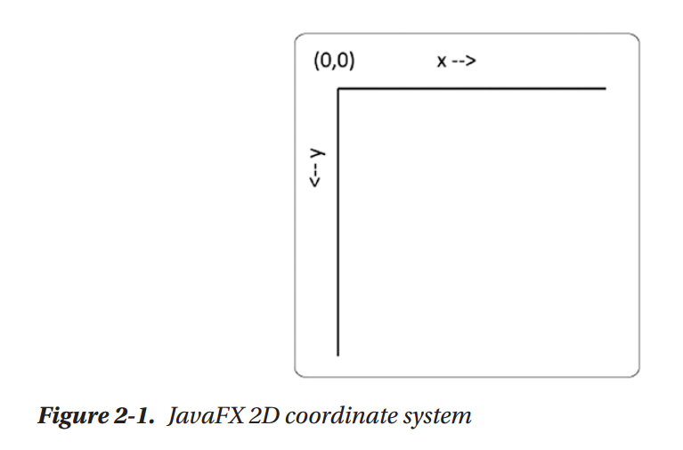

JavaFX同时支持3D图像，使用z坐标轴表示第三个维度，提供深度。参看第8章，了解JavaFX的三维功能。

除了相对于父节点的局部坐标系统之外，JavaFX有一个绝对坐标系统。在每种情况下，坐标系统的源点位于父节点的左上角。通常，布局控件隐藏了场景中组件放置的复杂性，并为你管理子节点的放置。组件放置基于特定的布局控制以及你如何配置。

也可以嵌套布局控制。例如，你可以在一个HBox中放置多个VBox，或是在一个SplitPane控制中的一个pane中放置一个AnchorPane。其它父节点是更为复杂的可视节点，例如TextField，TextArea以及Button。这些节点拥有管理的子部分。例如，Button包含一个标签文本部分与可选图像。图像可以是任意的节点类似，但通常是一个图像或图标。

回想叶子节点没有子节点。这样的示例包括Shape（例如Rectangle，Ellipse，Line，Path与Text）以及ImageView，用于渲染图像的节点。

一个简单的图形程序
=========================

图2-2展示了一个名为MyShapes的简单JavaFX应用，在应用窗口中显示 一个椭圆与一个文本元素。此窗口的外观会根据底层平台而变化。当你缩放窗口时，可视元素将会保持在缩放空间中的中心。尽管这是一个简单的程序，但有大量关于JavaFX渲染，布局特性与节点的知识需要学习。

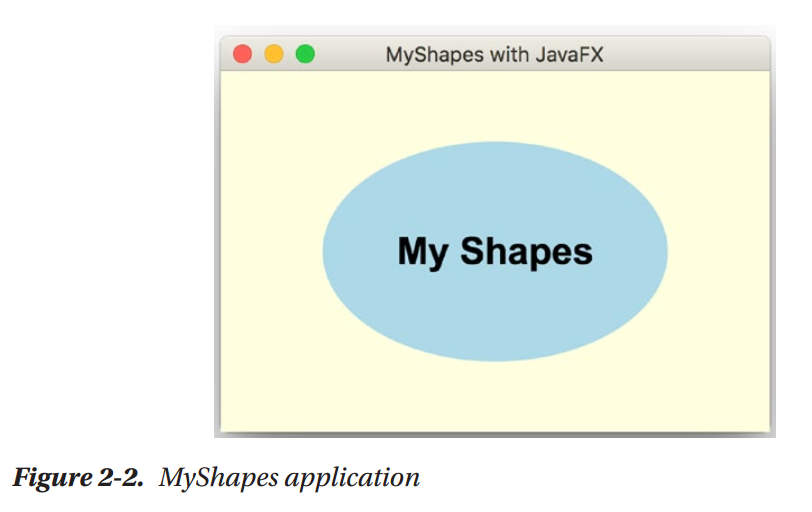

列表2-1展示了MyShapes程序的源码。类MyShapes是主类，并扩展自Application。JavaFX运行时系统实例化MyShapes以及主Stage，它传递给重写的start()方法。运行时系统为你调用start()方法。

 .. code::

    Listing 2-1

    package org.modernclient;

    import javafx.application.Application;
    import javafx.scene.Scene;
    import javafx.scene.layout.StackPane;
    import javafx.scene.paint.Color;
    import javafx.scene.shape.Ellipse;
    import javafx.scene.text.Font;
    import javafx.scene.text.Text;
    import javafx.stage.Stage;

    /**
    *
    * @author user
    */
    public class MyShapes extends Application {
        
        public static void main(String[] args) {
            launch(args);
        }

        @Override
        public void start(Stage stage) throws Exception {
            // Create an Ellipse and set fill color
            Ellipse ellipse = new Ellipse(110, 70);
            ellipse.setFill(Color.LIGHTBLUE);
            
            // create a text shape with font and size
            Text text = new Text("My Shapes");
            text.setFont(new Font("Arial Bold", 24));
            
            StackPane  stackPane = new StackPane();
            stackPane.getChildren().addAll(ellipse, text);
            
            Scene scene = new Scene(stackPane, 350, 230, Color.LIGHTYELLOW);
            
            stage.setTitle("MyShapes with JavaFX");
            stage.setScene(scene);
            stage.show();
        }
        
    }

注意，引用javafx.application，javafx.scene，以及javafx.stage中包的导入语句。

此程序创建多个节点并将其添加到StackPane布局容器中。程序同时创建了场景，配置了Stage并显示Stage。让我们详细了解这些步骤。

首先，我们创建了一个Ellipse图形，提供了以像素计的宽度和高度。由于Ellipse扩展自Shape，我们也可以配置任意的Shape属性。这包括填充，允许你指定一个内部的绘制值。

Color
=============

Shape的填充属性可是JavaFX颜色，线性梯度，放射梯度或是图像。让我们简要讨论颜色。在JavaFX中你可以通过多种方式指定颜色。在这里，我们将Ellipse的填充属性设置为Color.LIGHTBLUE。在JavaFX Color类中当前有147种预定义的颜色，以字母顺序命名，由ALICEBLUE到YELLOWGREEN。然而，你也可以通过十六进制或十进制数字使用web RGB值来指定颜色。你可以选择为透明指定一个alpha值。完全不透明为1，而完全透明为0。例如，透明度.5显示颜色，同时允许显示背景颜色。

下面是使用Color设置图形填充的一些示例：

.. code::

    ellipse.setFill(Color.LIGHTBLUE); // Light blue, fully opaque
    ellipse.setFill(Color.web("#ADD8E6")); // Light blue, fully opaque
    ellipse.setFill(Color.web("#ADD8E680")); // Light blue, .5 opaque
    ellipse.setFill(Color.web("0xADD8E6")); // Light blue, fully opaque
    ellipse.setFill(Color.web("0xADD8E680")); // Light blue, .5 opaque
    ellipse.setFill(Color.rgb(173, 216, 230)); // Light blue, fully opaque
    ellipse.setFill(Color.rgb(173, 216, 230, .5)); // Light blue, .5 opaque

第5章向你展示了在CSS与JavaFX中指定颜色，梯度与图像的其它选项。

值得注意的是，你可以插值一个颜色的值，而这正是JavaFX构建梯度的方式。我稍后将会向你展示如何创建一个线性梯度。

文本是图形
==================

接下来我们创建一个文本对象。Text也是一个具有其它属性的Shape，例如字体，文本对齐，文本以及封装宽度。构建器提供了文本而setFont()方法设置其字体。

JavaFX坐标系统
=======================

注意，我们创建了椭圆与文本节点，但是它们还没有出现在我们的场景图中。在我们添加它们之前，我们必须将这些节点放置在某种类型的布局容器中。布局控制在管理你的场景图极为重要。这些控制不仅为你为放置组件，而且响应事件，例如缩放，元素的添加与删除以及场景图中一个或多个节点的尺寸变化。

为了向你展示布局控制如何重要，让我们将列表2-1中的StackPane替换为Group并且手动指定位置。Group是一个组合其子节点的父节点，但是没有提供任何布局功能。在这里我们创建一个Group，并且使用构造函数添加椭圆与文本元素。然后我们将Group指定为场景的根节点：

.. code::

    Group group = new Group(ellipse, text);
    . . .
    Scene scene = new Scene(group, 350, 230, Color.LIGHTYELLOW);

Group为其子节点使用默认的对齐设置，并且将所有内容放置在源点（0,0），场景的左上角。对于文本，默认放置是文本元素的左下边。在此情况下，唯一可见的部分将会是超出底边的字符。椭圆将会以Group源点(0,0)为中心，所以仅有右下四分之一可见。

这种放置显然并不是我们所希望的。要修正，让我们手动将图形放置在350x230场景的中心，如下所示：

.. code::

    Group group = new Group(ellipse, text);
    // Manually placing components is tedious and error-prone
    ellipse.setCenterX(175);
    ellipse.setCenterY(115);

    text.setX(175-(text.getLayoutBounds().getWidth()/2));
    text.setY(115+(text.getLayoutBounds().getHeight()/2));
    . . .
    Scene scene = new Scene(group, 350, 230, Color.LIGHTYELLOW);

现在图形较好地位于场景中心。但这样仍然不完美。当窗口缩放时，图形依然位于这些坐标处。而你并不希望这样。因而，使用JavaFX布局控件。

布局控件
================

现在让我们略为迂回来讨论一些常见的布局控件。为了管理场景的节点，你使用一个或多个控制。每个控件是为特定的布局配置而的。而且，你可以嵌套布局控制来管理节点组合并且指定布局应如何响应事件，例如缩放或所管理节点的变化。你可以指定对齐设置以及边框控制与填充。

有多种方法将节点添加到布局容器。你可以使用布局容器的构造函数来添加子节点。对于单个节点，你也可以使用方法getChildren().add()或是对于多个节点使用getChildren().addAll()方法。另外，一些布局控件有一些添加节点的特定方法。让我们现在了解一些常用到的布局控件向你展示JavaFX如何为你合成场景。

StackPane
~~~~~~~~~~~~~~~~

方便与简单的布局容器是列表2-1中所用的StackPane。此布局控件以你添加节点的顺序将其子节点由后至前进行叠加。注意，我们首先添加椭圆，所以它显示在文本节点后面。以相反的顺序，椭圆将会遮盖文本元素。

默认情况下，StackPane将其所有子节点进行中心显示。你可以为子节点指定不同的对齐方式或是为StackPane中特定节点的应用对齐方式。例如，

.. code::

    // align the text only
    stackPane.setAlignment(text, Pos.BOTTOM_CENTER);

将文本节点沿StackPane的底边对齐。现在当你缩放窗口时，椭圆依然位于中心，而文本保持对齐到窗口的底边。要将所有管理的节点对齐到底边，使用

.. code::

    // align all managed nodes
    stackPane.setAlignment(Pos.BOTTOM_CENTER);

现在椭圆与文本均出现在窗口的底部，尽管它们不会彼此相对中心。为什么不呢？

AnchorPane
~~~~~~~~~~~~~~~~~~~

AnchorPane依据配置的锚点管理其子节点，甚至是窗口缩放时。你为一个组件指定了相对于pane边的偏移。在这里，我们向AnchorPane添加了一个Label而将其定位到pane左下部10个像素偏移处：

.. code::

    AnchorPane anchorPane = new AnchorPane();
    Label label = new Label("My Label");
    anchorPane.getChildren().add(label);
    AnchorPane.setLeftAnchor(label, 10.0);
    AnchorPane.setBottomAnchor(label, 10.0);

AnchorPane通常被用作顶级布局管理器用来控制边框，甚至是当窗口缩放时。

GridPane
~~~~~~~~~~~~~~~~~~

GridPane允许你以一种灵活的二维网格的方式放置子节点。组件可以跨行或列，但是一行中的所有组件具有一致的行尺寸。类似地，列宽度是一致的。GridPane具有特定的方法将节点添加到由列号和行号指定的特定单元处。可选参数允许你指定所跨的列与行数。例如，这里的第一个标签被放置与列0和行0对应的单元处。第二个标签位于与列1和行0对应的单元处，并且它跨两列（第二与第三列）。我们必须同时指定一个跨行值（在这里为1）：

.. code::

    GridPane gridPane = new GridPane();
    gridPane.add(new Label("Label1"), 0, 0);
    gridPane.add(new Label("Label2 is very long"), 1, 0, 2, 1);

GridPane对于以适应变化尺寸的列或行的形式放置组件非常有用。GridPane同时允许节点跨多个列或多个行。我们在我们的master-default UI示例中使用GridPane。

FlowPane与TilePane
~~~~~~~~~~~~~~~~~~~~~~~~~~~

FlowPane以水平流或垂直流的形式管理其子节点。默认方向为水平。你可以使用构造函数或使用方法setOrientation()设置流方向。这里，我们使用构造函数设置垂直方向：

.. code::

    FlowPane flowpane = new FlowPane(Orientation.VERTICAL);

FlowPane依据可配置的边界封装子节点。如果你缩放一个包含FlowPane的容器，布局会按需调整流。单元的尺寸基于节点的尺寸，而它不是统一的网格，除非所有的节点均是相同的尺寸。这种布局对于尺寸可变的节点非常方便，例如ImageView节点或图形。TilePane类似于FlowPane，所不同的是TilePane使用相等尺寸的单元。

BorderPane
~~~~~~~~~~~~~~~~~~

BorderPane对于具有不同区域的桌面应用非常方便，包括一个顶部工具栏（Top），一个底部状态栏（Bottom），一个中心区域（Center），以及两个侧边区域（Right与Left）。这五个区域中的任何一个都可以为空。下面是一个矩形位于中心而标签位于顶部的BorderPane示例：

.. code::

    BorderPane borderPane = new BorderPane();
    Label colorLabel = new Label("Color: Lightblue");
    colorLabel.setFont(new Font("Verdana", 18));
    borderPane.setTop(colorLabel);
    Rectangle rectangle = new Rectangle(100, 50, Color.LIGHTBLUE);
    borderPane.setCenter(rectangle);
    BorderPane.setAlignment(colorLabel, Pos.CENTER);
    BorderPane.setMargin(colorLabel, new Insets(20,10,5,10));

注意，BorderPane对于中心区域默认为中心对齐，对于顶部默认为左对齐。要使得顶部区域标签居中，我们使用Pos.CENTER配置其对齐方式。注意，我们同时使用BorderPane的静态方法setMargin()来设置标签周围的空白区域。Insets构造函数需要对应于顶边，右边，底边与左边的四个值。类似的对齐与空白配置同样适用于其它布局组件。

SplitPane
~~~~~~~~~~~~~~~~~~~

SplitPane将布局空间分割为多个水平或垂直配置的区域。分隔器是可移动的，而你通常在SplitPane的每个区域中使用其它的布局控件。我们在master-default UI示例中使用SplitPane。

HBox，VBox与ButtonBar
~~~~~~~~~~~~~~~~~~~~~~~~~~~

HBox与VBox布局控件为子节点提供单一的水平或垂直位置。你可以将HBox节点嵌入到VBox中实现网格效果或将VBox节点嵌入到HBox组件中。ButtonBar对于在水平容器中放置相同尺寸的一行按钮非常方便。

对于这些组件以及其它布局组件的详细信息，请参看第4章。

生成场景
===============

回到列表2-1，Scene存放由其根节点定义的场景图。首先，我们构造一个Scene并提供stackPane作为根节点。然后我们指定其像素宽度与高度，并为背景色提供一个可选的填充参数（Color.LIGHTYELLOW）。

剩下的是配置Stage。我们提供了标签，设置场景，显示舞台。JavaFX运行时渲染我们的场景，如图2-2所示。

图2-3显示了我们的MyShapes应用的场景图的层次视图。根节点是StackPane，它包含两个子节点，Ellipse与Text。

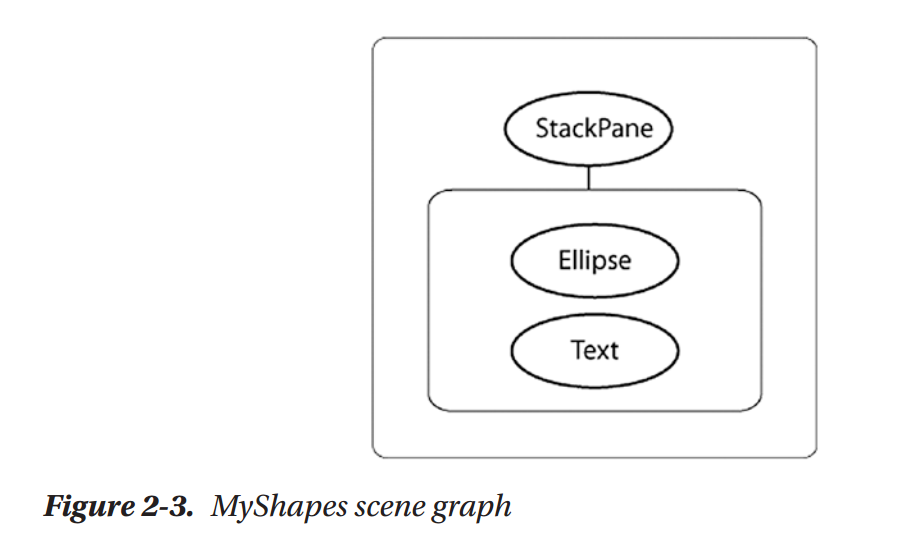

增强MyShapes应用
====================

相比于老的UI工具集，JavaFX的一个优点在于你可以很容易地将效果，梯度与动画应用于场景图中的节点。我们会重复回到场景图节点的概念，因为那是JavaFX运行高效渲染应用可视部分的方式。现在让我们对MyShapes做一些修改向你展示这些特性。由于JavaFX能够插值颜色，你可以使用颜色来定义梯度。梯度为图形赋予深度，而且可以为辐射状或线性。让我们展示一个线性梯度。

线性梯度
~~~~~~~~~~~~

线性梯度需要两个或多个颜色，称为Stop。梯度Stop由一个颜色与0至1之间的偏移组成。偏移指定了将颜色沿梯度放置在何处。梯度计算由一个颜色到下一个颜色的比例阴影。

在我们的示例中，我们使用三个颜色Stop：Color.DOGGERBLUE，Color.LIGHTBLUE，与Color.GREEN。第一个Stop的偏移为0，第二个偏移为.5，而第三个偏移为1.0，如下所示：

.. code::

    Stop[] stops = new Stop[] { new Stop(0, Color.DODGERBLUE),
    new Stop(0.5, Color.LIGHTBLUE),
    new Stop(1.0, Color.LIGHTGREEN)};

LinearGradient构造函数指了x坐标轴范围，后跟y坐标轴范围。下面的线性梯度具有固定的x坐标，但是变化的y坐标。这被称为垂直梯度。

.. code::

    // startX=0, startY=0, endX=0, endY=1
    LinearGradient gradient = new LinearGradient(0, 0, 0, 1, true,
    CycleMethod.NO_CYCLE, stops);

布尔真值指示梯度在图形中扩展（其中0与1是相对于图形的比例），而NO_CYCLE意味着模式不重复。布尔假值指示梯度的x与y值是相对于父节点的局部坐标系统的。

要生成一个水平梯度，为x坐标轴指定范围，而使y坐标固定，如下所示：

.. code::

    // startX=0, startY=0, endX=1, endY=0
    LinearGradient gradient = new LinearGradient(0, 0, 1, 0, true,
    CycleMethod.NO_CYCLE, stops);

其它组合允许你指定凌形梯度或反转梯度，其中颜色以相反顺序出现。

DropShadow
~~~~~~~~~~~~~~~~~

下面，让我们为椭圆添加阴影效果。你指定阴影的颜色以及半径和x与y偏移。半径越大，阴影越大。偏移表示相对于图形外边的阴影位置。这时在，我们指定半径为30像素，相对于图形右侧与底部的偏移为10像素：

.. code::

    ellipse.setEffect(new DropShadow(30, 10, 10, Color.GRAY));

这些偏移模拟了由左上角发射的光源。当偏移为0时，阴影覆盖整个图形，就如同光源直接由场景上部照射。

Reflection
~~~~~~~~~~~~~~~~~~~~

反射效果镜像一个组件，并且基于你所配置的顶部与底部透明度，分数以及偏移逐渐褪色为透明。让我们来为Text节点添加一个反射效果。我们将使用.8作为分数，从而反射将为被反射组件的十分之八。偏移指定了反射由距离底边多少像素远处开始。我们指定为１像素（默认为0）。反射由完全不透明（顶部透明度）开始，变化为完全透明（底部透明度），除非你修改了顶部与底部透明度值：

.. code::

    Reflection r = new Reflection();
    r.setFraction(.8);
    r.setTopOffset(1.0);
    text.setEffect(r);

图2-4展示了运行窗口中的增强的MyShapes程序。你可以看到线性梯度填充与阴影被应用于椭圆，反射效果被应用于文本。

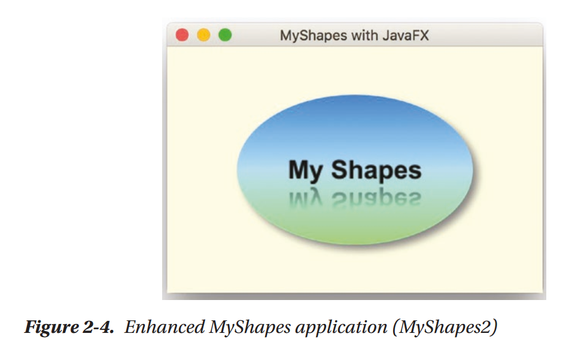

配置动作
===============

现在是时候让我们的应用来做一些事情了。JavaFX定义了使用鼠标，手势，触摸板或键盘的多种标准输入事情类型。这些输入事件类型每一个有其特定的处理器。

现在我们让事情保持简单。我们将向你展示如何编写一个事件处理器来处理鼠标点击事件。我们将创建处理器并将其关联到场景图中的节点。程序的行为将会依据要求处理器的节点而变化。我们可以在文本，椭圆或是栈pane节点上配置鼠标点击处理器。

下面是向文本节点添加动作事件处理器的代码：

.. code::

    text.setOnMouseClicked(mouseEvent -> {
                System.out.println(mouseEvent.getSource().getClass() + " clicked.");
            });

当用户在文本内部点击时，程序显示行：

.. code::

    class javafx.scene.text.Text clicked.

如果用户在背景区域或椭圆内部点击，不会有任何事情发生。如果我们将相同的监听器关联到椭圆而不是文本，我们可以看到行

.. code::

    class javafx.scene.shape.Ellipse clicked.

注意，由于文本对象在stack pane中出现在椭圆的前面，点击文本对象不会调用事件处理器。尽管这些场景图出现在每一个顶部，它们是层次结构中的单独节点。也就是，一个并不在另一个内部；而是，它们均是由stack pane管理的单独叶子节点。在此情况下，如果你希望所有节点均响应鼠标点击，你需要将鼠标事件处理器关联到所有节点。或者你可以仅将事件处理器关联到stack pane节点。这样，窗口内部的任意位置处的点击将会触发处理器，得到下面的输出行：

.. code::

    class javafx.scene.layout.StackPane clicked.

让我们做一些更有趣的事情，向MyShapes程序应用动画。

动画
============

当你使用内建的变换API时，JavaFX使得动画非常简单。每个JavaFX Transition类型控制一个或多个节点属性。例如，FadeTransition控制节点的透明度，随着时间变化属性。要逐渐消逝某个控制，你将其透明度由完全不秀明（1）变为完全透明（0）。TranslateTransition通过修改节点的translateX与translateY属性（如果在3D时修改translateZ）来移动节点。

你可以使用ParallelTransition并行执行多个变换或是使用SequentialTransition执行序列变换。要控制两个序列变换之间的时间，使用PauseTransition或是在Transition开始之前使用方法setDelay()。你也可以在属性onFinished上定义Transition动作处理器在Transition完成时执行的动作。

Transition在调用方法play()或playFromStart()开始。方法play()在当前时开始变；方法playFromStart()总是由时刻0开始。其它方法，包括stop()与pause()。你可以使用getStatus()查询变换的状态，它会返回一个Animation.Status枚举值中的一个：RUNNING，PAUSED，或STOPPED。

所有变换支持常见的属性duration，autoReverse，cycleCount，onFinished，currentTime以及node或shape（用于Shape特定的变换）。

让我们现在为MyShapes程序定义一个RotateTransition。当用户在运行程序的内部点击时开始放置。图2-5展示了放置变换中的程序运行状态。

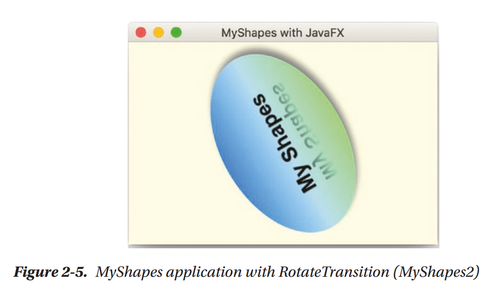

列表2-2展示了MyShapes程序的start()方法中的动画代码。

.. code::

    Listing 2-2

    public class MyShapes extends Application {
        
        public static void main(String[] args) {
            launch(args);
        }

        @Override
        public void start(Stage stage) throws Exception {
            // Create an Ellipse and set fill color
            Ellipse ellipse = new Ellipse(110, 70);
            ellipse.setFill(Color.LIGHTBLUE);
            
            Stop[] stops = new Stop[] {
                new Stop(0, Color.DODGERBLUE),
                new Stop(0.5, Color.LIGHTBLUE),
                new Stop(1.0, Color.LIGHTGREEN)
            };
            
            // startX=0, startY=0, endX=0, endY=1
            LinearGradient gradient = new LinearGradient(0, 0, 0, 1, true, CycleMethod.NO_CYCLE, stops);
            ellipse.setFill(gradient);
            
            ellipse.setEffect(new DropShadow(30, 0, 0, Color.GRAY));
            
            // create a text shape with font and size
            Text text = new Text("My Shapes");
            text.setFont(new Font("Arial Bold", 24));
            
            Reflection r = new Reflection();
            r.setFraction(.8);
            r.setTopOffset(1);
            text.setEffect(r);
            
            text.setOnMouseClicked(mouseEvent -> {
                System.out.println(mouseEvent.getSource().getClass() + " clicked.");
            });
            
            StackPane  stackPane = new StackPane();
            stackPane.getChildren().addAll(ellipse, text);
            
            //Define RotateTransition
            RotateTransition rotate = new RotateTransition(Duration.millis(2500), stackPane);
            rotate.setToAngle(360);
            rotate.setFromAngle(0);
            rotate.setInterpolator(Interpolator.LINEAR);
            
            // configure mouse click handler
            stackPane.setOnMouseClicked(mouseEvent -> {
                if (rotate.getStatus().equals(Animation.Status.RUNNING)) {
                    rotate.pause();
                } else {
                    rotate.play();
                }
            });
            
            Scene scene = new Scene(stackPane, 350, 230, Color.LIGHTYELLOW);
            
            stage.setTitle("MyShapes with JavaFX");
            stage.setScene(scene);
            stage.show();
        }
        
    }

RotateTransition构造函数指定了2500毫秒的运行时间，并将变换应用于StackPane节点。旋转动画由角度0开始，线性处理到360，提供一个完全旋转。当用户在StackPane布局控件内部任意位置点击时，动画开始。

在些示例中有一些需要注意的有趣的事情。首先，由于我们在StackPane节点上定义变换，旋转应用于StackPane的所有子节点。这意味着不仅Ellipse与Text图形旋转，阴影与反射效果也会旋转。

第二，事件处理器检测变换状态。如果动画正在运行，事件处理器暂停变换。如果没有运行，它使用play()启动。由于play()在变换的当前时刻启动，pause()后跟play()会重启变换。

JavaFX属性
=================

你通过操作其属性来控制节点。JavaFX属性类似于通常的JavaBean属性。它们有setter与getter，通常存放值并且遵循相同的命名约定。但是JavaFX属性更为强大，因为它们是可观察的。在本节中，我们将会介绍JavaFX属性，监听器以及绑定的概念，这有助于我们配置并控制场景图中的节点。

你已经了解了如何通过操作与节点关联的属性来配置场景图中的节点。例如，椭圆中的填充属性提供了图形的内部颜色。类似地，height与width属性定义了椭圆的尺寸。font属性定义了Text的文本，而其text属性存放单词My Shapes。

由于JavaFX属性是可观察的，你可以定义监听器，当属性值变化或变为无效时得到通知。而且，你可以使用内建的绑定机制来将一个或多个属性链接到另一个属性。你可以指定单向绑定或双向绑定。你甚至可以定义你自己的JavaFX属性，并在你的程序中包含作为模型对象或控件对象的一部分。

为了将表达式绑定到或将监听器关联到JavaFX属性，你必须通过属性的getter来访问属性。约定，属性的getter是小写字符形式的属性名后跟单词Property。例如，fill属性的属性getter为fillProperty()，而节点的opacity属性的属性getter为opacityProperty()。对于任意的属性getter，你可以访问属性元数据（例如通过属性getter方法getName()来访问其名字）并通过属性getter方法getValue()访问其值。让我们首先向你展示属性监听器。

属性监听器
~~~~~~~~~~~~~~~~~~

JavaFX属性监听器以两种方式应用于对象属性（而不是集合）：验证监听器与变化监听器。验证监听器会在属性值不再合法时触发。对于此示例以及后面的示例，我们将讨论MyShapeProperties程序，它基于前面的MyShapes应用。在这个新程序中，我们在旋转StackPane下在的VBox布局控制中添加第二个Text对象。图2-6展示了更新后的顶级VBox的场景图。

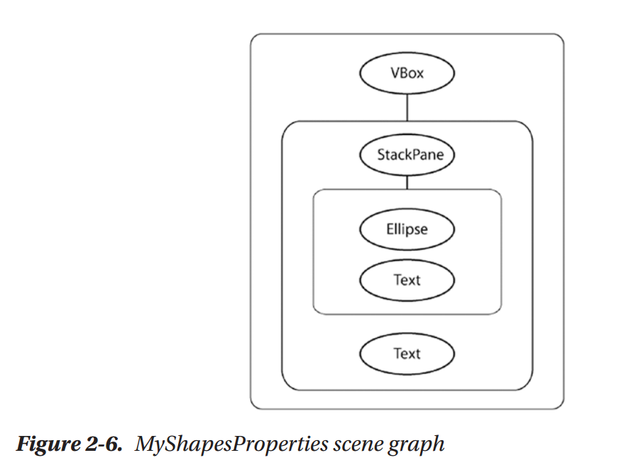

验证监听器
::::::::::::::::

验证监听器有一个方法，你可以使用Lambda表达式来覆盖。我们首先展示非Lambda表达式的形式，从而你可以看到完整的方法定义。当你点击StackPane时，鼠标点击处理器像之前一样旋转StackPane。第二个Text对象显示RotationTransition动画的状态，这是由一个只读的status属性来管理的。你可以看到RUNNING，PAUSE或STOPPED。图2-7展示了暂停的动画。

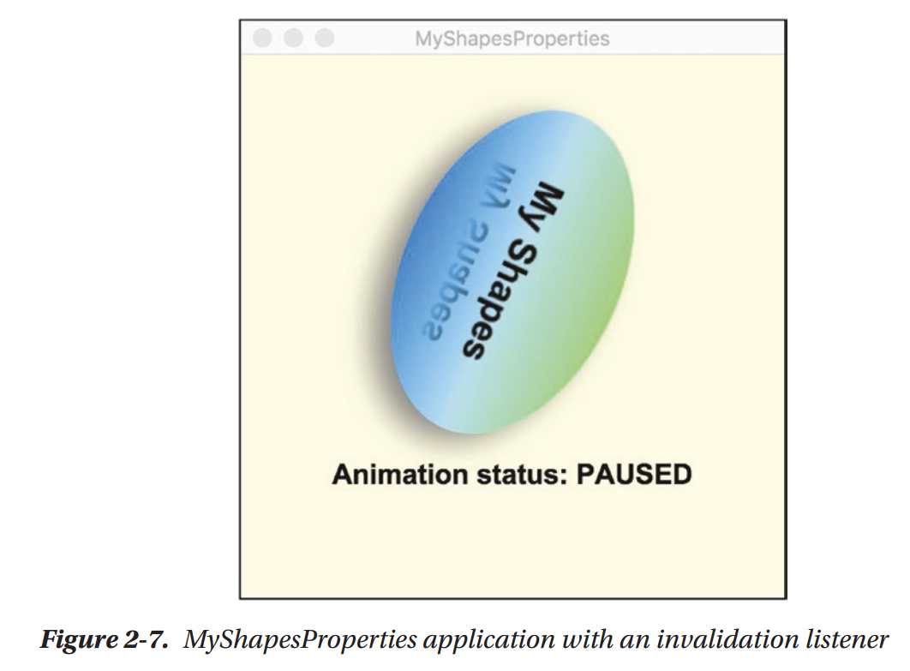

验证监听器包含一个可观察的对象，允许你访问属性。由于observale是非泛型的，你必须应用相应的类型转换来访问属性值。下面是在关联到属性的监听器中访问动画状态属性的值的一种方法。注意，我们使用属性getter方法statusProperty()关联监听器：

.. code::

    rotate.statusProperty().addListener(new InvalidationListener() {
                @Override
                public void invalidated(Observable observable) {
                    text2.setText("Animation status: " + ((ObservableObjectValue<Animation.Status>)observable).getValue());
                }
            });

下面我们使用Lambda表达式实现相同的监听器：

.. code::

    rotate.statusProperty().addListener(observable -> {
                text2.setText("Animation status: " + ((ObservableObjectValue<Animation.Status>)observable).getValue());
            });

由于我们只访问状态属性值，我们可以使用方法getStatus()略过observalbe，该方法会返回一个枚举值。这可以避免转换表达式：

.. code::

    rotate.statusProperty().addListener(observable -> {
            text2.setText("Animation status: " + rotate.getStatus());
        });

变化监听器
::::::::::::::::

当你需要访问observalbe的前一个值以及当前值，使用变化监听器。变化监听器提供observable以及当前值和旧值。变化监听器会更为昂贵，因为它们必须跟踪更多的信息。下面是变化监听器的非lambda版本，同时显示旧值与新值。注意，你无需转换这些参数，因为变化监听器是泛型的：

.. code::

    rotate.statusProperty().addListener(new ChangeListener<Animation.Status>(){
                @Override
                public void changed(ObservableValue<? extends Animation.Status> observableValue,
                        Animation.Status oldValue, Animation.Status newValue) {
                    text2.setText("Was " + oldValue + ", Now " + newValue);
                }
            });

下面是使用更为紧凑lmabda表达式的版本：

.. code::

    rotate.statusProperty().addListener((observaleValue, oldValue, newValue)-> {
                text2.setText("Was " + oldValue + ", Now " + newValue);
            });

图2-8展示了将变化监听器关联到动画的状态属性的MyShapesProperties。现在我们可以同时显示前一个值与当前值。

绑定
~~~~~~~~~~~

JavaFX绑定非常灵活，富API机制允许你避免在许多情况编写监听器。你使用绑定将JavaFX属性的值链接到一个或多个其它JavaFX属性。属性绑定可以是单向或双向的。当属性是相同类型时，单向bind()方法也许是你所需要的全部。然而，当属性具有不同类型或者你希望基于多个属性计算值时，则你将需要流式与绑定API。你也可以使用自定义绑定创建你自己的绑定方法。

单向绑定
::::::::::::::::

最简单的绑定形式是将一个属性的值链接到另一个属性的值。在这里，我们将text2的rotate属性绑定到stackPane的rotate属性：

.. code::

    text2.rotateProperty().bind(stackPane.rotateProperty());

这意味着stackPane的旋转的变化将会立即更新text2的rotate属性。当在MyShapesProperties程序中设置此绑定时，StackPane内的点击将会初始化旋转变换。这会使得StackPane和text2组件 同时旋转。StackPane旋转是因为我们启动了在此节点上定义的RotateTransition。text2节点旋转是由于绑定表达式。

注意，当你绑定一个属性时，你不能显式设置其值，除非你首先解绑属性。

双向绑定
::::::::::::::::

双向绑定在两个属性之间提供双向关系。当一个属性更新时，另一个属性也更新。下面是一个具有两个文本属性的示例：

.. code::

    text2.textProperty().bindBidirectional(text.textProperty());

两个文本控件初始时显示My Shapes。当用户在stackPane内部点击时，stackPane旋转，由于变化监听器，现在两个文本属性都将包含动画状态。

双向绑定并不是对称的；两个属性的初始值使用bindBidirectional()调用所传递的属性值。不同于bind()，当使用双向绑定时，你可以显示设置任意属性。

流式API与绑定API
::::::::::::::::::::::

当多个属性参与绑定或是当必须执行某些计算或转换时，流式API与绑定API有助于你构建绑定表达式。例如，下面的绑定表达式在StackPane由0旋转到360度时显示其角度。文本属性是一个字符串，而旋转属性是一个double。绑定方法asString()将double转换为字符串：

.. code::

    text2.textProperty().bind(stackPane.rotateProperty().asString("%.1f"));

作为一个更复杂的示例，让我们基于动画是否运行理新text2的stroke属性（颜色）。在这里我们使用基于ternary条件的When构建一个绑定表达式。当动画运行时，将stroke颜色设置为绿，但动画停止或暂停时设置为红色：

.. code::

    text2.strokeProperty().bind(new When(rotate.statusProperty().isEqualTo(Animation.Status.RUNNING)).then(Color.GREEN).otherwise(Color.RED));

text2的文本属性在关联到动画状态属性中的变化监听器来设置的。

图2-9展示了使用关联到text2 strokeProperty的复杂绑定属性的MyShapesProperties应用。由于动画正在运行，stroke属性被设置为Color.GREEN。

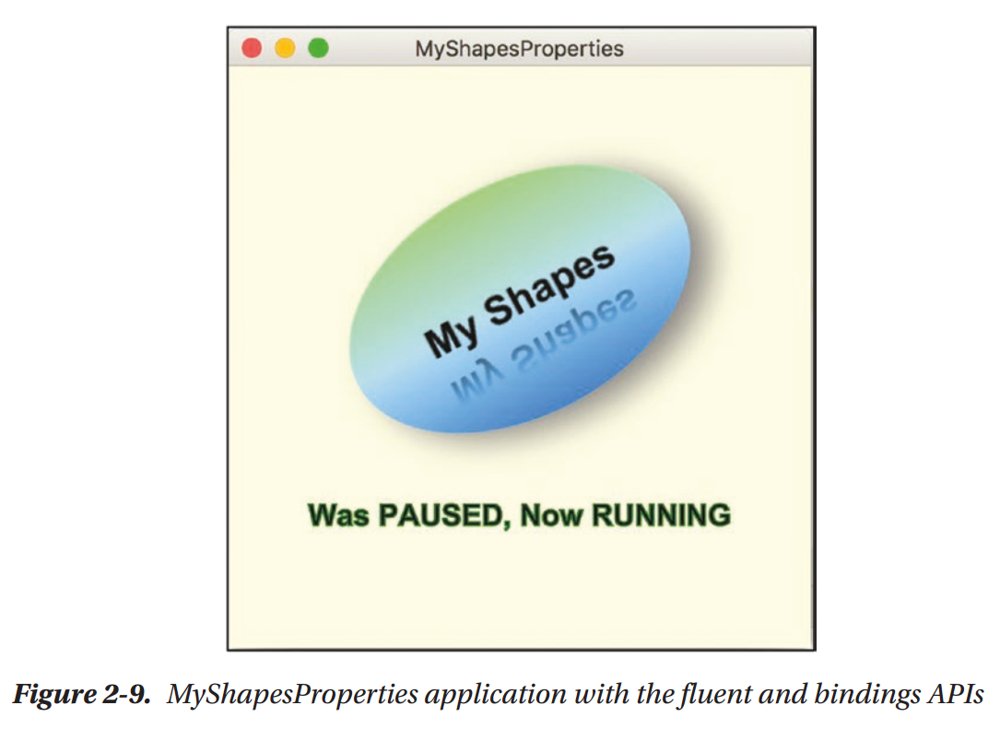

要了解更多JavaFX属性与绑定的示例，请参看第3章。

使用FXML
=============

你了经了解了JavaFX API如何创建场景图节点并为你配置。MyShapes与MyShapesProperties程序仅使用JavaFX代码来构建并配置这些对象。另一种方法是使用FXML来场景场景图节点，这是一种基于XML的标记语言。FXML允许以一种声明式格式描述并配置你的场景图。这种方法的优点如下：

* FXML标记结构是层次式的，从而它可以更紧密地反映你的场景图结构。
* FXML描述你的视图并支持模型－视图－控制器（MVC）体系结构，为更大的应用提供更多的结构。
* FXML减少了你必须编写来创建并配置场景图节点的代码。
* 你可以使用Scene Builder设计你的UI。这种拖拽工具是独立应用，为你的场景提供可视化渲染。并且Scene Builder为你生成FXML标记。
* 你也可以使用文本与IDE编辑编辑你的FXML标记。

FXML影响你的程序结构。现在主应用类调用FXMLLoader。该加载器会分析你的FXML标记，创建JavaFX对象，并且将场景图插入到你的根节点的场景中。你可以有多个FXML文件，并且通常每一个有一个对应的JavaFX控制器类。此控制器类也许包含事件处理器或是动态更新场景的其它语句。控制器也会包含管理特定视图的业务逻辑。

让我们回到我们的MyShapes示例（现在被称为MyShapesFXML），并且为视图使用FXML文件，为风格使用CSS。图2-10展示了我们程序中的文件，为构建工具或IDE的使用而排列。

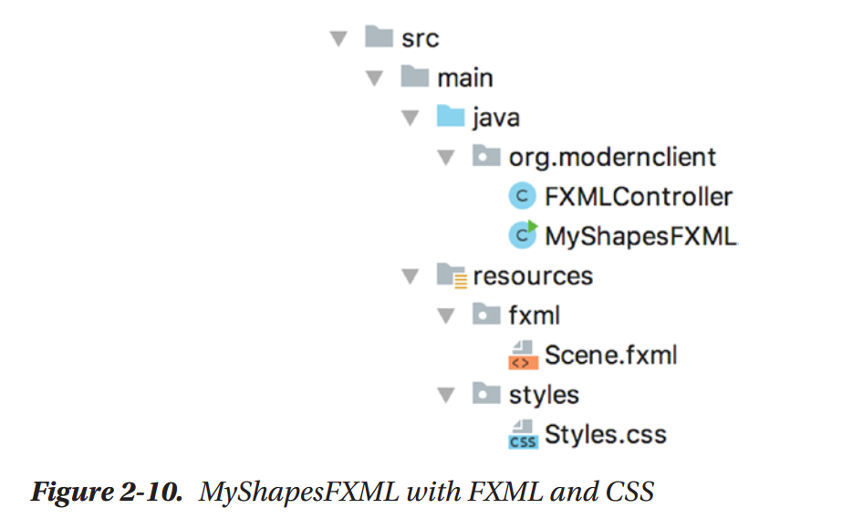

JavaFX源代码出现在java子目录下。resources子目录包含FXML与CSS文件（在这里为Scene.fxml与Styles.css）。

程序包含一个旋转StackPane，VBox控件以及第二个Text对象。列表2-3展示了描述我们场景图的FXML代码：一个顶层VBox包含StackPane与Text元素。StackPane包含Ellipse与Text图形。

.. code::

    Listing 2-3. Scene.FXML

    <?xml version="1.0" encoding="UTF-8"?>

    <?import javafx.scene.effect.Reflection?>
    <?import javafx.scene.layout.StackPane?>
    <?import javafx.scene.layout.VBox?>
    <?import javafx.scene.paint.LinearGradient?>
    <?import javafx.scene.paint.Stop?>
    <?import javafx.scene.shape.Ellipse?>
    <?import javafx.scene.text.Font?>
    <?import javafx.scene.text.Text?>

    <VBox alignment="CENTER" maxHeight="-Infinity" maxWidth="-Infinity" minHeight="-Infinity" minWidth="-Infinity" prefHeight="350.0" prefWidth="350.0" spacing="50.0" xmlns="http://javafx.com/javafx/11.0.1" xmlns:fx="http://javafx.com/fxml/1" fx:controller="org.modernclient.FXMLController">
        <children>
            <StackPane fx:id="stackPane" onMouseClicked="#handleMouseClick" prefHeight="150.0" prefWidth="200.0">
                <children>
                    <Ellipse radiusX="110.0" radiusY="70.0" stroke="BLACK" strokeType="INSIDE">
                        <fill>
                            <LinearGradient endX="1.0" endY="1.0">
                                <stops>
                                    <Stop color="DODGERBLUE" />
                                    <Stop color="LIGHTBLUE" offset="0.5" />
                                    <Stop color="LIGHTGREEN" offset="1.0" />
                                </stops>
                            </LinearGradient>
                        </fill>
                    </Ellipse>
                    <Text strokeType="OUTSIDE" strokeWidth="0.0" text="My Shapes">
                        
                            
                        
                        <effect>
                            <Reflection fraction="0.8" topOffset="1.0" />
                        </effect>
                    </Text>
                </children>
            </StackPane>
            <Text fx:id="text2" strokeType="OUTSIDE" strokeWidth="0.0" text="Animation Status:">
                
                    
                
            </Text>
        </children>
    </VBox>

顶层控制器使用属性fx:controller包含JavaFX控制器的名字。VBox指定其对齐方式，最优尺寸以及其后子节点StackPane与Text的间隔。在这里，我们使用最优尺寸配置StackPane。特殊属性fx:id指定与此节点对应的变量名字。在JavaFX控制器类中，你可以看到此变量名使用;@FXML为StackPane进行注解。这正是在控制器类如何访问在FXML文件中声明的对象的方法。

另外，StackPane指定了名为#handleMouseClick的事件处理器。此事件处理器也在JavaFX控制器类中使用@FXML进行注解。

在这里，StackPane的子节点，Ellipse与Text，在Children FXML节点中声明。两者都没有fx:id属性，因为控制器为不需要访问这些对象。你同时可以看到线性梯度，阴影，以及反射效果配置。

注意，fx:id为text2的Text对象出现在StackPane定义中。这使得第二个文本对象出现在VBox中StackPane的下面。我们同时指定了fx:id属性，从而由JavaFX控制器中访问此节点。

控制器类
~~~~~~~~~~~~~~~

现在让我们展示控制器类。你可以看到此代码更为紧凑，因为对象实体化与配置代码不再需要使用Java语句完成。所有这些代码在FXML标记语言中指定。列表2-4展示了FXMLController.java的控制器代码。

.. code::

    Listing 2-4. FXMLController.java

    package org.modernclient;

    import java.net.URL;
    import java.util.ResourceBundle;
    import javafx.animation.Animation;
    import javafx.animation.Interpolator;
    import javafx.animation.RotateTransition;
    import javafx.beans.binding.When;
    import javafx.fxml.FXML;
    import javafx.fxml.Initializable;
    import javafx.scene.input.MouseEvent;
    import javafx.scene.layout.StackPane;
    import javafx.scene.paint.Color;
    import javafx.scene.text.Text;
    import javafx.util.Duration;

    /**
    *
    * @author user
    */
    public class FXMLController implements Initializable {
        
        @FXML
        private StackPane stackPane;
        
        @FXML
        private Text text2;
        
        private RotateTransition rotate;

        @Override
        public void initialize(URL url, ResourceBundle rb) {
            rotate = new RotateTransition(Duration.millis(2500), stackPane);
            rotate.setToAngle(360);
            rotate.setFromAngle(0);;
            rotate.setInterpolator(Interpolator.LINEAR);
            
            rotate.statusProperty().addListener(
            (observableValue, oldValue, newValue) -> {
                text2.setText("Was " + oldValue + ", Now " + newValue);
            });
            
            text2.strokeProperty().bind(new When(rotate.statusProperty().isEqualTo(Animation.Status.RUNNING))
            .then(Color.GREEN).otherwise(Color.RED));
        }
        
        @FXML
        private void handleMouseClick(MouseEvent mouseEvent) {
            if (rotate.getStatus().equals(Animation.Status.RUNNING)) {
                rotate.pause();
            } else {
                rotate.play();
            }
        }
        
    }

控制器类实现了Initializable并重写了initialize()方法，并在运行时为你调用。重要的是，私有类域stackPane与text2使用@FXML进行注解。@FXML注解将控制器类中的变量名与FXML中描述的对象相关联。在控制器代码中并没有创建这些对象的代码，因为FXMLLoader会为你完成这些工作。

这里的initialize()方法完成三件工作。首先，它创建并配置RotateTransition并将其应用于stackPane节点。其次，它向变换的状态属性添加变化监听器。第三，text2 stroke属性的绑定表达式基于旋转变换的状态指定其颜色。

handleMouseClick()的@FXML注解指明FXML文件配置了事件处理器。鼠标点击事件处理器开始并停止旋转变换动画。

JavaFX Application类
:::::::::::::::::::::::::::::

主应用类，MyShapesFXML，现在变得非常简单。其任务是调用FXMLLoader，解析FXML（Scene.fxml），构建场景图，并返回场景图的根节点。现在你需要做的是构建场景对象并像前面一样配置Stage，如列有2-5所示。

.. code::

    Listing 2-5. MyShapesFXML.java

    package org.modernclient;

    import javafx.application.Application;
    import javafx.fxml.FXMLLoader;
    import javafx.scene.Parent;
    import javafx.scene.Scene;
    import javafx.scene.paint.Color;
    import javafx.stage.Stage;

    /**
    *
    * @author user
    */
    public class MyShapesFXML extends Application {

        @Override
        public void start(Stage stage) throws Exception {
            Parent root = FXMLLoader.load(getClass().getResource("resources/fxml/Scene.fxml"));
            
            Scene scene = new Scene(root, Color.LIGHTYELLOW);
            scene.getStylesheets().add(getClass().getResource("resources/styles/Styles.css").toExternalForm());
            
            stage.setTitle("MyShapesApp with JavaFX");
            stage.setScene(scene);
            stage.show();
        }
        
        public static void main(String[] args) {
            launch(args);
        }
        
    }

添加CSS
:::::::::::

现在我们向你展示如何使用CSS集成你自己的风格。JavaFX的一个优点就在于使用CSS格式化节点的能力。JavaFX自带默认风格，Modena.css。你可以增强这些风格或是使用新的风格来替换。我们的示例CSS文件位于Styles.css中，是一个将其字体风格设置为斜体的风格类，如列表2-6所示。

.. code::

    Listing 2-6. Styles.css

    .mytext {
        -fx-font-style: italic;
    }

要使用此风格，你必须首先载入此文件，在应用的start()方法或是在FXML文件中。列表2-5展示了如何在MyShapesFXML.java中载入风格。一旦该文件被加入到可用的风格中，你可以风格类应用于节点。要将单个定义的风格类应用于特定的节点，例如，使用

.. code::

    text2.getStyleClass().add("mytext");

在这时在，mytext是风格类，而text2是我们程序中的第二个Text对象。

另外，你可以在FXML文件中指定风格。这种方法的优点在于现在风格在Scene Builder内可用。下面是修改的Scene.fxml文件，加载自定义的CSS文件并将自定义CSS风格类应用于text2文本节点：

.. code::

    <VBox alignment="CENTER" maxHeight="-Infinity" maxWidth="-Infinity" minHeight="-Infinity" minWidth="-Infinity" prefHeight="350.0" prefWidth="350.0" spacing="50.0"
        stylesheets="@../styles/Styles.css"
        xmlns="http://javafx.com/javafx/11.0.1" xmlns:fx="http://javafx.com/fxml/1" fx:controller="org.modernclient.FXMLController">
        <children>
            <StackPane fx:id="stackPane" onMouseClicked="#handleMouseClick" prefHeight="150.0" prefWidth="200.0">
                <children>
                    <Ellipse radiusX="110.0" radiusY="70.0" stroke="BLACK" strokeType="INSIDE">
                        <fill>
                            <LinearGradient endX="1.0" endY="1.0">
                                <stops>
                                    <Stop color="DODGERBLUE" />
                                    <Stop color="LIGHTBLUE" offset="0.5" />
                                    <Stop color="LIGHTGREEN" offset="1.0" />
                                </stops>
                            </LinearGradient>
                        </fill>
                    </Ellipse>
                    <Text strokeType="OUTSIDE" strokeWidth="0.0" text="My Shapes">
                        
                            
                        
                        <effect>
                            <Reflection fraction="0.8" topOffset="1.0" />
                        </effect>
                    </Text>
                </children>
            </StackPane>
            <Text fx:id="text2" styleClass="mytext" strokeType="OUTSIDE" strokeWidth="0.0" text="Animation Status:">
                
                    
                
            </Text>
        </children>
    </VBox>

参看第5章了解如何在JavaFX应用中使用CSS的深度讨论。

使用Scene Builder
:::::::::::::::::::::::::

Scene Builder最初由Oracle，现在为开源。可以由Gluon下载：https://gluonhq.com/products/scene-builder/。Scene Builder是一个用于创建JavaFX UI的独立拖拽工具。图2-11使用MyShapesFXML程序中的Scene.fxml文件展示了主Scene Builder窗口。

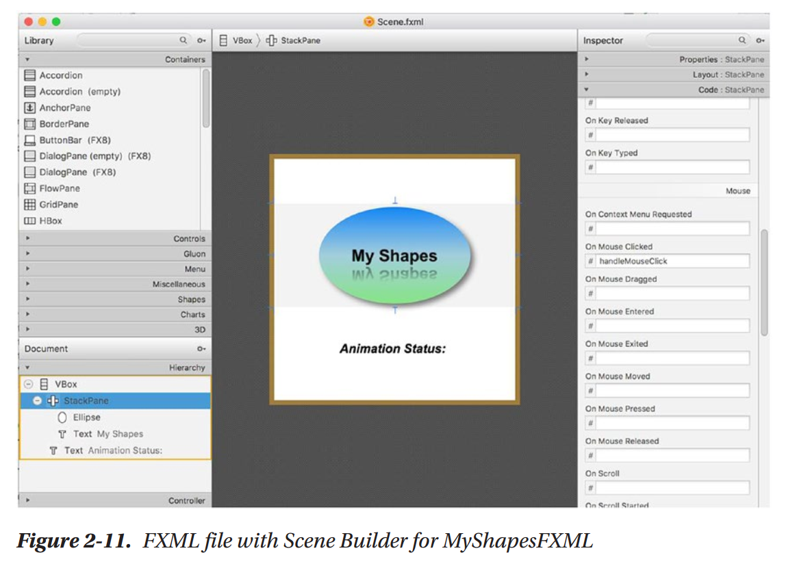

左上窗口显示了JavaFX组件库。该库包含容器，旁若无人，图形，3D以及其它组件。由此窗口，你选择组件并将其拖拽到中部可视视图的场景或是左下区域中所显示的文档窗口。

文档窗口显示了场景图的层次结构。你可以选择组件并将其移动到树中。右部窗口是一个检视（Inspector）窗口，允许你配置每个组件，包括其属性，布局设置以及代码。在图2-11中，StackPane在文档层次结构窗口中被选中，并出现在中部可视视图中。在检视窗口，OnMouseClicked属性被设置为#handleMouseClick，这是JavaFX控制器类中对应的方法名。

当构建真实世界基于窗口的UI时，Scene Builder特别有用。你可以可视化场景层次结构，并且很容易配置布局与对齐设置。

将所有综合起来
===================

现在是构建更为有趣的JavaFX应用的时候了，我们要实现在一个master-detail视图。当我们向你展示此应用时，我们将会解释一些JavaFX特性，有助于你控制UI并保持数据与应用的一致。

首先，我们使用Scene Builder来构建并配置UI。我们的示例包含一个Person模式类以及存放数据的底层ObservableList。程序允许用户做出修改，但是我们不会持久化数据。JavaFX有一个管理数据集合的ObservableList，而你可以编写监听器并绑定响应数据变化的表达式。程序使用事件处理器与绑定表达式的组合来保持应用状态一致。

Master-Detail UI
~~~~~~~~~~~~~~~~~~~~~~~~~~~~~~

对于UI，我们在左边窗口（master视图）使用JavaFX ListView控件，而在右侧窗口（detail视图）使用Form。在Scene Builder中，我们选择AnchorPane作为顶层组件并作为场景图的根节点。SplitPane布局面板将应用视图分为两部分，而每个部分有一个AnchorPane作为其主窗口。图2-12展示了运行中的Person UI应用。

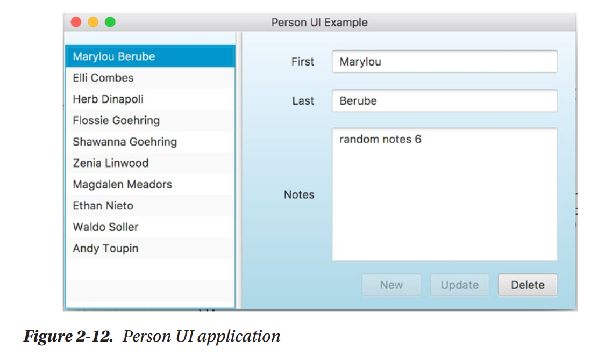

ListView控件允许你选择Person对象。在这里，第一个Person被选中，而Person的详细内容显示在右侧的窗体控件中。

窗体控件具有下列布局：

* 窗口包含一个GridPane（两列四行），存放TextField，存放Person的firstname与lastname域。
* TextArea存放Person的notes域。第一列的Label标记这些控件。
* GridPane的底行由跨列的ButtonBar组成，并且默认对齐到右侧。ButtonBar将所有按钮的尺寸调整为最宽按钮标签的宽度，从而所有按钮具有一致的尺寸。
* 按钮允许你执行New（创建Person并将Person添加到列表），Update（编辑一个选中的Person）以及Delete（由列表删除选中的Person）。
* 绑定表达式查询应用的状态，并允许或禁止按钮。图2-12展示了禁止的New与Update按钮以及允许的Delete按钮。

图2-13展示了Person UI应用的场景图的层次结构。

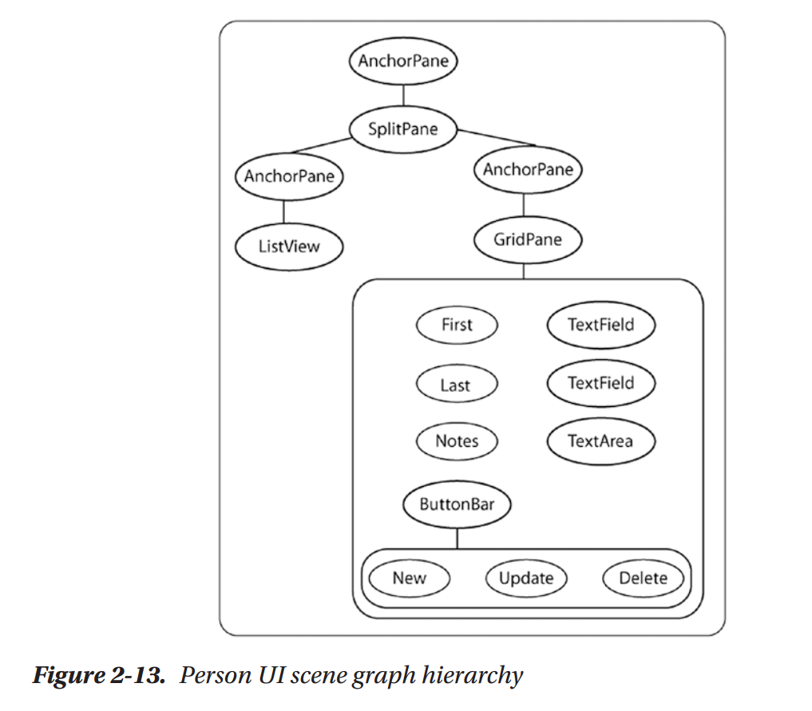

应用由图2-14中所示的文件组成。Person.java包含Person模型代码，而SampleData.java提供数据初始化应用。FXMLController.java是JavaFX控件器类，而PersonUI.java存放主应用类。在resources目录下，FXML文件Scene.fxml描述UI。

模型
::::::::::::::::::

让我们由列表2-7中所示的Person类开始。这是我们用于应用的模型。

我们的Person类有三个域：firstname，lastname与notes。这些域被实现为JavaFX属性，使其observable。我们遵循前面描述的命名约定来实现getter与setter，以及属性getter。幸运的是，JavaFX提供了约定类，帮助你创建属性。在这里我们使用SimpleStringProperty()来将每个域构建为JavaFX String属性。

.. code::

    Listing 2-7. model.Person.java

    package org.modernclient.model;

    import java.util.Objects;
    import javafx.beans.property.SimpleStringProperty;
    import javafx.beans.property.StringProperty;

    /**
    *
    * @author user
    */
    public class Person {
        private final StringProperty firstname = new SimpleStringProperty(this, "firstname", "");
        private final StringProperty lastname = new SimpleStringProperty(this, "lastname", "");
        private final StringProperty notes = new SimpleStringProperty(this, "notes", "");
        
        public Person(){}
        
        public Person(String firstname, String lastname, String notes) {
            this.firstname.set(firstname);
            this.lastname.set(lastname);
            this.notes.set(notes);
        }
        
        public String getFirstname() {
            return firstname.get();
        }
        
        public StringProperty firstnameProperty() {
            return firstname;
        }
        
        public void setFirstname(String firstname) {
            this.firstname.set(firstname);
        }
        
        public String getLastname() {
            return lastname.get();
        }
        
        public StringProperty getLastnameProperty() {
            return lastname;
        }
        
        public void setLastname(String lastname) {
            this.lastname.set(lastname);
        }
        
        public String getNotes() {
            return notes.get();
        }
        
        public StringProperty notesProperty() {
            return notes;
        }
        
        public void setNotes(String notes) {
            this.notes.set(notes);
        }
        
        @Override
        public String toString() {
            return firstname.get() + " " + lastname.get();
        }
        
        @Override
        public boolean equals(Object obj) {
            if (this == obj) return true;
            if (obj == null || getClass() != obj.getClass()) return false;
            Person person = (Person)obj;
            return Objects.equals(firstname, person.firstname) &&
                    Objects.equals(lastname, person.lastname) &&
                    Objects.equals(notes, person.notes);
        }
        
        @Override
        public int hashCode() {
            return Objects.hash(firstname, lastname, notes);
        }
    }

可观察列表
~~~~~~~~~~~~~~~~~~

当处理JavaFX集合时，你通常使用ObservableList，通过监听器检测列表变化。而且，显示数据列表的JavaFX控件期望可观察的列表。这些控件自动更新UI以响应列表修改。随着我们构建我们的示例程序，我们将会解释这些特性。

实现ListView选择
:::::::::::::::::::::::::

ListView控件显示可观察列表中的数据项，并允许你允许一个或多个数据项。要在右侧的视图中显示选中的Person，你为selectedItemProperty使用变化监听器。该变化监听器会在每次用户选中ListView中的不同项或是取消选中的项。对于取消选择，新值为空，而我们清空所有窗体控件。列表2-8展示了ListView的选择变化监听器。

.. code:: 

    Listing 2-8. ListView 选择变化监听器

    listView.getSelectionModel().selectedItemProperty().addListener(
            personChangeListener = (observable, oldValue, newValue) -> {
                // newValue can be null if nothing is selected
                selectedPerson = newValue;
                modifiedProperty.set(false);
                if (newValue != null) {
                    // Populate controls with selected Person
                    firstnameTextField.setText(selectedPerson.getFirstname());
                    lastnameTextField.setText(selectedPerson.getLastname());
                    notesTextArea.setText(selectedPerson.getNotes());
                } else {
                    fistnameTextField.setText("");
                    lastnameTextField.setText("");
                    notesTextArea.setText("");
                }
            });

布尔属性modifiedProperty跟踪用户是否修改窗体中三个文本控件中的一个。我们在每次ListView选择之后重置此标记，并在绑定表达式中使用此属性来控制Update按钮的disable属性。

使用多个选择
::::::::::::::::::::::

默认情况下，ListView控件实现单个选择，从而至多只有一个列表项被选中。ListView同时提供了多个选择，你可以通过配置selection模式来实现，如下所示：

.. code::

    listView.getSelectionModel().setSelectionMode(SelectionMode.MULTIPLE);

使用此配置，每次用户通过CTRL-Shift或CTRL-Command来将另一个列表项添加到选中时，selectedItemProperty监听器会使用新的选择进行调用。getSelectedItems()方法返回所有当前被选中的列表项，而newValue参数是最近被选中的值。例如，下面的变化监听器收集多个选中的列表项并输出：

.. code::

    listView.getSelectionModel().selectedItemProperty().addListener(
                    personChangeListener = (observable, oldValue, newValue) -> {
                        ObservableList<Person> selectedItems = listView.getSelectionModel().getSelectedItems();
                        
                        // Do something with selectedItems
                        System.out.println(selectedItems);
            });

我们的Person UI应用对ListView使用单选模式。

ListView与Sort
:::::::::::::::::::::::

假定你希望先依据名然后依据姓对名字列表进行排序。JavaFX有多种排序列表的方法。由于我们需要将名进行排序，我们将底层的ObservableArrayList封装到一个SortedList中。要使得ListView中的列表排序，我们使用已排序的列表调用ListView的setItems()方法。比较器指定了排序。首先，我们比较每个Person的名进行排序，如果需要则比较姓。要设置排序，setComparator()方法使用匿名类，或是更紧凑的lambda表达式：

.. code::

    // Use a sorted list; sort by lastname; then by firstname
    SortedList<Person> sortedList = new SortedList(personList);
    
    sortedList.setComparator((p1, p2) -> {
        int result = p1.getLastname().compareToIgnoreCase(p2.getLastname());
        if (result == 0) {
            result = p1.getFirstname().compareToIgnoreCase(p2.getFirstname());
        }
        return result;
    });
    
    listView.setItems(sortedList);

注意，比较器参数p1与p2被推断为Person类型，因为SortedList是泛型的。

Person UI应用动作
~~~~~~~~~~~~~~~~~~~~~~~~~~

我们的Person UI应用实现了三个动作：Delete（由底层列表中删除选中的Person对象），New（创建一个Person对象并将其添加到底层列表中），与Update（对选中的Person对象进行修改并更新底层列表）。让我们详细探讨每个动作，并了解有助于你构建此应用类型的更多JavaFX特性。

Delete a Person
::::::::::::::::::::::::

控制器类包含用于Delete按钮的动作事件处理器。下面是定义Delete按钮的FXML片段：

.. code::

    <Button fx:id="removeButton" mnemonicParsing="false"
    onAction="#removeButtonAction" text="Delete" />

fx:id属性命名按钮，从而JavaFX控制器类可以访问它。onAction属性对应于控制器代码中的ActionEvent处理器。在此应用中我们并没有使用键盘，从而我们将属性mnemonicParsing设置为false。

你不能直接更新SortedList，但是你可以对底层列表（ObservalbeList personList）进行修改。当你添加或删除列表项时，SortedList总是对其元素进行排序。

下面是控制器类中的事件处理器：

.. code::

    @FXML
    private void removeButtonAction(ActionEvent actionEvent) {
        personList.remove(selectedPerson);
    }

此处理器由底层的可观察数组列表中删除选中的Person对象。ListView控件的选中变化监听器设置selectedPerson，如列表2-8所示。

注意，在这里我们并不需要检测selectedPerson是否为空。为什么不呢？你将会看到，当;selectedItemProperty为空时，我们禁止了Delete按钮。这意味着当用户取消选中ListView控件中的元素时，Delete按钮的动作事件处理器绝不会被调用。下面是控制Delete按钮的disable属性的绑定表达式：

.. code::

    removeButton.disableProperty().bind(listView.getSelectionModel().selectedItemProperty().isNull());

优雅的语句使得事件处理器更为紧凑，因而不易出错。按钮的disableProperty与选择模式selectedItemProperty均是JavaFX可观察的。因而你可以将其用在绑定表达式中。当bind()参数的值发生变化时，调用bind()的属性自动进行更新。

Add a Person
:::::::::::::::::::::

New按钮向列表添加一个Person并更新ListView控件。新的列表总是会被排序，因为当元素被添加到封装的列表时，列表会重新排序。下面是定义New按钮的FXML。类似于Delete按钮，我们同时定义了fx:id与onAction属性：

.. code::

    <Button fx:id="createButton" mnemonicParsing="false"
    onAction="#createButtonAction" text="New" />

在什么条件下应禁止New按钮呢？

* 当点击New时，ListView中不应有被选中的列表项。所以，如果selectedItemProperty不为空时，我们禁止New按钮。
* 如果姓或名为空时，我们不应创建新的Person。所以如果这些域中的任何一个为空时，我们禁止New按钮。然而，我们却允许Notes域为空。

下面是反映这些约束的绑定表达式：

.. code::

    createButton.disableProperty().bind(
        listView.getSelectionModel().selectedItemProperty().isNotNull()
            .or(firstnameTextField.textProperty().isEmpty())
            .or(lastnameTextField.textProperty().isEmpty())
    );

现在，让我们展示New按钮的事件处理器：

.. code::

    @FXML
    private void createButtonAction(ActionEvent actionEvent) {
        Person person = new Person(firstnameTextField.getText(),
                lastnameTextField.getText(), notesTextArea.getText());
        personList.add(person);
        // and select it
        listView.getSelectionModel().select(person);
    }

首先，我们使用窗体的文本控件创建一个新的Person对象，并将此Person添加到封装列表中（ObservableList personList）。要使得Person的数据立即可见与可编辑，我们选中新添加的Person。

Update a Person
::::::::::::::::::::::

Person的更新并不像其它操作一样直接。在我们深入为什么的细节之前，让我们首先看一下Update按钮的FXML代码，这类似于其它按钮：

.. code::

    <Button fx:id="updateButton" mnemonicParsing="false"
    onAction="#updateButtonAction" text="Update" />

默认情况下，排序列表不会影响单数组元素的主烨。例如，如果Person Ethan Nieto修改为Ethan Abraham，列表并不会像元素被添加或删除时那样进行重新排序。有两种修正方法。第一种是将其删除并使用新值再次添加。这并不完美。

第二种方法是为低层对象定义一个extractor。extractor定义了当发生变化时应被观察的属性。通常，单个列表元素的变化并不会被观察。由extractor返回的observable对象标记列表ChangeListener中的更新变化。所以，要使得ListView控件在单个元素变化之后显示正确的排序列表，你应该定义一个带有extractor的ObservalbeList。

extractor的好处在于你只包含影响排序的属性。在我们的示例中，属性firstname与lastname影响列表顺序。这些属性应位于extractor中。

extractor是模型类中的静态回调方法。下面是我们Person类的extractor：

.. code::

    public static Callback<Person, Observable[]> extractor = 
        p -> new Observable[] {
            p.lastnameProperty(), p.firstnameProperty()
        };

现在控制器类可以使用此extractor来声明名为personList的ObservableList，如下所示：

.. code::

    private final ObservableList<Person> personList = FXCollections.observableArrayList(Person.extractor);

设置此extractor之后，现在排序列表可以同时检测到firstnameProperty与lastnameProperty中的变化，并在需要时重新排序。

下面我们定义Update按钮何时允许。在我们的应用中，如果没有列表项被选中或是姓或名的文本域为空时，Update按钮应被禁止。最后，如果用户没有对窗体的文本组件进行修改时，我们禁止Update。我们使用名为modifiedProperty的JavaFX布尔属性来跟踪这些变化，创建JavaFX布尔属性助手SimpleBooleanProperty来创建此属性。我们在JavaFX控制器类中将此布尔属性设置为false，如下所示：

.. code::

    private final BooleanProperty modifiedProperty = new SimpleBooleanProperty(false);

在ListView选择变化监听器中我们重置此Boolean属性为false。当三个域，姓，名与备注控件，中发生引起变化的击键时，modifiedProperty被设置为真。下面是击键事件处理器，当这三个控件中的焦点内检测到击键时，方法被调用：

.. code::

    @FXML
    private void handleKeyAction(KeyEvent keyEvent) {
        modifiedProperty.set(true);
    }

当然，FXML标记必须为三个文本控件配置属性onKeyReleased来调用击键事件处理器。下面是firstname TextField的配置，在此控件中，将handleKeyAction事件处理器链接到按键释放事件：

.. code::

    <TextField fx:id="firstnameTextField" onKeyReleased="#handleKeyAction"
    prefWidth="248.0"
    GridPane.columnIndex="1"
    GridPane.hgrow="ALWAYS" />

下面是Update按钮的定表达式，如果selectedItemProperty为空，modifiedProperty为假，或是文本控件为空时，此按钮被禁止：

.. code::

    updateButton.disableProperty().bind(
        listView.getSelectionModel().selectedItemProperty().isNull()
            .or(modifiedProperty.not())
            .or(firstnameTextField.textProperty().isEmpty())
            .or(lastnameTextField.textProperty().isEmpty()));

下面展示Update按钮的动作事件处理器。当用户在ListView控件中选中一个列表项并对至少一个文本域做出修改后后点击Update按钮时，处理器被调用。

在使用窗体控件的值更新选中的项之前，我们必须移动selectedItemProperty上的监听器。为什么呢？回想一下，属性的变化将会影响动态影响列表并可能重新排序。而且，这也许会修改ListView的当前选中项，并调用ChangeListener。为避免这样，我们在更新过程中移除监听器并在更新完成后添加监听器。在更新过程中，选中的项保持未修改。所以，我们清除modifiedProperty标记来确保Update按钮被禁止：

.. code::

    @FXML
    private void updateButtonAction(ActionEvent actionEvent) {
        Person p = (Person)listView.getSelectionModel().getSelectedItem();
        listView.getSelectionModel().selectedItemProperty().removeListener(personChangeListener);
        
        p.setFirstname(firstnameTextField.getText());
        p.setLastname(lastnameTextField.getText());
        p.setNotes(notesTextArea.getText());
        listView.getSelectionModel().selectedItemProperty().addListener(personChangeListener);
        modifiedProperty.set(false);
    }

关键点小结
=================
