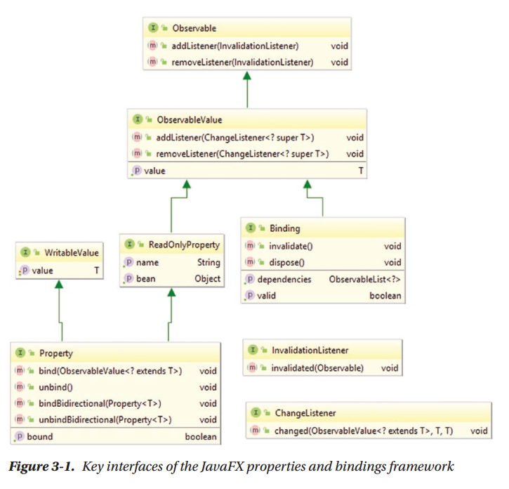

Chapter 3: Properties and Bindings
^^^^^^^^^^^^^^^^^^^^^^^^^^^^^^^^^^^^^^^^^^

前两章为你介绍了客户端Java的宏观印象以及JavaFX基础。在本章中，我们深入绑定与属性框架，JavaFX的组成部分，配合声明式UI语言FXML与可视化UI设计器Scene Builder，使得JavaFX桌面与移动客户端应用更为优雅与易于编写。

javafx.base模块是JavaFX属性与绑定框架的源。它导出下列包：

* javafx.beans
* javafx.beans.binding
* javafx.beans.property
* javafx.beans.property.adapter
* javafx.beans.value
* javafx.collections
* javafx.collections.transformation
* javafx.event
* javafx.util
* javafx.util.converter

我们将会关注于javafx.beans与javafx.collections包及其子包。

关键概念
================

属性与绑定API的核心是为我们要讨论的两个核心概念：property与binding，赋予生命的接口集合。图3-1展示了这些接口。

Observable与InvalidationListener
~~~~~~~~~~~~~~~~~~~~~~~~~~~~~~~~~~~~~~~~~

Observalbe接口允许你将InvalidationListener注册到Property或Binding，从而当Property或Bindig变为invalidated时，你会得到通知。当Property使用其set()或setValue()方法使用一个不同于当前值的值进行调用时，Property会为无效。当Binding的invalidate()方法被调用或是其依赖变为无效时，Binding变为无效。InvalidationListener中的回调方法具有下列签名，允许你访问Observable对象的引用：

.. code::

    void invalidated(Observable observable);

ObservableValue与ChangeListener
~~~~~~~~~~~~~~~~~~~~~~~~~~~~~~~~~~~~~~~~

ObservableValue接口允许你将ChangeListener注册到Property或Binding，从而你在Property或Binding由一个值变化到另一个值时接收到通知。通知以ChangeListener中回调方法的形式到达，其方法签名如下，允许你访问值已发生变化的属性或绑定的引用，以及旧值和新值：

.. code::

    void changed(ObservableValue<? extends T> observable,
    T oldValue, T newValue)

WritableValue与ReadOnlyProperty
~~~~~~~~~~~~~~~~~~~~~~~~~~~~~~~~~~~~~~~~

WritableValue接口为Property提供了setValue()方法。ReadOnlyProperty接口向Property插入两个方法：返回存放属性的getBean()方法以及返回属性描述性名字的getName()方法。如果属性并不是较大对象的一部分或者描述性名字并不重要时，两个方法均返回空。

JavaFX属性
~~~~~~~~~~~~~~~~~~~

有了前面这些基础，我们最终来了解一下Property接口。它提供了五个方法：

.. code::

    void bind(ObservableValue<? extends T> observable);
    void unbind();
    boolean isBound();
    void bindBidirectional(Property<T> other);
    void unbindBidirectional(Property<T> other);

bind()方法建立Property与ObservableValue之间的单向绑定。unbind()方法释放此绑定。而isBound()方法报告单向绑定是否起作用。一旦起作用，单向绑定建立了前者与后者之间的依赖。Property上的set()或setValue()方法将会抛出RuntimeException，而get()或getValue()方法将会返回ObservableValue的值。

bindBidirectional()方法建立两个Property对象之间的双向绑定。unbindBidirectional()方法释放此绑定。一旦起作用，在任意一个Property上调用set()或setValue()方法会导致两个对象的值都被更新。

总结一下目前为止我们的讨论，我们可以看到，Property可以存放一个值，当其值发生变化时可以通知其它对象，可以被绑定到其它对象来反映被绑定对象的值。列表3-1展示了一个使用这些功能的简单程序。

.. code::

    Listing 3-1. PropertiesExample.java

    package org.modernclient;

    import javafx.beans.InvalidationListener;
    import javafx.beans.property.IntegerProperty;
    import javafx.beans.property.SimpleIntegerProperty;
    import javafx.beans.value.ChangeListener;

    /**
    *
    * @author user
    */
    public class PropertiesExample {

        private static IntegerProperty i1;

        public static void main(String[] args) {
            createProperty();
            addAndRemoveInvalidationListener();
            addAndRemoveChangeListener();
            bindAndUnbindOnePropertyToAnother();
        }

        private static void createProperty() {
            System.out.println();
            i1 = new SimpleIntegerProperty(1024);
            System.out.println("i1 = " + i1);
            System.out.println("i1.get() = " + i1.get());
            System.out.println("i1.getValue() = " + i1.getValue());
        }

        private static void addAndRemoveInvalidationListener() {
            System.out.println();
            final InvalidationListener invalidationListener
                    = observable -> {
                        System.out.println("The observable has been invalidated: " + observable + ".");
                    };

            i1.addListener(invalidationListener);
            System.out.println("Added invalidation listener.");

            System.out.println("Calling i1.set(2048)");
            i1.set(2048);

            System.out.println("Call i1.setValue(3072).");
            i1.setValue(3072);

            i1.removeListener(invalidationListener);
            System.out.println("Removed invalidation listener.");

            System.out.println("Calling i1.set(4096).");
            i1.set(4096);
        }

        private static void addAndRemoveChangeListener() {
            System.out.println();
            final ChangeListener<Number> changeListener
                    = (observableValue, oldValue, newValue) -> {
                        System.out.println("The observableValue has changed: oldValue = " + oldValue + ", newValue = " + newValue);
                    };

            i1.addListener(changeListener);
            System.out.println("Added change listener.");

            System.out.println("Calling i1.set(5120).");
            i1.set(5120);

            i1.removeListener(changeListener);
            System.out.println("Removed change listener.");

            System.out.println("Calling i1.set(6144).");
            i1.set(6144);
        }

        private static void bindAndUnbindOnePropertyToAnother() {
            System.out.println();

            IntegerProperty i2 = new SimpleIntegerProperty(0);
            System.out.println("i2.get() = " + i2.get());
            
            System.out.println("Binding i2 to i1.");
            i2.bind(i1);
            System.out.println("i2.get() = " + i2.get());
            
            System.out.println("Calling i1.set(7168).");
            i1.set(7168);
            System.out.println("i2.get() = " + i2.get());
            
            System.out.println("Unbinding i2 from i1.");
            i2.unbind();
            System.out.println("i2.get() = " + i2.get());
            
            System.out.println("Calling i1.set(8192).");
            i1.set(8192);
            System.out.println("i2.get() = " + i2.get());
        }
    }

此程序是自解释性的，而且你可以在头脑中想像它是如何执行的。在程序中，我们使用一个抽象类IntegerProperty及其具体实现SimpleInterProperty。它存放一个基础int值。

列表3-2展示了双向绑定的工作。

.. code::

    Listing 3-2. BidirectionalBindingExample.java

    package org.modernclient;

    import javafx.beans.property.SimpleStringProperty;
    import javafx.beans.property.StringProperty;

    /**
    *
    * @author user
    */
    public class BidirectionalBingExample {
        public static void main(String[] args) {
            System.out.println("Constructing two StringProperty objects.");
            StringProperty prop1 = new SimpleStringProperty();
            StringProperty prop2 = new SimpleStringProperty();
            
            System.out.println("Calling bindBidirectional.");
            prop2.bindBidirectional(prop1);
            
            System.out.println("prop1.isBound() = " + prop1.isBound());
            System.out.println("prop2.isBound() = " + prop2.isBound());
            
            System.out.println("Calling prop1.set(\"prop1 says: Hi\")");
            prop1.set("prop1 says: Hi");
            System.out.println("prop2.get() returned: ");
            System.out.println(prop2.get());
            
            System.out.println("Calling prop2.set(prop2.get() + \"\\nprop2 says: Bye!\")");
            prop2.set(prop2.get() + "\nprop2 says: Bye!");
            System.out.println("prop1.get() returned: ");
            System.out.println(prop1.get());
        }
    }

创建绑定
==============

在上节内容中我们探讨了JavaFX属性与绑定框架的主要接口。同时我们了解了Property对象的基础。在本节中，我们关注框架的另一半并探讨Binding。

JavaFX绑定
~~~~~~~~~~~~~~~~~~~~

Binding接口提供了四个方法：

.. code::

    boolean isValid();
    void invalidate();
    ObservableList<?> getDependencies();
    void dispose();

Binding的validity可以通过isValid()方法查询并使用invalidate()方法设置。它有一个依赖列表，可以通过getDependencies()方法来获取。最后，dispose()方法通知绑定不会再被用到，而其所占用的资源可以被清理。

所以，Binding表示一个有多个依赖的单向绑定。每个依赖可以向Binding发送失效事件，从而使其无效。当通过get()或是getValue()调用查询Binding的值时，如果其有效，它的值会依据依赖的值进行重新计算。该值会被缓存并用于后续的值查询中，直到Binding再次变为无效。这种延迟值计算是JavaFX属性与绑定框架高效的原因。关联ChangeListener可以强制急切计算。

由于一个绑定可以用作另一个绑定的依赖，从而可以构建复杂的绑定树。这是JavaFX属性与绑定框架的另一个强大来源。

不同于属性，框架并没有提供具体的绑定类。所以，所有的绑定均为自定义绑定，并且有多种方法来创建绑定：

* 扩展一个抽象基类，例如DoubleBinding。
* 使用实用类Bindings中的工厂方法。
* 使用属性与绑定类中的流式API。

通过直接扩展创建绑定
~~~~~~~~~~~~~~~~~~~~~~~~~

列表3-3展示了通过直接扩展DoubleBinding创建绑定并用其计算矩形面积。

.. code::

    Listing 3-3. DirectExtensionExample.java

    package org.modernclient;

    import javafx.beans.binding.DoubleBinding;
    import javafx.beans.property.DoubleProperty;
    import javafx.beans.property.SimpleDoubleProperty;

    /**
    *
    * @author user
    */
    public class DirectExtensionExample {
        public static void main(String[] args) {
            System.out.println("Constructing x with value 2.0.");
            final DoubleProperty x = new SimpleDoubleProperty(null, "x", 2.0);
            
            System.out.println("Constructing y with value 3.0");
            final DoubleProperty y = new SimpleDoubleProperty(null, "y", 3.0);
            
            System.out.println("Creating binding area with dependencies x and y.");
            DoubleBinding area = new DoubleBinding() {
                {
                    super.bind(x, y);
                }

                @Override
                protected double computeValue() {
                    System.out.println("computeValue() is called.");
                    return x.get() * y.get();
                }
            };
            
            System.out.println("area.get() = " + area.get());
            
            System.out.println("area.get() = " + area.get());
            
            System.out.println("Setting x to 5");
            x.set(5);
            
            System.out.println("Setting y to 7");
            y.set(7);
            
            System.out.println("area.get() = " + area.get());
        }
    }

在这里我们扩展DoubleBinding类，并通过重写其唯一的抽象方法computeValue()来计算边长分别为x与y的矩形的面积。我们同时调用超类的bind()方法来使得属性x与y成为我们的依赖。

运行此程序会在控制台得到下面的输出：

.. code::

    Constructing x with value 2.0.
    Constructing y with value 3.0.
    Creating binding area with dependencies x and y.
    computeValue() is called.
    area.get() = 6.0
    area.get() = 6.0
    Setting x to 5
    Setting y to 7
    computeValue() is called.
    area.get() = 35.0

注意，当我们在一行中调用两次area.get()时，computeValue()仅被计算一次。

类型特化
===============

在我们了解创建绑定的下一种方法之前，我们需要使你了解关于关键接口及其类型特化的泛型属性的细节。

本章前面的示例包含类似IntegerProperty，StringProperty与DoubleBinding这样的类。它们是泛型工Property<T>与Bindings<T>的特化类。由于Java的基础类型与引用类型之间的差别，泛型类型的直接使用，例如Property<Integer>，当使用基础类型时会发生装箱与拆箱的低效率。为了避免这种代价，为基础类型boolean，int，long，float与double值构建了泛型类型的类型特定特化，这样当其get()或set()方法被调用时，以及执行内部计算时，基础类型不会被装箱与拆箱。出于统一的原因，同样为String与Object引用类型构建了类似的特化。这正是BooleanProperty，IntegerProperty，LongProperty，FloatProperty，DoubleProperty，StringProperty以及ObjectProperty类存在的原因。

这些类型特定的特化的另一方面在于对于数值基础类型的特化是使用Number作为类型参数来派生的。而特定的结果则是任意的数值属性可以在其它的数值属性或绑定上调用bind()。列表3-4展示了一个示例程序。

.. code::

    Listing 3-4. NumbericPropertiesExample.java

    package org.modernclient;

    import javafx.beans.property.DoubleProperty;
    import javafx.beans.property.FloatProperty;
    import javafx.beans.property.IntegerProperty;
    import javafx.beans.property.LongProperty;
    import javafx.beans.property.SimpleDoubleProperty;
    import javafx.beans.property.SimpleFloatProperty;
    import javafx.beans.property.SimpleIntegerProperty;
    import javafx.beans.property.SimpleLongProperty;

    /**
    *
    * @author user
    */
    public class NumericPropertiesExample {
        public static void main(String[] args) {
            IntegerProperty i = new SimpleIntegerProperty(null, "i", 1024);
            LongProperty l = new SimpleLongProperty(null, "l", 0L);
            FloatProperty f = new SimpleFloatProperty(null, "f", 0.0F);
            DoubleProperty d = new SimpleDoubleProperty(null, "d", 0.0);
            
            System.out.println("Constructed numerical properties i, l, f, d.");
            
            System.out.println("i.get() = " + i.get());
            System.out.println("l.get() = " + l.get());
            System.out.println("f.get() = " + f.get());
            System.out.println("d.get() = " + d.get());
            
            l.bind(i);
            f.bind(l);
            d.bind(f);
            System.out.println("Bound l to i, f to l, d to f.");
            
            System.out.println("i.get() = " + i.get());
            System.out.println("l.get() = " + l.get());
            System.out.println("f.get() = " + f.get());
            System.out.println("d.get() = " + d.get());
            
            System.out.println("Calling i.set(2048).");
            i.set(2048);
            
            System.out.println("i.get() = " + i.get());
            System.out.println("l.get() = " + l.get());
            System.out.println("f.get() = " + f.get());
            System.out.println("d.get() = " + d.get());
            
            d.unbind();
            f.unbind();
            l.unbind();
            System.out.println("Unbound l to i, f to l, d to f.");
            
            f.bind(d);
            l.bind(f);
            i.bind(l);
            System.out.println("Bound f to d, l to f, i to l.");
            
            System.out.println("Calling d.set(10000000000L).");
            d.set(10000000000L);
            
            System.out.println("i.get() = " + i.get());
            System.out.println("l.get() = " + l.get());
            System.out.println("f.get() = " + f.get());
            System.out.println("d.get() = " + d.get());
        }
    }

运行此程序会得到下面的输出：

.. code::

    Constructed numerical properties i, l, f, d.
    i.get() = 1024
    l.get() = 0
    f.get() = 0.0
    d.get() = 0.0
    Bound l to i, f to l, d to f.
    i.get() = 1024
    l.get() = 1024
    f.get() = 1024.0
    d.get() = 1024.0
    Calling i.set(2048).
    i.get() = 2048
    l.get() = 2048
    f.get() = 2048.0
    d.get() = 2048.0
    Unbound l to i, f to l, d to f.
    Bound f to d, l to f, i to l.
    Calling d.set(10000000000L).
    d.get() = 1.0E10
    f.get() = 1.0E10
    l.get() = 10000000000
    i.get() = 1410065408

Bindings中的工厂方法
==========================

Bindings类包含200多个工厂方法，可以由已有的可观察值或普通值生成的绑定。这些方法被重载以考虑参数类型的组合。

add()，subtract()，multiply()与divide()方法由两个数值值创建一个数值绑定，其中至少一个是可观察的值。列表3-5中的程序展示了其使用。它使用下面的公式

.. code::

    area = (x1*y2 + x2*y3 + x3*y1 – x1*y3 - x2*y1 – x3*y2)/2

计算顶点为(x1,y1)，(x2,y2)以及(x3,y3)的三角形的面积。

.. code::

    Listing 3-5. TriangleAreaExample.java

    package org.modernclient;

    import javafx.beans.binding.Bindings;
    import javafx.beans.binding.NumberBinding;
    import javafx.beans.property.IntegerProperty;
    import javafx.beans.property.SimpleIntegerProperty;

    /**
    *
    * @author user
    */
    public class TriangleAreaExample {
        public static void main(String[] args) {
            IntegerProperty x1 = new SimpleIntegerProperty(0);
            IntegerProperty y1 = new SimpleIntegerProperty(0);
            IntegerProperty x2 = new SimpleIntegerProperty(0);
            IntegerProperty y2 = new SimpleIntegerProperty(0);
            IntegerProperty x3 = new SimpleIntegerProperty(0);
            IntegerProperty y3 = new SimpleIntegerProperty(0);
            
            final NumberBinding x1y2 = Bindings.multiply(x1, y2);
            final NumberBinding x2y3 = Bindings.multiply(x2, y3);
            final NumberBinding x3y1 = Bindings.multiply(x3, y1);
            final NumberBinding x1y3 = Bindings.multiply(x1, y3);
            final NumberBinding x2y1 = Bindings.multiply(x2, y1);
            final NumberBinding x3y2 = Bindings.multiply(x3, y2);
            
            final NumberBinding sum1 = Bindings.add(x1y2, x2y3);
            final NumberBinding sum2 = Bindings.add(sum1, x3y1);
            final NumberBinding sum3 = Bindings.add(sum2, x3y1);
            final NumberBinding diff1 = Bindings.subtract(sum3, x1y3);
            final NumberBinding diff2 = Bindings.subtract(diff1, x2y1);
            final NumberBinding determinant = Bindings.subtract(diff2, x3y2);
            final NumberBinding area = Bindings.divide(determinant, 2.0D);
            
            x1.set(0); y1.set(0);
            x2.set(6); y2.set(0);
            x3.set(4); y3.set(3);
            
            printResult(x1, y1, x2, y2, x3, y3, area);
            
            x1.set(1);  y1.set(0);
            x2.set(2);  y2.set(2);
            x3.set(0);  y3.set(1);
            
            printResult(x1, y1, x2, y2, x3, y3, area);
        }

        private static void printResult(
                IntegerProperty x1, 
                IntegerProperty y1, 
                IntegerProperty x2, 
                IntegerProperty y2, 
                IntegerProperty x3, 
                IntegerProperty y3, 
                NumberBinding area) {
            System.out.println("For A(" +
                    x1.get() + ", " + y1.get() + "), B(" +
                    x2.get() + ", " + y2.get() + "), C(" +
                    x3.get() + ", " + y3.get() + "), the area of triangle ABC is " +
                    area.getValue());
        }
    }

运行此程序会在控制台得到下面的输出：

.. code::

    For A(0,0), B(6,0), C(4,3), the area of triangle ABC is 9.0
    For A(1,0), B(2,2), C(0,1), the area of triangle ABC is 1.5

Bindings中的其它工厂方法包含逻辑操作符and()，or()与not()；数值操作数min()，max()与negate()；空检测操作符isNull()与;isNotNull()；字符串操作符length()，isEmpty()与isNotEmpty()；以及关系操作符equal()，equalIgnoreCase()，greaterThan()，greaterThanOrEqual()，lessThan()，;lessThanOrEqual()，notEqual()与;notEuqalIgnoreCase()。这些方法的名字是自描述的，而它们的操作正是你所认为的那样。例如，要确保只有当接受者被选中且输入的数量大于零时，第二个money按钮被允许时，我们可以编写

.. code::

    sendBtn.disableProperty().bind(Bindings.not(
    Bindings.and(recipientSelected,
    Bindings.greaterThan(amount, 0.0))));

存在一个名为createDoubleBinding()等的工厂方法集合允许你由Callable与依赖集合创建绑定。我们在列表3-3中所创建的DoubleBinding可以简化为

..code::

    DoubleBinding area = Bindings.createDoubleBinding(() -> {
    return x.get() * y.get();
    }, x, y);

convert()，concate()与多个重载的format()方法可以用来将非字符的可观察值转换可观察的字符串值，将多个可观察的字符串连接在一起，以及将可观察的数值值或日期值格式化为可观察的字符串值。要在Label中显示温度值，我们可以使用下面的绑定：

.. code::

    tempLbl.textProperty().bind(Bindings.format("%2.1f \u00b0C",
    temperature));

随着温度属性值的变化，温度的格式化字符串表示会随着变化。例如，当tempeerature为37.5时，标签显示37.5。

存在名为select()与selectInteger()等的工厂方法集合作用于JavaFX Bean上，Java类遵循JavaFX Bean约定。还有一些方法作用于可观察的集合上，可观察的内容并不包含单个值，而不是List，Map，Set或元素数组。我们在本章的后续章节中讨论。

使用流式API创建绑定
==========================

流式API由一组协作的类构成，其方法被设计为以一种方法链的形式链接在一起，当大声读出时，以一种类似散文的语句描述了它们执行的操作。创建绑定的流式API被嵌入到类的InterExpression系列中。这些表达式类是属性类与绑定类的超类。所以，流式API方法可以由熟悉的属性与绑定类得到。你可以通过浏览表达式类的Javadoc来感受这些方法。而通常，它们反映了必须要提供的Bindings类。下面是使用流式API构建的示例：

.. code::

    recipientSelected.and(amount.greaterThan(0.0)).not()
    temperature.asString("%2.1f \u00b0C")

它们等同于我们在前面的内容中使用Bindings类的工厂方法构建的绑定。

在这里值得指出的一个事实是，用于类型特定数值表达式的方法定义在NumberExpression基接口中，返回NumberBinding类型，并且在类型特定的表达式中以相同的参数签名进行重载，并返回一个更为特定的返回类型。这被称为covariant return-type overriding，是Java5之后的一种Java语言特性。这一事实的一个结果在于使用流式API构建的数值绑定要比使用Bindings类中的工厂方法构建的绑定具有更有特定的类型。

列表3-6展示了列表3-5中三角形面积的流式API版本。

.. code::

    Listing 3-6. TriangleAreaFluentExample.java

    package org.modernclient;

    import javafx.beans.binding.Bindings;
    import javafx.beans.binding.NumberBinding;
    import javafx.beans.binding.StringExpression;
    import javafx.beans.property.IntegerProperty;
    import javafx.beans.property.SimpleIntegerProperty;

    /**
    *
    * @author user
    */
    public class TriangleAreaFluentExample {
        public static void main(String[] args) {
            IntegerProperty x1 = new SimpleIntegerProperty(0);
            IntegerProperty y1 = new SimpleIntegerProperty(0);
            IntegerProperty x2 = new SimpleIntegerProperty(0);
            IntegerProperty y2 = new SimpleIntegerProperty(0);
            IntegerProperty x3 = new SimpleIntegerProperty(0);
            IntegerProperty y3 = new SimpleIntegerProperty(0);
            
            final NumberBinding area = x1.multiply(y2)
                    .add(x2.multiply(y3))
                    .add(x3.multiply(y1))
                    .subtract(x1.multiply(y3))
                    .subtract(x2.multiply(y1))
                    .subtract(x3.multiply(y2))
                    .divide(2.0D);
            
            StringExpression output = Bindings.format("For A(%d,%d), B(%d,%d), C(%d,%d), the area of triangle ABC is %3.1f", x1, y1, x2, y2, x3, y3, area);
            
            x1.set(0); y1.set(0);
            x2.set(6); y2.set(0);
            x3.set(4); y3.set(3);
            
            System.out.println(output.get());
            
            x1.set(1); y1.set(0);
            x2.set(2); y2.set(2);
            x3.set(0); y3.set(1);
            
            System.out.println(output.get());
        }
    }

运行此程序会在控制台得到如下输出：

.. code::

    For A(0,0), B(6,0), C(4,3), the area of triangle ABC is 9.0
    For A(1,0), B(2,2), C(0,1), the area of triangle ABC is 1.5

类When允许你在流式API中表达if/then/else逻辑。你可以使用构建器或Bindings类中的when()工厂方法，传递ObservableBooleanValue构建此类的对象。在When对象上重载then()方法返回嵌套条件构建器类的对象，它有一个重载的otherwise()方法返回一个绑定对象。这允许你以下面的方式进行构建：

.. code::

    new When(condition).then(result).otherwise(alternative)

在这里，ObservableBooleanValue中的condition，以及result与alternative是相似类型，并且可观察或不可观察。结果绑定的类型类似于result与alternative的类型。

列表3-7展示了此API的使用。在这里，我们使用Heron公式计算边为a，b与c的三角形面积

.. code::

    area = sqrt(s * (s – a) * (s – b) * (s – c))

其中

.. code::

    s = (a + b + c) / 2 

回想一下，在三角形中，两边之和大于第三边。

.. code::

    Listing 3-7. HeronsFormulaExample.java

    package org.modernclient.propertiesandbindings;

    import javafx.beans.binding.DoubleBinding;
    import javafx.beans.binding.When;
    import javafx.beans.property.DoubleProperty;
    import javafx.beans.property.SimpleDoubleProperty;

    /**
    *
    * @author user
    */
    public class HeronsFormulaExample {
        public static void main(String[] args) {
            DoubleProperty a = new SimpleDoubleProperty(0);
            DoubleProperty b = new SimpleDoubleProperty(0);
            DoubleProperty c = new SimpleDoubleProperty(0);
            
            DoubleBinding s = a.add(b).add(c).divide(2.0d);
            
            final DoubleBinding areaSquared = new When(
                    a.add(b).greaterThan(c)
                            .and(b.add(c).greaterThan(a))
                            .and(c.add(a).greaterThan(b)))
                    .then(s.multiply(s.subtract(a))
                            .multiply(s.subtract(b))
                            .multiply(s.subtract(c)))
                    .otherwise(0.0D);
            
            a.set(3);
            b.set(4);
            c.set(5);
            
            System.out.printf("Given sides a = %1.0f, "
                    + " b = %1.0f, and c = %1.0f, "
                    + " the area of the griangle is"
                    + " %3.2f\n", a.get(), b.get(), c.get(), Math.sqrt(areaSquared.get()));
            
            a.set(2);
            b.set(2);
            c.set(2);
            
            System.out.printf("Given sides a = %1.0f, "
                    + " b = %1.0f, and c = %1.0f, "
                    + " the area of the griangle is"
                    + " %3.2f\n", a.get(), b.get(), c.get(), Math.sqrt(areaSquared.get()));
        }
    }

运行此程序会在控制台得到如下输出：

.. code::

    Given sides a = 3, b = 4, and c = 5, the area of the triangle is 6.00
    Given sides a = 2, b = 2, and c = 2, the area of the triangle is 1.73

应值得注意的是，流式API有其局限性。当关系变得更为复杂或是超出可用操作符时，直接扩展方法更为可取。列表3-8展示了解决与列表3-7中相同问题的程序。

.. code::

    Listing 3-8. HeronsFormulaDirectExtensionExample.java

    package org.modernclient.propertiesandbindings;

    import javafx.beans.binding.DoubleBinding;
    import javafx.beans.property.DoubleProperty;
    import javafx.beans.property.SimpleDoubleProperty;

    /**
    *
    * @author user
    */
    public class HeronsFormulaDirectExtensionExample {

        public static void main(String[] args) {
            final DoubleProperty a = new SimpleDoubleProperty(0);
            final DoubleProperty b = new SimpleDoubleProperty(0);
            final DoubleProperty c = new SimpleDoubleProperty(0);

            DoubleBinding area = new DoubleBinding() {
                {
                    super.bind(a, b, c);
                }

                @Override
                protected double computeValue() {
                    double a0 = a.get();
                    double b0 = b.get();
                    double c0 = c.get();

                    if ((a0 + b0 > c0) && (b0 + c0 > a0) && (c0 + a0 > b0)) {
                        double s = (a0 + b0 + c0) / 2.0D;
                        return Math.sqrt(s * (s - a0) * (s - b0) * (s - c0));
                    } else {
                        return 0.0D;
                    }
                }
            };

            a.set(3);
            b.set(4);
            c.set(5);
            System.out.printf("Given sides a = %1.0f, "
                    + " b = %1.0f, and c = %1.0f, "
                    + " the area of the griangle is"
                    + " %3.2f\n", a.get(), b.get(), c.get(), Math.sqrt(area.get()));

            a.set(2);
            b.set(2);
            c.set(2);

            System.out.printf("Given sides a = %1.0f, "
                    + " b = %1.0f, and c = %1.0f, "
                    + " the area of the griangle is"
                    + " %3.2f\n", a.get(), b.get(), c.get(), Math.sqrt(area.get()));
        }
    }

可观察集合
=====================

JavaFX在包javafx.collections与javafx.collections.transformation中提供了对可观察集合的支持。

它们引入了四个额外的Observable的子接口来配合我们在本章前面内容中学习的ObservableValue接口。它们是ObservableList，ObservableMap，ObservableSet与ObservableArray。可观察的list，map与set同时分别扩展自Lisp，Map与Set Java集合框架的接口，因而可以像普通集合那样使用。由于它们只存放装箱的基础类型值，因而不需要类型特定的特化。与之相对，可观察的数组存放一个内部数组，因而有用于int与float类型的类型特定的特化。它们用于JavaFX 3D API中。

这些接口的主要目的是允许你注册与反注册变化监听器。除此之外，ObservableList接口具有以更高效的方式操作可观察列表的额外的方法。ObservableMap与ObservableSet接口没有额外的方法。ObservableArray接口以及ObservableIntegerArray和ObservableFloatArray子接口具有操作这些可观察数组的方法。

FXCollections中的工厂与实用方法
~~~~~~~~~~~~~~~~~~~~~~~~~~~~~~~~~~~~~

FXCollections实用类包含用于创建可观察集合与数组的工厂方法。它们将工厂方法组织在java.util.Collections包中，所不同的是它们返回可观察的集合与数组。它们是通过系统提供的实例创建可观察集合与数组的唯一方法。

FXCollections实用类同时为操作其所创建的ObservableList对象提供了一些操作方法。这此方法包括copy()，fill()，replaceAll()，reverse()，rotate()，shuffle()与sort()方法。它们执行与对应的java.util.Collections相同的功能，所不同的是它们关注于最小化所生成的列表变化通知的数量。

列表3-9展示了FXCollections方法的用法。

.. code::

    Listing 3-9. FXCollectionsExample.java

    package org.modernclient.propertiesandbindings;

    import java.util.Arrays;
    import java.util.Comparator;
    import java.util.Random;
    import javafx.collections.FXCollections;
    import javafx.collections.ListChangeListener;
    import javafx.collections.MapChangeListener;
    import javafx.collections.ObservableFloatArray;
    import javafx.collections.ObservableList;
    import javafx.collections.ObservableMap;
    import javafx.collections.ObservableSet;
    import javafx.collections.SetChangeListener;

    /**
    *
    * @author user
    */
    public class FXCollectionsExample {

        public static void main(String[] args) {
            ObservableList<String> list = FXCollections.observableArrayList();
            ObservableMap<String, String> map = FXCollections.observableHashMap();
            ObservableSet<Integer> set = FXCollections.observableSet();
            ObservableFloatArray array = FXCollections.observableFloatArray();

            list.addListener((ListChangeListener<String>) c -> {
                System.out.println("\tlist = " + c.getList());
            });

            map.addListener((MapChangeListener<String, String>) c -> {
                System.out.println("\tmap = " + c.getMap());
            });

            set.addListener((SetChangeListener<Integer>) c -> {
                System.out.println("\tset = " + c.getSet());
            });

            array.addListener((observableArray, sizeChanged, from, to) -> {
                System.out.println("\tarray = " + observableArray);
            });

            manipulateList(list);
            manipulateMap(map);
            manipulateSet(set);
            manipulateArray(array);
        }

        private static void manipulateList(ObservableList<String> list) {
            System.out.println("Calling list.addAll(\"Zero\","
                    + " \"One\", \"Two\", \"Three\"):");
            list.addAll("Zero", "One", "Two", "Three");
            
            System.out.println("Calling copy(list,"
                    + " Arrays.asList(\"Four\", \"Five\")):");
            FXCollections.copy(list,
                    Arrays.asList("Four", "Five"));
            
            System.out.println("Calling replaceAll(list,"
                    + " \"Two\", \"Two_1\"):");
            FXCollections.replaceAll(list, "Two", "Two_1");
            
            System.out.println("Calling reverse(list):");
            FXCollections.reverse(list);
            
            System.out.println("Calling rotate(list, 2):");
            FXCollections.rotate(list, 2);
            
            System.out.println("Calling shuffle(list):");
            FXCollections.shuffle(list);

            System.out.println("Calling shuffle(list,"
                    + " new Random(0L)):");
            FXCollections.shuffle(list, new Random(0L));
            
            System.out.println("Calling sort(list):");
            FXCollections.sort(list);
            
            System.out.println("Calling sort(list, c)"
                    + " with custom comparator: ");
            FXCollections.sort(list, new Comparator<String>() {
                @Override
                public int compare(String lhs, String rhs) {
                    // Reverse the order
                    return rhs.compareTo(lhs);
                }
                
            });
            
            System.out.println("Calling fill(list,"
                    + " \"Ten\"): ");
            FXCollections.fill(list, "Ten");
        }

        private static void manipulateMap(ObservableMap<String, String> map) {
            System.out.println("Calling map.put(\"Key\","
                    + " \"Value\"):");
            map.put("Key", "Value");
        }

        private static void manipulateSet(ObservableSet<Integer> set) {
            System.out.println("Calling set.add(1024):");
            set.add(1024);
        }

        private static void manipulateArray(ObservableFloatArray array) {
            System.out.println("Calling array.addAll(3.14159f,"
                    + " 2.71828f):");
            array.addAll(3.14159f, 2.71828f);
        }
    }

在这里，我们使用FXCollections工厂方法创建了一个可观察列表，一个可观察映射，一个可观察集合以及一个可观察数组，向其关联监听器，并以某种方式进行操作，包括用于列表的FXCollections实用方法以及用于ObservableFloatArray方法。

运行此程序会在控制台得到如下输出：

.. code::

    Calling list.addAll("Zero", "One", "Two", "Three"):
        list = [Zero, One, Two, Three]
    Calling copy(list, Arrays.asList("Four", "Five")):
        list = [Four, Five, Two, Three]
    Calling replaceAll(list, "Two", "Two_1"):
        list = [Four, Five, Two_1, Three]
    Calling reverse(list):
        list = [Three, Two_1, Five, Four]
    Calling rotate(list, 2):
        list = [Five, Four, Three, Two_1]
    Calling shuffle(list):
        list = [Two_1, Five, Three, Four]
    Calling shuffle(list, new Random(0L)):
        list = [Four, Two_1, Five, Three]
    Calling sort(list):
        list = [Five, Four, Three, Two_1]
    Calling sort(list, c) with custom comparator: 
        list = [Two_1, Three, Four, Five]
    Calling fill(list, "Ten"): 
        list = [Ten, Ten, Ten, Ten]
    Calling map.put("Key", "Value"):
        map = {Key=Value}
    Calling set.add(1024):
        set = [1024]
    Calling array.addAll(3.14159f, 2.71828f):
        array = [3.14159, 2.71828]

可观察集合的变化监听器
~~~~~~~~~~~~~~~~~~~~~~~~~~~~~~~~~~

ObservableList，ObservableMap，ObservableSet以及ObservableArray接口提供了addListener()与removeListener()方法注册与反注册监听器，来得到底层集合或数组的变化通知。对应的ListChangeListener，MapChangeListener与SetChangeListener接口具有onChanged()回调方法，其参数是一个嵌套Change类。ArrayChangeListener接口有一个带有显式参数的onChanged()回调方法。

列表3-10展示了操作ObservableList<String>并以Lambda方式实现的在关联ListChangeListener查询对应Change对象的程序。

.. code::

    Listing 3-10. ObservableListExample.java

    package org.modernclient.propertiesandbindings;

    import java.util.Arrays;
    import java.util.Iterator;
    import java.util.List;
    import javafx.beans.Observable;
    import javafx.collections.FXCollections;
    import javafx.collections.ObservableList;

    import static javafx.collections.ListChangeListener.Change;

    /**
    *
    * @author user
    */
    public class ObservableListExample {

        public static void main(String[] args) {
            ObservableList<String> strings = FXCollections.observableArrayList();

            strings.addListener((Observable observable) -> {
                System.out.println("\tlist invalidated");
            });
            
            strings.addListener((Change<? extends String> change) -> {
                System.out.println("\tstrings = "
                        + change.getList());
            });
            
            System.out.println("Calling add(\"First\"): ");
            strings.add("First");
            
            System.out.println("Calling add(0, \"Zeroth\"): ");
            strings.add(0, "Zeroth");
            
            System.out.println("Calling addAll(\"Second\","
                    + " \"Third\"): ");
            strings.addAll("Second", "Third");
            
            System.out.println("Calling set(1,"
                    + " \"New First\"): ");
            strings.set(1, "New First");
            final List<String> list
                    = Arrays.asList("Second_1", "Second_2");
            
            System.out.println("Calling addAll(3, list): ");
            strings.addAll(3, list);
            
            System.out.println("Calling remove(2, 4): ");
            strings.remove(2, 4);
            final Iterator<String> iterator
                    = strings.iterator();
            while (iterator.hasNext()) {
                final String next = iterator.next();
                if (next.contains("t")) {
                    System.out.println("Calling remove()"
                            + " on iterator: ");
                    iterator.remove();
                }
            }
            
            System.out.println("Calling removeAll("
                    + "\"Third\", \"Fourth\"): ");
            strings.removeAll("Third", "Fourth");
        }
    }

运行此程序会在控制台得到如下输出：

.. code::

    Calling add("First"): 
        list invalidated
        strings = [First]
    Calling add(0, "Zeroth"): 
        list invalidated
        strings = [Zeroth, First]
    Calling addAll("Second", "Third"): 
        list invalidated
        strings = [Zeroth, First, Second, Third]
    Calling set(1, "New First"): 
        list invalidated
        strings = [Zeroth, New First, Second, Third]
    Calling addAll(3, list): 
        list invalidated
        strings = [Zeroth, New First, Second, Second_1, Second_2, Third]
    Calling remove(2, 4): 
        list invalidated
        strings = [Zeroth, New First, Second_2, Third]
    Calling remove() on iterator: 
        list invalidated
        strings = [New First, Second_2, Third]
    Calling remove() on iterator: 
        list invalidated
        strings = [Second_2, Third]
    Calling removeAll("Third", "Fourth"): 
        list invalidated
        strings = [Second_2]

ListChangeListener中的变化事件
:::::::::::::::::::::::::::::::::::::::

在上节内容中，我们只查询了ListChangeListener.Change对象的list属性，该属性引用被观察的list。此对象存储更多关于底层列表变化的信息。它表示一个或多个离散变化，其中的每个可以是元素被添加，元素被删除，元素被替换或是元素被重排。变化接口为你提供了方法来查询变化的所有方面。

next()与reset()方法控制在离散变化中迭代的光标。当onChange()被调用时，在第一个离散变化之前，光标被定位。一旦光标是一个合法的离散变化，wasAdded()，wasRemoved()，wasReplaced()以及wasPermuted()方法将会告诉你它是哪种离散类型。

一旦你知道光标所指向的离散变化时，你可以调用其它的方法来获取关于离散变化更为详细的信息。对于被添加的元素，你可以获取from（包含）与to（不包含）索引，addedSize以及addedSubList。对于被删除的元素，你可以获取元素被删除的from与to（与from相同）索引，removedSize与removed list。对于被替换的元素，可以将其看作是删除后添加，应同时检测添加与删除信息。对于被重排的元素，getPermutation(int i)方法将前面的索引映射到后面的索引。

列表3-11展示当变化事件被触发时输出Change对象细节的ListChangeListener的实现。

.. code::

    Listing 3-11. ListChangeEventExample.java

    package org.modernclient.propertiesandbindings;

    import javafx.collections.FXCollections;
    import javafx.collections.ListChangeListener;
    import javafx.collections.ObservableList;

    /**
    *
    * @author user
    */
    public class ListChangeEventExample {

        public static void main(String[] args) {
            ObservableList<String> strings
                    = FXCollections.observableArrayList();
            strings.addListener(new MyListener());
            System.out.println("Calling addAll(\"Zero\","
                    + " \"One\", \"Two\", \"Three\"): ");
            strings.addAll("Zero", "One", "Two", "Three");
            System.out.println("Calling"
                    + " FXCollections.sort(strings): ");
            FXCollections.sort(strings);
            System.out.println("Calling set(1, \"Three_1\"): ");
            strings.set(1, "Three_1");
            System.out.println("Calling setAll(\"One_1\","
                    + " \"Three_1\", \"Two_1\", \"Zero_1\"): ");
            strings.setAll("One_1", "Three_1", "Two_1", "Zero_1");
            System.out.println("Calling removeAll(\"One_1\","
                    + " \"Two_1\", \"Zero_1\"): ");
            strings.removeAll("One_1", "Two_1", "Zero_1");
        }

        private static class MyListener implements
                ListChangeListener<String> {

            @Override
            public void onChanged(
                    Change<? extends String> change) {
                System.out.println("\tlist = "
                        + change.getList());
                System.out.println(prettyPrint(change));
            }

            private String prettyPrint(
                    Change<? extends String> change) {
                StringBuilder sb
                        = new StringBuilder("\tChange event data:\n");
                int i = 0;
                while (change.next()) {
                    sb.append("\t\tcursor = ")
                            .append(i++)
                            .append("\n");
                    final String kind
                            = change.wasPermutated() ? "permutated"
                            : change.wasReplaced() ? "replaced"
                            : change.wasRemoved() ? "removed"
                            : change.wasAdded() ? "added"
                            : "none";
                    sb.append("\t\tKind of change: ")
                            .append(kind)
                            .append("\n");
                    sb.append("\t\tAffected range: [")
                            .append(change.getFrom())
                            .append(", ")
                            .append(change.getTo())
                            .append("]\n");
                    if (kind.equals("added")
                            || kind.equals("replaced")) {
                        sb.append("\t\tAdded size: ")
                                .append(change.getAddedSize())
                                .append("\n");
                        sb.append("\t\tAdded sublist: ")
                                .append(change.getAddedSubList())
                                .append("\n");
                    }
                    if (kind.equals("removed")
                            || kind.equals("replaced")) {
                        sb.append("\t\tRemoved size: ")
                                .append(change.getRemovedSize())
                                .append("\n");
                        sb.append("\t\tRemoved: ")
                                .append(change.getRemoved())
                                .append("\n");
                    }
                    if (kind.equals("permutated")) {
                        StringBuilder permutationSB
                                = new StringBuilder("[");
                        int from = change.getFrom();
                        int to = change.getTo();
                        for (int k = from; k < to; k++) {
                            int permutation
                                    = change.getPermutation(k);
                            permutationSB.append(k)
                                    .append("->")
                                    .append(permutation);
                            if (k < change.getTo() - 1) {
                                permutationSB.append(", ");
                            }
                        }
                        permutationSB.append("]");
                        String permutation
                                = permutationSB.toString();
                        sb.append("\t\tPermutation: ")
                                .append(permutation).append("\n");
                    }
                }
                return sb.toString();
            }
        }
    }

运行此程序会在控制台得到如下输出：

.. code::

    Calling addAll("Zero", "One", "Two", "Three"): 
        list = [Zero, One, Two, Three]
        Change event data:
            cursor = 0
            Kind of change: added
            Affected range: [0, 4]
            Added size: 4
            Added sublist: [Zero, One, Two, Three]

    Calling FXCollections.sort(strings): 
        list = [One, Three, Two, Zero]
        Change event data:
            cursor = 0
            Kind of change: permutated
            Affected range: [0, 4]
            Permutation: [0->3, 1->0, 2->2, 3->1]

    Calling set(1, "Three_1"): 
        list = [One, Three_1, Two, Zero]
        Change event data:
            cursor = 0
            Kind of change: replaced
            Affected range: [1, 2]
            Added size: 1
            Added sublist: [Three_1]
            Removed size: 1
            Removed: [Three]

    Calling setAll("One_1", "Three_1", "Two_1", "Zero_1"): 
        list = [One_1, Three_1, Two_1, Zero_1]
        Change event data:
            cursor = 0
            Kind of change: replaced
            Affected range: [0, 4]
            Added size: 4
            Added sublist: [One_1, Three_1, Two_1, Zero_1]
            Removed size: 4
            Removed: [One, Three_1, Two, Zero]

    Calling removeAll("One_1", "Two_1", "Zero_1"): 
        list = [Three_1]
        Change event data:
            cursor = 0
            Kind of change: removed
            Affected range: [0, 0]
            Removed size: 1
            Removed: [One_1]
            cursor = 1
            Kind of change: removed
            Affected range: [1, 1]
            Removed size: 2
            Removed: [Two_1, Zero_1]

MapChangeListener中的变化事件
::::::::::::::::::::::::::::::::::::

MapChangeListener.Change事件要比其对应的可观察的列表简单得多，因为它只反映一个键的变化。所以，不再需要next()与reset()方法。如果影响到多个键，将会触发多个变化事件。

wasAdded()与wasRemoved()方法指示一个键是否被添加或被删除。你总是可以获取被变化影响的键。如果一个键被添加，你可以获取valueAdded，而如果一个键被删除，你可以获取valueRemoved。

列表3-12展示操作可观察的映射并记录生成的变化事件的程序。

.. code::

    Listing 3-12. MapChangeEventExample.java

    package org.modernclient.propertiesandbindings;

    import java.util.HashMap;
    import java.util.Iterator;
    import java.util.Map;
    import javafx.collections.FXCollections;
    import javafx.collections.MapChangeListener;
    import javafx.collections.ObservableMap;

    /**
    *
    * @author user
    */
    public class MapChangeEventExample {

        public static void main(String[] args) {
            ObservableMap<String, Integer> map
                    = FXCollections.observableHashMap();
            map.addListener(new MyListener());
            System.out.println("Calling put(\"First\", 1): ");
            map.put("First", 1);
            System.out.println("Calling put(\"First\", 100): ");
            map.put("First", 100);
            Map<String, Integer> anotherMap = new HashMap<>();
            anotherMap.put("Second", 2);
            anotherMap.put("Third", 3);
            System.out.println("Calling putAll(anotherMap): ");
            map.putAll(anotherMap);
            Iterator<Map.Entry<String, Integer>> entryIterator
                    = map.entrySet().iterator();
            while (entryIterator.hasNext()) {
                final Map.Entry<String, Integer> next
                        = entryIterator.next();
                if (next.getKey().equals("Second")) {
                    System.out.println("Calling remove on"
                            + " entryIterator: ");
                    entryIterator.remove();
                }
            }
            final Iterator<Integer> valueIterator
                    = map.values().iterator();
            while (valueIterator.hasNext()) {
                final Integer next = valueIterator.next();
                if (next == 3) {
                    System.out.println("Calling remove on"
                            + " valueIterator: ");
                    valueIterator.remove();
                }
            }
        }

        private static class MyListener implements
                MapChangeListener<String, Integer> {

            @Override
            public void onChanged(
                    Change<? extends String, ? extends Integer> change) {
                System.out.println("\tmap = " + change.getMap());
                System.out.println(prettyPrint(change));
            }

            private String prettyPrint(
                    Change<? extends String, ? extends Integer> change) {
                StringBuilder sb
                        = new StringBuilder("\tChange event"
                                + " data:\n");
                sb.append("\t\tWas added: ")
                        .append(change.wasAdded())
                        .append("\n");
                sb.append("\t\tWas removed: ")
                        .append(change.wasRemoved())
                        .append("\n");
                sb.append("\t\tKey: ")
                        .append(change.getKey())
                        .append("\n");
                sb.append("\t\tValue added: ")
                        .append(change.getValueAdded())
                        .append("\n");
                sb.append("\t\tValue removed: ")
                        .append(change.getValueRemoved())
                        .append("\n");
                return sb.toString();
            }
        }
    }

SetChangeListener中的变化事件
:::::::::::::::::::::::::::::::::

SetChangeListener.Change事件要比可观察的映射更简单，因为当可观察的集合被修改时没有值被调用。

列表3-13展示了操作可观察的集合并记录生成的变化事件的程序。

.. code::

    Listing 3-13. SetChangeEventExample.java

    package org.modernclient.propertiesandbindings;

    import java.util.Arrays;
    import javafx.collections.FXCollections;
    import javafx.collections.ObservableSet;
    import javafx.collections.SetChangeListener;

    /**
    *
    * @author user
    */
    public class SetChangeEventExample {

        public static void main(String[] args) {
            ObservableSet<String> set
                    = FXCollections.observableSet();
            set.addListener(new MyListener());
            System.out.println("Calling add(\"First\"): ");
            set.add("First");
            System.out.println("Calling addAll("
                    + "Arrays.asList(\"Second\", \"Third\")): ");
            set.addAll(Arrays.asList("Second", "Third"));
            System.out.println("Calling remove("
                    + "\"Third\"): ");
            set.remove("Third");
        }

        private static class MyListener
                implements SetChangeListener<String> {

            @Override
            public void onChanged(Change<? extends String> change) {
                System.out.println("\tset = "
                        + change.getSet());
                System.out.println(prettyPrint(change));
            }

            private String prettyPrint(
                    Change<? extends String> change) {
                StringBuilder sb
                        = new StringBuilder("\tChange"
                                + " event data:\n");
                sb.append("\t\tWas added: ")
                        .append(change.wasAdded())
                        .append("\n");
                sb.append("\t\tWas removed: ")
                        .append(change.wasRemoved())
                        .append("\n");
                sb.append("\t\tElement added: ")
                        .append(change.getElementAdded())
                        .append("\n");
                sb.append("\t\tElement removed: ")
                        .append(change.getElementRemoved())
                        .append("\n");
                return sb.toString();
            }
        }
    }

ArrayChangeListener中的变化事件
:::::::::::::::::::::::::::::::::::::::

ArrayChangeListener中的onChanged()方法的签名如下：

.. code::

    public void onChanged(T observableArray,
        boolean sizeChanged, int from, int to);

作为许多数组的管理类，ObservableArray具有capacity与size。容量是底层数组的长度，而大小是包含应用数据的元素的数量。size总是小于等于capacity。ensureCapacity()方法将容量设置为一个指定的值，并在需要时重新分配底层数组。resize()方法修改size。如果新的size大小于旧的capacity，capacity会被增加。如果新的size大小于旧的size，其余的元素会被填充为零。如果新的size小于旧的size，丢失的元素会被填充为零。trimToSize()方法将capacity缩小为size。clear()方法将可观察的数组重新调整为大小为零。size()方法返回可观察数组的当前大小。

ObservableArray的类型特定特化，ObservableIntegerArray与ObservableFloatArray具有以类型特定的方式操作底层数组的重载方法。get()方法获取指定索引处的值。set()方法设置指定索引处的值或值的数组。addAll()方法将额外的元素添加到可观察的数组。setAll()方法替换可观察数组中的元素。toArray()方法返回以可观察数组填充的基础数组。get()与set()方法会抛出ArrayIndexOutOfBoundsException。

列表3-14展示了操作ObservableIntegerArray并显示变化通知的程序。

.. code::

    Listing 3-14. ArrayChangeEventExample.java

    package org.modernclient.propertiesandbindings;

    import javafx.collections.FXCollections;
    import javafx.collections.ObservableIntegerArray;

    /**
    *
    * @author user
    */
    public class ArrayChangeEventExample {

        public static void main(String[] args) {
            final ObservableIntegerArray ints
                    = FXCollections.observableIntegerArray(10, 20);
            ints.addListener((array,
                    sizeChanged, from, to) -> {
                StringBuilder sb
                        = new StringBuilder("\tObservable Array = ")
                                .append(array)
                                .append("\n")
                                .append("\t\tsizeChanged = ")
                                .append(sizeChanged).append("\n")
                                .append("\t\tfrom = ")
                                .append(from).append("\n")
                                .append("\t\tto = ")
                                .append(to)
                                .append("\n");
                System.out.println(sb.toString());
            });
            ints.ensureCapacity(20);
            System.out.println("Calling addAll(30, 40):");
            ints.addAll(30, 40);
            final int[] src = {50, 60, 70};
            System.out.println("Calling addAll(src, 1, 2):");
            ints.addAll(src, 1, 2);
            System.out.println("Calling set(0, src, 0, 1):");
            ints.set(0, src, 0, 1);
            System.out.println("Calling setAll(src):");
            ints.setAll(src);
            ints.trimToSize();
            final ObservableIntegerArray ints2
                    = FXCollections.observableIntegerArray();
            ints2.resize(ints.size());
            System.out.println("Calling copyTo(0, ints2,"
                    + " 0, ints.size()):");
            ints.copyTo(0, ints2, 0, ints.size());
            System.out.println("\tDestination = " + ints2);
        }
    }

程序的输出如下所示：

.. code::

    Calling addAll(30, 40):
        Observable Array = [10, 20, 30, 40]
            sizeChanged = true
            from = 2
            to = 4

    Calling addAll(src, 1, 2):
        Observable Array = [10, 20, 30, 40, 60, 70]
            sizeChanged = true
            from = 4
            to = 6

    Calling set(0, src, 0, 1):
        Observable Array = [50, 20, 30, 40, 60, 70]
            sizeChanged = false
            from = 0
            to = 1

    Calling setAll(src):
        Observable Array = [50, 60, 70]
            sizeChanged = true
            from = 0
            to = 3

    Calling copyTo(0, ints2, 0, ints.size()):
        Destination = [50, 60, 70]

为可观察的集合创建绑定
~~~~~~~~~~~~~~~~~~~~~~~~~~~~~~~~

Bindings实用类包含为可观察的集合创建绑定的工厂方法。

重载方法valueAt()，booleanValueAt()，integerValueAt()，longValueAt()，floatValueAt()，doubleValueAt()以及stringValueAt()为相同类型的集合创建相应类型的绑定，而相应类型的索引或键或者为可观察，或者为不可观察。

例如，如果authorizations是表示Person对象认证状态的ObservableMap<Person, Boolean>，而user是一个ObjectProperty<Person>对象，则booleanValueAt(authorizations, user)是表示user认证状态的BooleanBinding。

重载的bindContent()方法将一个不可观察的集合绑定到相同类型的可观察集合，以确保不可观察的集合与可观察的集合具有相同的内容。unbindContent()方法移除这样的内容绑定。重载的bindContentBidirectional()方法绑定两个相同类型的可观察集合，确保它们具有相同内容。unbindContentBidirectional()方法移除这样的双向内容绑定。

JavaFX Bean
=====================

在前面的内容中，我们介绍了单个JavaFX属性与可观察的集合。现在我们研究如何将其组织为一个更大的单元来形成更有意义的软件组件。

Java Beans概念几乎自始存在。它引入了三个体系结构概念：属性，事件与方法。方法在Java中比较直接。事件是通过监听器接口与事件对象来提供的，JavaFX控件依然使用。属性通过使用现在非常熟悉的getter与setter方法来提供。

JavaFX在getter与setter之外引入了JavaFX Bean概念，JavaFX Bean属性同时有属性getter。对于名为height的double类型属性，三个方法如下所示：

.. code::

    public final double getHeight();
    public final void setHeight(double height);
    public DoubleProperty heightProperty();

类似于传统属性使用相同类型的域来实现，JavaFX Bean属性通常使用相应Property类型的域来实现。由于这些属性是引用类型，对于拥有许多属性的JavaFX Bean，实质上会创建许多额外的对象。依据于使用模式，可以使用不同的策略来实现这些属性。

注意：只读JavaFX Bean属性可以使用getter与返回JavaFX属性只读版本的属性getter来定义。

急切实例化的属性
~~~~~~~~~~~~~~~~~~~~~~~~~

实现JavaFX Bean属性最简单的策略是急切实例化的属性策略。每个属性以在构建时实体化的相应的属性类型为基础。getter与setter只是简单地调用基础属性的get()与set()方法。属性getter返回基础属性本身。列表3-15展示了具有int，String，与Color属性的JavaFX Bean。

.. code::

    Listing 3-15. JavaFXBeanModelExample.java

    package org.modernclient.propertiesandbindings;

    import java.awt.Color;
    import javafx.beans.property.IntegerProperty;
    import javafx.beans.property.ObjectProperty;
    import javafx.beans.property.SimpleIntegerProperty;
    import javafx.beans.property.SimpleObjectProperty;
    import javafx.beans.property.SimpleStringProperty;
    import javafx.beans.property.StringProperty;

    /**
    *
    * @author user
    */
    public class JavaFXBeanModelExample {
        private IntegerProperty i = new SimpleIntegerProperty(this, "i", 0);
        private StringProperty str = new SimpleStringProperty(this, "str", "Hello");
        private ObjectProperty<Color> color = new SimpleObjectProperty<Color>(this, "color", Color.BLACK);
        
        public final int getI() {
            return i.get();
        }
        
        public final void setI(int i) {
            this.i.set(i);
        }
        
        public IntegerProperty iProperty() {
            return i;
        }
        
        public final String getStr() {
            return str.get();
        }
        
        public final void setStr(String str) {
            this.str.set(str);
        }
        
        public StringProperty strProperty() {
            return str;
        }
        
        public final Color getColor() {
            return color.get();
        }
        
        public final void setColor(Color color) {
            this.color.set(color);
        }
        
        public final ObjectProperty<Color> colorProperty() {
            return color;
        }
    }

注意，我们使用具有完全环境的属性构建器，包括bean，属性名以及初始化属性的初始值。

半延迟实例化的属性
~~~~~~~~~~~~~~~~~~~~~~~~~~~~~

如果setter与属性getter不会被访问，getter总是返回属性的默认值；而你不知道属性实例来了解这些。这是半延迟实体化策略的基础。在此策略中，仅当setter使用不同于默认值的值进行调用或是如果属性getter被调用时，属性才会被实例化。这种策略非常适合于有许多属性，而仅有一些被设置的JavaFX Beans。

列表3-16展示了这种策略的一个示例。

.. code::

    Listing 3-16. JavaFXBeanModelHalfLazyExample.java

    package org.modernclient.propertiesandbindings;

    import javafx.beans.property.SimpleStringProperty;
    import javafx.beans.property.StringProperty;

    /**
    *
    * @author user
    */
    public class JavaFXBeanModelHalfLazyExample {
        private static final String DEFAULT_STR = "Hello";
        private StringProperty str;
        
        public final String getStr() {
            if (str != null) {
                return str.get();
            } else {
                return DEFAULT_STR;
            }
        }
        
        public final void setStr(String str) {
            if ((this.str != null) || !(str.equals(DEFAULT_STR))) {
                strProperty().set(str);
            }
        }
        
        public StringProperty strProperty() {
            if (str == null) {
                str = new SimpleStringProperty(this, "str", DEFAULT_STR);
            }
            
            return str;
        }
    }

完全延迟实例化属性
~~~~~~~~~~~~~~~~~~~~~~~~~

深入思考一下半延迟实例化策略，我们会问自己，“我们真的需要在setter被调用时实例化属性吗？”答案当然是不。这导致了完全延迟实例化策略的出现。在此策略中，仅当属性getter被调用时，属性会被实例化。仅当属性对象已经被实例化时，getter与setter才会访问属性，否则它会访问单独的基础域。

列表3-17展示了这种策略的一个示例。

.. code::

    Listing 3-17. JavaFXBeanModelFullLazyExample.java

    package org.modernclient.propertiesandbindings;

    import javafx.beans.property.SimpleStringProperty;
    import javafx.beans.property.StringProperty;

    /**
    *
    * @author user
    */
    public class JavaFXBeanModelFullLazyExample {

        private static final String DEFAULT_STR = "Hello";
        private StringProperty str;
        private String _str = DEFAULT_STR;

        public final String getStr() {
            if (str != null) {
                return str.get();
            } else {
                return _str;
            }
        }

        public final void setStr(String str) {
            if (this.str != null) {
                this.str.set(str);
            } else {
                _str = str;
            }
        }

        public StringProperty strProperty() {
            if (str == null) {
                str = new SimpleStringProperty(this,
                        "str", DEFAULT_STR);
            }
            return str;
        }
    }

选择绑定
~~~~~~~~~~~~~~~~

现在我们理解了JavaFX Bean概念，我们可以回到Bindings实用类，并了解select()与selectInteger()等方法。其方法签名如下：

.. code::

    selectInteger(Object root, String... steps);

这些选择操作符允许你创建观察深度嵌套的JavaFX Bean属性的绑定。在这里，root是作用域内的对象引用，而每个step是指向下一个对象的对象的属性。

最好是使用示例来演示此概念。考虑类Lighting（位于javafx.scene.effect中）。它有一个名为light的Light类型属性。而Light有一个名为color的Color（位于javafx.scene.paint中）类型属性。列表3-18展示了一个访问root对象的light属性的color属性的选择绑定。

.. code::

    Listing 3-18. SelectBindingExample.java

    package org.modernclient.propertiesandbindings;

    import javafx.beans.binding.Bindings;
    import javafx.beans.binding.ObjectBinding;
    import javafx.beans.property.ObjectProperty;
    import javafx.beans.property.SimpleObjectProperty;
    import javafx.scene.effect.Light;
    import javafx.scene.effect.Lighting;
    import javafx.scene.paint.Color;

    /**
    *
    * @author user
    */
    public class SelectBindingExample {

        public static void main(String[] args) {
            ObjectProperty<Lighting> root
                    = new SimpleObjectProperty<>();
            final ObjectBinding<Color> colorBinding
                    = Bindings.select(root, "light", "color");
            colorBinding.addListener((o, oldValue, newValue)
                    -> System.out.println("\tThe color changed:\n"
                            + "\t\told color = " + oldValue
                            + ",\n\t\tnew color = " + newValue));
            
            System.out.println("firstLight is black.");
            Light firstLight = new Light.Point();
            firstLight.setColor(Color.BLACK);
            
            System.out.println("secondLight is white.");
            Light secondLight = new Light.Point();
            secondLight.setColor(Color.WHITE);
            
            System.out.println("firstLighting has firstLight.");
            Lighting firstLighting = new Lighting();
            firstLighting.setLight(firstLight);
            
            System.out.println("secondLighting has secondLight.");
            Lighting secondLighting = new Lighting();
            secondLighting.setLight(secondLight);
            
            System.out.println("Making root observe"
                    + " firstLighting.");
            root.set(firstLighting);
            
            System.out.println("Making root observe"
                    + " secondLighting.");
            root.set(secondLighting);
            
            System.out.println("Changing secondLighting's"
                    + " light to firstLight");
            secondLighting.setLight(firstLight);
            
            System.out.println("Changing firstLight's"
                    + " color to red");
            firstLight.setColor(Color.RED);
        }
    }

运行此程序会在控制台得到如下输出：

.. code::

    firstLight is black.
    secondLight is white.
    firstLighting has firstLight.
    secondLighting has secondLight.
    Making root observe firstLighting.
        The color changed:
            old color = null,
            new color = 0x000000ff
    Making root observe secondLighting.
        The color changed:
            old color = 0x000000ff,
            new color = 0xffffffff
    Changing secondLighting's light to firstLight
        The color changed:
            old color = 0xffffffff,
            new color = 0x000000ff
    Changing firstLight's color to red
        The color changed:
            old color = 0x000000ff,
            new color = 0xff0000ff

适配Java Beans
~~~~~~~~~~~~~~~~~~~~

对于许多编写多年的旧风格的Java Beans，JavaFX在javafx.beans.property.adpater包中提供了许多适配器类可以将Java Bean属性转换为JavaFX属性。

回想一下，当属性发生变化时，如果PropertyChange事件被触发，则Java Bean属性是一个绑定属性。当属性发生变化时，如果VetoableChange事件被触发，则它是一个约束属性。如果注册的监听器抛出PropertyVetoException，则变化不会发生作用。

列表3-19展示了一个具有普通属性name，一个绑定属性address以及一个约束属性phoneNumber的Person bean。

.. code::

    Listing 3-19. Person.java

    package org.modernclient.propertiesandbindings;

    import java.beans.PropertyChangeListener;
    import java.beans.PropertyChangeSupport;
    import java.beans.PropertyVetoException;
    import java.beans.VetoableChangeListener;
    import java.beans.VetoableChangeSupport;

    /**
    *
    * @author user
    */
    public class Person {

        private PropertyChangeSupport propertyChangeSupport;
        private VetoableChangeSupport vetoableChangeSupport;
        private String name;
        private String address;
        private String phoneNumber;

        public Person() {
            propertyChangeSupport
                    = new PropertyChangeSupport(this);
            vetoableChangeSupport
                    = new VetoableChangeSupport(this);
        }

        public String getName() {
            return name;
        }

        public void setName(String name) {
            this.name = name;
        }

        public String getAddress() {
            return address;
        }

        public void setAddress(String address) {
            String oldAddress = this.address;
            this.address = address;
            propertyChangeSupport.firePropertyChange("address",
                    oldAddress, this.address);
        }

        public String getPhoneNumber() {
            return phoneNumber;
        }

        public void setPhoneNumber(String phoneNumber)
                throws PropertyVetoException {
            String oldPhoneNumber = this.phoneNumber;
            vetoableChangeSupport.fireVetoableChange("phoneNumber",
                    oldPhoneNumber, phoneNumber);
            this.phoneNumber = phoneNumber;
            propertyChangeSupport.firePropertyChange("phoneNumber",
                    oldPhoneNumber, this.phoneNumber);
        }

        public void addPropertyChangeListener(PropertyChangeListener l) {
            propertyChangeSupport.addPropertyChangeListener(l);
        }

        public void removePropertyChangeListener(PropertyChangeListener l) {
            propertyChangeSupport.removePropertyChangeListener(l);
        }

        public PropertyChangeListener[] getPropertyChangeListeners() {
            return propertyChangeSupport.getPropertyChangeListeners();
        }

        public void addVetoableChangeListener(VetoableChangeListener l) {
            vetoableChangeSupport.addVetoableChangeListener(l);
        }

        public void removeVetoableChangeListener(VetoableChangeListener l) {
            vetoableChangeSupport.removeVetoableChangeListener(l);
        }

        public VetoableChangeListener[] getVetoableChangeListeners() {
            return vetoableChangeSupport.getVetoableChangeListeners();
        }
    }

一个String类型的Java Bean属性可以使用JavaBeanStringPropertyBuilder适配为JavaBeanStringProperty。

.. code::

    JavaBeanStringPropertyBuilder.create()
            .bean(person)
            .name("name")
            .build();

这遵循类似的构建模式：你调用静态的create()方法来获取构建器的实例，然后在构建器实例上调用bean()与name()方法来配置构建器，通知它适配哪个bean以及哪个属性。最后，你在构建器上调用build()方法来获得适配的JavaFX属性。

构建器类有更多的方法可以用来处理更为复杂的情况，例哪，当getter或setter不遵循的命名约定而是使用元数据指定时。

列表3-20展示了一个将Person类的三个Java Bean属性转换为JavaBeanStringProperty对象的程序。

.. code::

    Listing 3-20. JavaBeanPropertiesExample.java

    package org.modernclient.propertiesandbindings;

    import java.beans.PropertyVetoException;
    import javafx.beans.property.SimpleStringProperty;
    import javafx.beans.property.adapter.JavaBeanStringProperty;
    import javafx.beans.property.adapter.JavaBeanStringPropertyBuilder;

    /**
    *
    * @author user
    */
    public class JavaBeanPropertiesExample {

        public static void main(String[] args)
                throws NoSuchMethodException {
            adaptJavaBeansProperty();
            adaptBoundProperty();
            adaptConstrainedProperty();
        }

        private static void adaptJavaBeansProperty()
                throws NoSuchMethodException {
            Person person = new Person();
            JavaBeanStringProperty nameProperty
                    = JavaBeanStringPropertyBuilder.create()
                            .bean(person)
                            .name("name")
                            .build();
            nameProperty.addListener((observable, oldValue, newValue) -> {
                System.out.println("JavaFX property "
                        + observable + " changed:");
                System.out.println("\toldValue = "
                        + oldValue + ", newValue = " + newValue);
            });
            
            System.out.println("Setting name on the"
                    + " JavaBeans property");
            person.setName("Weiqi Gao");
            
            System.out.println("Calling fireValueChange");
            nameProperty.fireValueChangedEvent();
            
            System.out.println("nameProperty.get() = "
                    + nameProperty.get());
            System.out.println("Setting value on the"
                    + " JavaFX property");
            nameProperty.set("Johan Vos");
            System.out.println("person.getName() = "
                    + person.getName());
        }

        private static void adaptBoundProperty()
                throws NoSuchMethodException {
            System.out.println();
            Person person = new Person();
            JavaBeanStringProperty addressProperty
                    = JavaBeanStringPropertyBuilder.create()
                            .bean(person)
                            .name("address")
                            .build();
            addressProperty.addListener((observable, oldValue, newValue) -> {
                System.out.println("JavaFX property "
                        + observable + " changed:");
                System.out.println("\toldValue = "
                        + oldValue + ", newValue = " + newValue);
            });
            System.out.println("Setting address on the"
                    + " JavaBeans property");
            person.setAddress("12345 main Street");
        }

        private static void adaptConstrainedProperty()
                throws NoSuchMethodException {
            System.out.println();
            Person person = new Person();
            JavaBeanStringProperty phoneNumberProperty
                    = JavaBeanStringPropertyBuilder.create()
                            .bean(person)
                            .name("phoneNumber")
                            .build();
            phoneNumberProperty.addListener((observable,
                    oldValue, newValue) -> {
                System.out.println("JavaFX property "
                        + observable + " changed:");
                System.out.println("\toldValue = "
                        + oldValue + ", newValue = " + newValue);
            });
            System.out.println("Setting phoneNumber on the"
                    + " JavaBeans property");
            try {
                person.setPhoneNumber("800-555-1212");
            } catch (PropertyVetoException e) {
                System.out.println("A JavaBeans property"
                        + " change is vetoed.");
            }
            System.out.println("Bind phoneNumberProperty"
                    + " to another property");
            SimpleStringProperty stringProperty
                    = new SimpleStringProperty("866-555-1212");
            phoneNumberProperty.bind(stringProperty);
            System.out.println("Setting phoneNumber on the"
                    + " JavaBeans property");
            try {
                person.setPhoneNumber("888-555-1212");
            } catch (PropertyVetoException e) {
                System.out.println("A JavaBeans property"
                        + " change is vetoed.");
            }
            System.out.println("person.getPhoneNumber() = "
                    + person.getPhoneNumber());
        }
    }

注意，由于name不是一个绑定属性，调用person.setName()不会自动将新值传播到适配的nameProperty。我们必须在nameProperty上调用fireValueChangedEvent()来使其发生。对于绑定属性address，调用person.setAddress()自动将新值传播到addressProperty()。对于约束属性phoneNumber，在我们将适配的phoneNumberProperty绑定到另一个stringProperty之后，调用person.setPhoneNumber()抛出PropertyVetoException，而新值会被拒绝。

运行此程序会在控制台得到如下输出：

.. code::

    Setting name on the JavaBeans property
    Calling fireValueChange
    JavaFX property StringProperty [bean: org.modernclient.propertiesandbindings.Person@65ae6ba4, name: name, value: Weiqi Gao] changed:
        oldValue = null, newValue = Weiqi Gao
    nameProperty.get() = Weiqi Gao
    Setting value on the JavaFX property
    JavaFX property StringProperty [bean: org.modernclient.propertiesandbindings.Person@65ae6ba4, name: name, value: Johan Vos] changed:
        oldValue = Weiqi Gao, newValue = Johan Vos
    person.getName() = Johan Vos

    Setting address on the JavaBeans property
    JavaFX property StringProperty [bean: org.modernclient.propertiesandbindings.Person@7c53a9eb, name: address, value: 12345 main Street] changed:
        oldValue = null, newValue = 12345 main Street

    Setting phoneNumber on the JavaBeans property
    JavaFX property StringProperty [bean: org.modernclient.propertiesandbindings.Person@707f7052, name: phoneNumber, value: 800-555-1212] changed:
        oldValue = null, newValue = 800-555-1212
    Bind phoneNumberProperty to another property
    JavaFX property StringProperty [bean: org.modernclient.propertiesandbindings.Person@707f7052, name: phoneNumber, value: 866-555-1212] changed:
        oldValue = 800-555-1212, newValue = 866-555-1212
    Setting phoneNumber on the JavaBeans property
    A JavaBeans property change is vetoed.
    person.getPhoneNumber() = 866-555-1212

小结
=============

