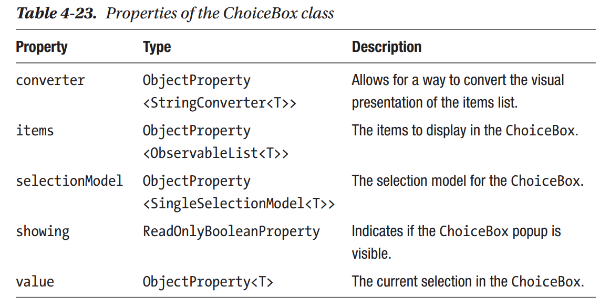

Chapter 4: JavaFX Controls Deep Dive
^^^^^^^^^^^^^^^^^^^^^^^^^^^^^^^^^^^^^^^^^^^^^

当JavaFX 2007年第一次回归时，它并没有任何用户可用的用户界面控件。开发者不得不创建自己的原始UI控件或是改进Swing工具集中的UI组件。由JavaFX 1.2开始，这种情况开始改善，引进了大量重要的UI控件，例如Button，ProgressBar以及ListView。在后续的发布中，JavaFX坚持完整的，良好设计的UI控件集，提供构建应用用户界面的能力。

本章将会介绍JavaFX11中存在的大部分UI控件。由于本节页数的限制，示例代码保持简略。可以在本书的代码仓库中找到示例程序。

UI控件模块
====================

由JavaFX 9开始，几乎所有的UI控件都封装在javafx.controls模块中。此模块被分割为四个导出包，如下所示：

* javafx.scene.chart：此包包含用于构建图表，例如线，栏，区域，饼图，的组件。
* javafx.scene.control：此包含几乎包含JavaFX中所有用户界面的API。这是我们在本章中将要探讨的主要包。
* javafx.scene.control.cell：此包包含大量预构建的单元工厂的API。
* javafx.scene.control.skin：此包包含用于控件的皮肤或可视组件。

什么是UI控件？
=====================

JavaFX基础控件
======================

JavaFX中存在UI控件子集，对于几乎所有的用户界面都非常重要，但是由终端用户角度或是开发者角度来看，它们的使用非常简单。本节将会依次介绍这些基础控件。对于JavaFX 11，基础UI控件可以为分为以下三类：

* 标签控件：Button，CheckBox，HyperLink，Label，RadioButton以及ToggleButton。
* 文本输入控件：TextField，TextArea以及PasswordField。
* 其它简单包含：ProgressBar，ProgressIndicator以及Slider。

标签控件
~~~~~~~~~~~~~~~~~

大部显示只读文本的控件派生自一个共同的抽象超类，Labeld。此类指定了一些用于处理对齐，字体，图形（以及图形定位），封装等以及用于显示的文本的属性集合。由于Labeld是抽象的，它通常不能被直接使用，但是许多实际使用的UI控件由其派生，包括Button，CheckBox，Hyperlink，Label，RadioButton能主ToggleButton。除了这些基础控件，其它更高级的控件（在本章后面讨论）也受益于Labeld，包括MenuButton，TitledPane以及ToggleButton。

Labeld最重要的属性如表4-1所示。

注意，由于Labeled控件是抽象的，大部分开发者不会直接使用该控件。相反，他们使用JavaFX所提供的具体子类之一，现在我们将深入其细节。

Label
:::::::::::::::

由于Labeled是如此具体，具体的Label类极为简单，只是添加了额外的API。这被称为labelFor，并且用于通过简单的助记符使得键盘浏览到UI控件，以及视图有障碍的人提供文本到语音输出。它最佳实践是使用Label来描述另一个控件（例如Slider），例如通过label.labelFor(slider)将Label实例与Slider实例关联到一起。这意味着Slider控件获得焦点时，屏幕读取软件可以读出Label的文本来以帮助向用户描述Slider用于做什么。

Button
:::::::::::::::

Button类通过提供可点击的区域允许用户执行某些动作。当用户按下按钮，它变为armed，当鼠标被释放时，它在变为disarmed之前fire。Button最重要的属性如表4-2所示。

仅有一个需要关注的方法，即fire()方法。此方法可以被调用来通过编程触发Button，从而使得相关联的onAction事件被调用。最常见的情况是用户直接点击按钮，而这具有相同的结果－触发按钮并使得所安装的onAction事件处理器被调用。处理动作事件的代码如列表4-1所示。

Listing 4-1. 创建JavaFX Button实例，处理点击向控制台输出。

.. code::

    var button = new Button("Click Me!");
    button.setOnAction(event -> System.out.println("Button was clicked"));

CheckBox
:::::::::::::::::::::

通常，CheckBox允许用户指定某件事情是否为真或假。在JavaFX中这是可能的，但是还有显示第三种状态的能力：indeterminate。默认情况下，JavaFX CheckBox将只在选中与未选中（这是在selected属性中反映的）之间转换。要支持indeterminate状态转换，开发者必须将allowIndeterminate属性设置为真。当设置此属性后，可以读取indeterminate属性，结合selected属性来确定CheckBox的状态。

由于CheckBox是一个Labeled控件，它支持在复选框旁边显示text与graphic。它仅有一些额外重要的属性，如表4-3所示。CheckBox的典型使用显示在列表4-2中。

Listing 4-2. 创建一个确定的CheckBox实例

.. code::

    CheckBox cb = new CheckBox("Enable Power Plant");
    cb.setIndeterminate(false);
    cb.setOnAction(e -> log("Action event fired"));
    cb.selectedProperty()
    .addListener(i -> log("Selected state change to " + cb.isSelected()));

Hyperlink
:::::::::::::::::::

Hyperlink控件本质上是一个以超链接形式展示的Button控件，就如同在网站上所看到的那样。所以Hyperlink的API与Button类等同，只有一个小小的区别：表示用户是否点击链接的visited属性，如表4-4所示。如果visited为真，开发者也许会选择以不同的风格显示Hyperlink。Hyperlink的典型使用如列表4-3所示。

Listing 4-3. 创建Hyperlink实例并监听其点击

.. code::

    var hyperlink = new Hyperlink("Click Me!");
    hyperlink.setOnAction(event -> log("Hyperlink was clicked"));

ToggleButton
:::::::::::::::::::::

ToggleButton是一个Button（意味着它依然可以触发事件），但是通常这并不是最佳方法。这是因为ToggleButton的意图是在点击时在其选中与未选中之间转换其selected属性。当一个ToggleButton被选中时，其显示是不同的，看起来是被压入。ToggleButton实体会被添加到ToggleGroup来控制选择。

什么是ToggleGroup？

ToggleGroup是一个简单包含Toggle实例列表的类，它管理其选中状态。ToggleGroup确保一次至多只有一个Toggle被选中。

Toggle是一个具有两个属性－selected与toggleGroup－的接口。实现此接口的类包括ToggleButton，RadioButton与RadioMenuItem。

我如何使用ToggleButton与ToggleGroup？

通过实例化一个ToggleGroup实例，以及多个ToggleButton实例，并将每个ToggleButton上的toggleGroup属性设置为单个ToggleGroup实例，可以将ToggleButton关联到ToggleGroup。如列表4-4所示。

在此过程中，此组中的ToggleButton实例有一个额外的约束：任意时刻只有一个ToggleButton被选中。用户选中一个新的ToggleButton，前一个被选中的ToggleButton将会变为未选中。当ToggleButton被放置在ToggleGroup中时，没有被选中的ToggleButton实例是可能的（例如，选中的ToggleButton可以被未选中）。ToggleButton的主要属性如表4-5所示。

.. code::

   Listing 4-4.

    // create a few toggle buttons
    ToggleButton tb1 = new ToggleButton("Toggle button 1");
    ToggleButton tb2 = new ToggleButton("Toggle button 2");
    ToggleButton tb3 = new ToggleButton("Toggle button 3");
    // create a toggle group and add all the toggle buttons to it
    ToggleGroup group = new ToggleGroup();
    group.getToggles().addAll(tb1, tb2, tb3);

    // it is possible to add an onAction listener for each button
    tb1.setOnAction(e -> log("ToggleButton 1 was clicked on!"));
    // but it is better to add a listener to the toggle group selectedToggle
    property
    group.selectedToggleProperty()
    .addListener(i -> log("Selected toggle is " + group.
    getSelectedToggle()));

RadioButton
:::::::::::::::::::::

RadioButton是一个ToggleButton，当放置于ToggleGroup中时，具有不同的风格与不同的行为。ToggleGroup中的ToggleButton可以全部未选中，在ToggleGroup有RadioButton的情况下，用户没有办法取消选中所有的RadioButton。这是因为，RadioButton只能通过点击进入选中状态。后续的点击没有效果（当然也不能导致未被选中）。所以，取消选中RadioButton的唯一方法是选择相同ToggleGroup中另一个不同的RadioButton。

由于RadioButton的API本质上与ToggleButton等同，请参考列表4-4来了解ToggleButton代码示例。唯一的区别在于将ToggleButton实例替换为RadioButton实例。

文本输入控件
~~~~~~~~~~~~~~~~~~~~~

在简单的Labeled控件之后，下一个要讨论的是主要用于文本输入的三个控件，即TextArea，TextField与PasswordField。TextField主要设计用来接收单行文本，而TextArea被设计用来接收多行输入。PasswordField扩展自TextField，通过隐藏用户输入允许用户输入敏感信息。在所有三种情况下，这些控件不接受富文本输入（参看后续介绍的HTMLEditor控件以了解富文本输入）。

TextArea与TextField扩展自一个名为TextInputControl的抽象类，它提供了基础的功能集合，以及可以应用于两个类的属性与方法。例如，TextInputControl允许定位插入符号，文本选择与格式化，以及编辑。

TextFormatter
:::::::::::::::::::::::

在我们深入具体的控件之前，我们首先关注一下前面提到的TextFormatter API。TextFormatter有两个不同的机制，允许其影响文本输入控件中所接受与显示的文本：

1. 过滤器可以拦截与修改用户输入。这有助于使得文本满足所需要的格式。默认的文本提供器可以用来提供初始文本。

2. 值转换器与值可以用来提供表示类型V的值的特殊格式。如果控件可编辑而文本被用户修改，则值被更新为对应的文本。

可以有一个仅有过滤器或值转换器的格式化器。然而如果没有提供值转换器，设置值将会导致IllegalStateException，而值为null。

TextField，PasswordFile与TextArea
::::::::::::::::::::::::::::::::::::::::::::

正如已经注意到的，TextField控件用于由用户接收未格式化的单行文本。这对于请求用户姓名，邮件地址等窗体非常理想。其中两个关键属性为text与onAction。text属性前面已经讨论过，因为它继承自TextInputControl，而onAction的功能正是所期望，我们在Button与类似的类中已经讨论过：当Enter键被按下时，会由TextField触发一个ActionEvent，提示开发者用户已经选择提交他们的输入。列表4-5展示了使用TextField控件的标准方式。

.. code::

   Listing 4-5

    TextField textField = new TextField();
    textField.setPromptText("Enter name here");
    // this is fired when the user hits the Enter key
    textField.setOnAction(e -> log("Entered text is: " + textField.getText()));
    // we can also observe input in real time
    textField.textProperty()
    .addListener((o, oldValue, newValue) -> log("current text input is "
    + newValue));

Password功能与TextField完全相同，所不同的是它会隐藏用户输入，从而具有一定程度的安全性。另外，出于安全原因，PasswordField不支持剪切与复制操作（然而粘贴依然是可用操作）。PasswordFiled没有其它的属性或API。

TextArea控件为多行用户输入而设计，但也仅支持未格式化文本。TextArea控件最适用于在单行文本不合适的情况。例如，如果你希望向用户询问反馈，TextArea则是最佳选项。由于TextArea设计用于多行输入，有一些值得关注的有用属性，如表4-7所示。

其它简单控件
~~~~~~~~~~~~~~~~~~~~~

除了Labeled控件与文本输入控件以外，还有三种被认为简单的其它控件：PrograssBar，ProgressIndicator与Slider。

ProgressBar与ProgressIndicator
::::::::::::::::::::::::::::::::::::

JavaFX提供了两个UI控件向用户显示进度：ProgressBar与ProgressIndicator。它们在API的角度非常相近，因为ProgressBar扩展自ProgresIndicator，且没有添加额外的API。ProgressIndicator最重要的属性如表4-8所示。

两个控件都可以用于显示进度或者被设置为未确定状态来向用户表明工作正在处理中，但此时进度未知。

要显示进度，开发者应将progress属性设置为0.0至1.0之间的值。初看起来会显得反直觉－为什么使用0.0至1.0之间的范围，而不是0－100之间的范围呢？答案并不明显，这是整个JavaFX UI工具集处理百分比时的一致设计选择。要使得进度控件切换到其未确定形式，简单地将progress属性值设置为-1。当这样做后，indeterminate属性将会由false变为true。

一个简单的使用示如列表4-6所示。

.. code::

    Listing 4-6

    ProgressBar p2 = new ProgressBar();
    p2.setProgress(0.25F);

Slider
:::::::::::::::::::

Slider控件用于允许用户指定特定min/max范围之间的一个值。这是通过向户展示一个滑轨与滑标来实现的。滑标可以被用户拖拽来改变值。因而Slider控件最重的三个属性为min，max与value属性就并不奇怪，如表4-8所示。使用Slider的简单示例如列表4-7所示。

.. code::

    Listing 4-7

    Slider slider = new Slider(0.0f, 1.0f, 0.5f);
    slider.valueProperty()
    .addListener((o, oldValue, newValue) -> log("Slider value is " + newValue));

容器控件
================

现在我们已了解了简单的UI控件，现在我们可以接触一些更有趣的控件。本节将会探讨容器控件，或是用于包含并显示其它用户界面元素的控件。这些容器控件提供了一些额外的功能，例如收起其内容，提供标签界面改变视图或是其它一些功能。

Accordion与TitledPane
~~~~~~~~~~~~~~~~~~~~~~~~~~~~~~

TitledPane是一个可以显示标题区域与内容区域的容器，具有通过点击标题区域展开与收起内容区域的功能。这对于侧面板以及类似的界面非常有用，它允许显示信息，并可以被用户收起，从而他们可以只看起他们需要看到的信息。

TitledPane扩展自Labeled，正如我们前面讨论的，存在自定义显示的大量属性。然而，应该注意到的是，这些Labeled属性只适用于TitlePane的标题区域，而不适用于内容区域。TitledPane的主要属性如表4-10所示。

介绍了TitledPane之后，我们可以进入Accordion，它是一个包含零个或多个TitledPane的简单容器。当Accordion被显示给用户时，它只允许一个次展开一个TitledPane。展开一个不同的TitledPane将会导致当前展开的TitledPane被收起。

只有一个值得注意的属性－expandedPane－ObjectProperty<TitledPane>，表示当前被展开的TitledPane，如表4-11所示。

要将TitledPane添加到Accordion，我们使用getPanes()方法来获取TitledPane的ObservableList，然后我们将相应的TitledPane添加到列表中。此操作的结果是TitledPane将会以其在列表中出现的顺序垂直排列显示。代码示例如列表4-8所示。

.. code::

    Listing 4-8

    TitledPane t1 = new TitledPane("TitledPane 1", new Button("Button 1"));
    TitledPane t2 = new TitledPane("TitledPane 2", new Button("Button 2"));
    TitledPane t3 = new TitledPane("TitledPane 3", new Button("Button 3"));
    Accordion accordion = new Accordion();
    accordion.getPanes().addAll(t1, t2, t3);

ButtonBar
~~~~~~~~~~~~~~~~~~

ButtonBar控件在JavaFX8u40版本中被加入，所以它是一个相对较新以及相对未知的控件。ButtonBar可以认为是本质上是一个Button控件（尽管它适用于任何节点）的HBox，具有将所提供的按钮以用户界面所在的操作系统的正确顺序放置的能力。这对于对话框极为有用，例如，Windows，Mac OS与Linux均具有不同的按钮顺序。其中存在一些有用的属性，如表4-12所示，而列表4-9展示了如何创建并填充ButtonBar界面。

.. code::

    Listing 4-9

    // Create the ButtonBar instance
    ButtonBar buttonBar = new ButtonBar();
    // Create the buttons to go into the ButtonBar
    Button yesButton = new Button("Yes");
    ButtonBar.setButtonData(yesButton, ButtonData.YES);
    Button noButton = new Button("No");
    ButtonBar.setButtonData(noButton, ButtonData.NO);
    // Add buttons to the ButtonBar
    buttonBar.getButtons().addAll(yesButton, noButton);

ScrollPane
~~~~~~~~~~~~~~~~~~~~

ScrollPane是一个对几乎所有用户界面都非常重要的控件－当内容超出用户界面的边界时水平与垂直滚动的能力。例如，想像一个图像处理程序，例如Adobe Photoshop。在这样的用户界面中，你也许会放大在一个较小的绘制区域内工作，而水平与垂直滚动条允许你在周围移动此区域以查看相邻的区域。

不同的其它一个UI工具集，没有必要将一些UI控件，例如ListView，TableView与ScrollPane封装在一起，因为它们内建滚动并为开发者处理。所以，ScrollPane通常为开发者用于完成某些自定义的界面中。如列表4-10所示的示例，而ScrollPane的属性如表4-13所示。

.. image:: _images/table-4-13.png

.. code::

    Listing 4-10

    // in this sample we create a linear gradient to make the scrolling visib
    Stop[] stops = new Stop[] { new Stop(0, Color.BLACK), new Stop(1, Color.
    RED)};
    LinearGradient gradient = new LinearGradient(0, 0, 1500, 1000, false,
    CycleMethod.NO_CYCLE, stops);
    // we place the linear gradient inside a big rectangle
    Rectangle rect = new Rectangle(2000, 2000, gradient);
    // which is placed inside a scrollpane that is quite small in comparison
    ScrollPane scrollPane = new ScrollPane();
    scrollPane.setPrefSize(120, 120);
    scrollPane.setContent(rect);
    // and we then listen (and log) when the user is scrolling vertically or
    horizontally
    ChangeListener<? super Number> o = (obs, oldValue, newValue) -> {
    log("x / y values are: (" + scrollPane.getHvalue() + ", " + scrollPane.
    getVvalue() + ")");
    };
    scrollPane.hvalueProperty().addListener(o);
    scrollPane.vvalueProperty().addListener(o);

SplitPane
~~~~~~~~~~~~~~~~~~~

SplitPane控制接受两个或多个子控件，并在其间绘制一个可拖拽的分割条。然后用户能够通过些分割条给一个子控件更多的空间，当然会以占用另一个子控件的空间为代价。SplitPane特别适用于有一个主内容区域，并用内容区域的左/右/下被用于显示更为内容特定的信息的界面。在此场景下，用户也许会在需要时为主内容区域或内容相关区域提供额外空间。

在历史上，UI工具集仅支持两个子控件（例如左与右，或上与下），但JavaFX移除了这种限制并允许无限的子控件数量，但有一个限制：所有的子控件必须具有相同的分割条方向。这意味着对所有的分割条仅有一个方向属性（如表4-14所示）。然而，有一种解决办法：简单地将每个Split嵌入到每个子控件中，从而最终的结果将会得到以需要的顺序在水平与垂直方向上操作的分割条。

SplitPane控件观察其子控件的最小与最大尺寸属性。它不会将节点的尺寸缩小到其最小尺寸之下，也不会提供超出最大尺寸的尺寸。为此，推荐将所有添加到SplitPane中的节点封装到一个单独的布局容器中，从而布局容器可以处理节点的尺寸，而不影响SplitPane的功能。

分割条的位置范围为0至1.0（包含）。位置0会将分割条放置在SplitPane的左上边加上节点的最小尺寸。位置1.0会将分割条放置在SplitPane的右下边减去节点的最小尺寸。位置0.5会将分割条放置在SplitPane中的中间。将分割条的位置设置为大于节点最大尺寸的位置将会使得分割条被设置在节点最大尺寸的位置。将分割条位置设置为小于节点最小尺寸的位置将会使得分割条设置在节点最小尺寸的位置。

创建SplitPane的示例如列表4-11所示。

.. code::

    Listing 4-11

    final StackPane sp1 = new StackPane();
    sp1.getChildren().add(new Button("Button One"));
    final StackPane sp2 = new StackPane();
    sp2.getChildren().add(new Button("Button Two"));
    final StackPane sp3 = new StackPane();
    sp3.getChildren().add(new Button("Button Three"));
    SplitPane splitPane = new SplitPane();
    splitPane.getItems().addAll(sp1, sp2, sp3);
    splitPane.setDividerPositions(0.3f, 0.6f, 0.9f);

TabPane
~~~~~~~~~~~~~~

TabPane是一个允许用户显示标签界面的UI控件。例如，大部分读者会比较熟悉他们喜欢的web浏览器中的标签界面，从而他们不需要打开多个窗口－为每个页面打开一个窗口。

表格4-15列出了最重要的属性，但是两个最有用的属性是side属性与tabClosingPolicy属性。side属性用于指定标签将显示在TabPane的哪一侧（默认为Side.TOP，意味着标签将位于TabPane的顶部）。tabClosingPolicy用于指定标签是否可以被用户关掉－有一个TabClosingPoliy枚举，它有三个可用值：

1. UNAVAILABLE：标签不能被用户关掉。
2. SELECTED_TAB：当前被选中的标签在标签区域有一个小的关闭按钮 （显示小x）。当不同的标签被选中时，关闭按钮将会由前一个被选中的标签消失，而显示在新选中的标签上。
3. ALL_TABS：TabPane中的所有可见标签将会有一个可见的关闭按钮。

JavaFX TabPane通过提供一个Tab实例的ObservableList而工作。每个Tab实例由title属性与content属性组成。当一个Tab被添加到tabs列表中时，它将会以出现在列表中的顺序显示在用户界面中。如列表4-12所示。

.. code::

    Listing 4-12

    TabPane tabPane = new TabPane();
    tabPane.setTabClosingPolicy(TabPane.TabClosingPolicy.UNAVAILABLE);
    for (int i = 0; i < 5; i++) {
    Tab tab = new Tab("Tab " + I, new Rectangle(200, 200, randomColor()));
    tabPane.getTabs().add(tab);
    }

ToolBar
~~~~~~~~~~~~~~~~~~~

ToolBar是一个非常简单的UI控件。在其最常见的排列中，它可以看作是一个格式化的HBox－也就是，它表示水平添加到其中的节点，具有背景梯度。添加到ToolBar中最常见的元素是其它UI控件，例如Button，ToggleButton以及Separator，但在对于哪些可以放置在ToolBar中并没有限制，只要它是一个Node即可。

ToolBar控件确实提供了一些有用的功能－它支持内容溢出，从而如果要显示的元素多于显示所需要的空间，它会由ToolBar中移除溢出的元素并显示一个溢出按钮，当点击时会弹出一个包含ToolBar中所有溢出元素的菜单。

正如表4-16中所注意到的，ToolBar提供了一个垂直朝向，从而它可以被放置在程序用户界面的左侧或右侧，尽管并不如放置在用户界面顶部常见，通常仅位于菜单栏下。

创建ToolBar的示例如列表4-13所示。

.. code::

    Listing 4-13

    ToolBar toolBar = new ToolBar();
    toolBar.getItems().addAll(
    new Button("New"),
    new Button("Open"),
    new Button("Save"),
    new Separator(),
    new Button("Clean"),
    new Button("Compile"),
    new Button("Run"),
    new Separator(),
    new Button("Debug"),
    new Button("Profile")
    );

其它控件
===============

HTMLEditor
~~~~~~~~~~~~~~~~~

HTMLEditor控件允许用户创建内部格式化为HTML内容的富文本输入。控件提供大量UI控件来指定字体尺寸，颜色，类型以及对齐等内容。

关于HTMLEditor需要注意的一点是，由于它依赖于用于渲染用户输入的JavaFX WebView组件，此控件并不随javafx.controls模块发布，而是位于javafx.web模块中，而它位于javafx.scene.web包中。

尽管向终端用户提供了大量功能，但使用HTMLEditor的开发者用的API却出奇的少。其中并没有相关的属性，而唯一相关的方法是用于htmlText的getter与setter方法。这些方法处理String，并且期望此String包含合法的HTML。

Pagination
~~~~~~~~~~~~~~~~~~~~

理解Pagination控件最简单的方法是思考一个Google搜索结果页面。页面底部的每个数字表示一个结果页面，而用户可以点击这些数字进入页面。其中重要的事实是Google并不会预先确定除当前页面之外的其它页面上要放置的元素－其它页面仅在被请求时才会确定。

这正是JavaFX中Pagination所提供的功能。分页类的关键属性如表4-17所示。Pagination是表示多个页面的一种抽象方法，其中只有当前显示的页面才真正存在于场景图中，而其它页面仅在请求时生成。

这是本章中我们第一次遇到使用大量JavaFX UI控件中会使用的回调功能的场景。这会利用pageFactory，允许在用户请求时按生成页面。随着本章的推进，我们将会多次遇到此方不地，因而确保你理解列表4-14的内容，特别是在哪里设计pageFactory是值得的。

.. code::

    Listing 4-14

    Pagination pagination = new Pagination(10, 0);
    pagination.setPageFactory(pageIndex -> {
    VBox box = new VBox(5);
    for (int i = 0; i < 10; i++) {
    int linkNumber = pageIndex * 10 + i;
    Hyperlink link = new Hyperlink("Hyperlink #" + linkNumber);
    link.setOnAction(e -> log("Hyperlink #" + linkNumber + " clicked!"));
    box.getChildren().add(link);
    }
    return box;
    });

ScrollBar
~~~~~~~~~~~~~~~~~~

ScrollBar本质上是一个具有不同风格的Slider控件。然而ScrollBar通常并不用在与Slider相同的场景中－相反，它通常用作更复杂的UI控件的组成部分。例如，它被用于ScrollPane控件中来支持垂直与水平滚动，并且被用在ListView，TableView，TreeView以及TreeTableView控件中。

表格4-18介绍了ScrollBar控件最重要的属性。

Separator
~~~~~~~~~~~~~~

Separator也许是整个JavaFX UI工具套件中最简单的控件。它是一个缺少交互并且被简单地设计来在用户界面的相关区域绘制线的控件。这通常用于ToolBar控件中来将按钮分为小组。类似的方法用于弹出菜单中，但是正如前面所注意到的，在菜单的情况下，需要使用SeparatorMenuItem，而不是这里使用的标准Separator控件。

默认情况下，Separator是垂直朝向的，从而当放置在水平ToolBar中可以进行相应的绘制。这可以通过修改orientation属性来控件。

Spinner
~~~~~~~~~~~~~~~~

Spinner控件被引入到JavaFX中相对较近，在JavaFX 8u40中被引入。Spinner可以被看作一个单行TextField，可以或不可以修改，并有额外的增加与减少箭头在值集合中遍历。表格4-19介绍了此控件最重要的属性。

由于Spinner可以用于在多种值类型（integer，float，double或者某些类型的List）中遍历，Spinner借助于SpinnerValueFactory来处理值范围遍历的实际处理。JavaFX提供了多个内建SpinnerValueFactory类型（用于double，integer以及List），并且可以为自定义需求编写自定义SpinnerValueFactory实例。列表4-15中的代码示例展示了整型值工厂，而double与list值工厂以相同的方式工作。

.. code::

    Listing 4-15.

    Spinner<Integer> spinner = new Spinner<>();
    spinner.setValueFactory(new SpinnerValueFactory.
    IntegerSpinnerValueFactory(5, 10));
    spinner.valueProperty().addListener((o, oldValue, newValue) -> {
    log("value changed: '" + oldValue + "' -> '" + newValue + "'");
    });

Tooltip
~~~~~~~~~~~~~~~~

当鼠标位于场景图中的Node上时，Tooltip通常用于显示关于此Node的额外信息。所有Node都可以显示工具提示。在大部分情况下，创建Tooltip，并修改其text属性来向用户展示普通文本。然而，Tooltip能够在其中展示任意的节点的场景图－这是通过创建场景图并将其设置为Tooltip graphic属性来实现的。

你可以使用列表4-16中所示的方法来在任意节点上设置Tooltip。

.. code::

   Listing 4-16.

    Rectangle rect = new Rectangle(0, 0, 100, 100);
    Tooltip t = new Tooltip("A Square");
    Tooltip.install(rect, t);

此工具提示将会具有典型的工具提示语义。注意Tooltip并不需要删除安装：当它不为任何Node引用时，它会被垃圾收集。然而也可以以相同的方式手动uninstall工具提示。

一个工具提示可以被安装到多个目标节点或是多个控件上。

由于大部分Tooltip显示在UI控件上，有一个用于所有控件的特殊API来以更简洁的方式安装Tooltip。列表4-17中的示例展示了如何为Button控件创建工具提示。

.. code::

    Listing 4-17

    Button button = new Button("Hover Over Me");
    button.setTooltip(new Tooltip("Tooltip for Button"));

Tooltip类的关键属性如表4-20所示。

弹出控件
===============

JavaFX带有一系列的弹出控件集合。这意味着，在幕后，它们位于其自己的窗口中，这不同的用户界面的主舞台，因而当它们高于或宽于窗口本身时，它们也许会显示在窗口外面。开发者并不需要关心其位置，尺寸或是相关的细节，但是理解细节会非常有帮助。

本节会探讨JavaFX中使用弹出功能的所有UI控件。对于其中的许多控件，它们同时利用了用于构建菜单的相同API，所以在我们依次探讨每个控件之前，我们首先探讨这种常见的功能。

基于菜单的控件
~~~~~~~~~~~~~~~~~~~~~~~

Menu与MenuItem
:::::::::::::::::::::::

在JavaFX中构建菜单由Menu与MenuItem类开始。值得注意的是，两个类并没有实际年扩展Control，这是由于它们被设计用来表示菜单结构，但是实现是在JavaFX在幕后处理的。

MenuItem所扮演的角色本质上与Button相同。它支持类似的属性集合－text，graphic与onAction。在此之上，它添加了对于指定键盘快捷键（例如Ctrl-c）的支持。如表4-21所示。

由于MenuItem只是简单地扩展自Object，就其本身而言，它用处不大，并且不能以标准方法添加到JavaFX用户界面中。MenuItem的使用方式借助于Menu类，它扮演了MenuItem实例的容器的角色。Menu类有一个getItems()方法，其作用方式与大部分其它JavaFX API相同－开发者将MenuItem实例添加到getItems()中，当Menu被展示给用户时，这些菜单项将会被展……

这会引出一些重要问题：

1. JavaFX如何支持菜单菜单（例如，菜单包含一个子菜单，子菜单本身会包含更多的子菜单）？这简单地通过Menu类本身扩展自MenuItem来处理的。这意味着允许MenuItem的API，它也会隐式地支持Menu。

2. JavaFX如何支持带有复选框或单选状态的菜单项？JavaFX提供了两个子类－CheckMenuItem与RadioMenuItem－来支持这种菜单。CheckMenuItem有一个selected属性，用户每次点击菜单项时，会在真与假之间切换。RadioMenuItem的功能类似于RadioButton－它应与一个ToggleGroup相关联，然后JavaFX将会强制每次至多只有一个RadioMenuItem被选中。

3. 我如何将菜单项分为不同的组？在用户界面中处理的常见做法是使用分隔符。正如本章前面所提到的，不能将Separator直接添加到Menu中（因为它并不扩展自MenuItem），为此，JavaFX提供了SeparatorMenuItem，当SeparatorMenuItem被放置在Menu项列表中时，会在Menu中相同位置放置一个Separator。

4. 自定义菜单元素怎么办？例如，如果我要在Menu中显示一个Slider或是一个TextField时怎么办呢？JavaFX使用CustomMenuItem类来支持这种功能。通过使用这个类，开发者可以将任意的Node嵌入到content属性中。

MenuBar
:::::::::::::::::

目前为止我们已经探讨了指定Menu所需要的API，但是并没有探讨如何将其展示给用户。目前，将菜单添加到JavaFX用户界面最常见的方法是通过MenuBar控件。此类通常被放置在用户界面的顶部（例如，如果使用BorderLayout，它通常被设置为顶部节点），而且它是简单地通过创建实例来构建，然后将Menu实例添加到getMenus()调用返回的列表中。

在某些操作系统上（最值得注意的Mac OS），通常并不能在程序窗口的顶部看到菜单栏，因为Mac OS具有一个跨越所有屏幕顶部的系统菜单栏。此系统菜单栏是应用环境相关的，即它会随着焦点程序的变化而变化其内容。JavaFX支持此类情况，而MenuBar类有一个useSystemMenuBar属性，如果此属性被设置为真，则会由应用窗口移除MenuBar，而使用系统菜单栏本地渲染菜单栏。这将会在具有系统菜单栏（Mac OS）的平台上自动发生，但对于其它平台没有影响。

列表4-18展示了如何创建一个具有菜单与菜单项的MenuBar。

.. code::

    Listing 4-18

    // Firstly we create our menu instances (and populate with menu items)
    final Menu fileMenu = new Menu("File");
    final Menu helpMenu = new Menu("Help");
    // we are creating a Menu here to add as a submenu to the File menu
    Menu newMenu = new Menu("Create New...");
    newMenu.getItems().addAll(
    makeMenuItem("Project", console),
    makeMenuItem("JavaFX class", console),
    makeMenuItem("FXML file", console)
    );
    // add menu items to each menu
    fileMenu.getItems().addAll(
    newMenu,
    new SeparatorMenuItem(),
    makeMenuItem("Exit", console)
    );
    helpMenu.getItems().addAll(makeMenuItem("Help", console));
    // then we create the MenuBar instance and add in the menus
    MenuBar menuBar = new MenuBar();
    menuBar.getMenus().addAll(fileMenu, helpMenu);

MenuButton与SplitMenuButton
:::::::::::::::::::::::::::::::::

在JavaFX中将菜单展示给用户的另一种常见方法是通过MenuButton与SplitMenuButton类。这两个类非常相近，但它们以一种略为不同的方式实现其功能，所以我们在后面进行分别探讨。

MenuButton是类按钮的控件，当点击时会将展示一个由所有被添加到菜单项列表中的MenuItem元素组成的菜单。由于MenuButton类扩展自ButtonBase（其本身扩展自Labeled），因而与JavaFX Buttton控件具有大量重叠的API。例如，MenuButton具有相同的onAction事件，以及text和graphic属性等。然而注意，对于MenuButton，设置onAction并没有作用，因为MenuButton不会触发onAction事件，因为这被用于展示弹出菜单。表4-22列表出MenuItem所引入的属性，而列表4-19展示了如何在代码中使用MenuButton。

SplitMenuButton扩展自MenuButton类，但不同于MenuButton，SplitMenuButton的可视部分将按钮本身分为两部分－一个动作区域与一个菜单打开区域。当用户点击动作区域时，SplitMenuButton本质上就如一个Button－执行onAction属性所关联的代码。当用户点击菜单打开区域时，显示弹出菜单，而用户可以与每个菜单交互。列表4-20展示了如何在代码中使用SplitMenuButton。

.. code::

    Listing 4-19.

    MenuButton menuButton = new MenuButton("Choose a meal...");
    menuButton.getItems().addAll(
    makeMenuItem("Burgers", console),
    makeMenuItem("Pizza", console),
    makeMenuItem("Hot Dog", console));
    // because the MenuButton does not have an 'action' area,
    // onAction does nothing
    menuButton.setOnAction(e -> log("MenuButton onAction event"));

.. code::

    Listing 4-20

    SplitMenuButton splitMenuButton = new SplitMenuButton();
    // this is the text in the 'action' area
    splitMenuButton.setText("Perform action!");
    // these are the menu items to display in the popup menu
    splitMenuButton.getItems().addAll(
    makeMenuItem("Burgers", console),
    makeMenuItem("Pizza", console),
    makeMenuItem("Hot Dog", console));
    // splitMenuButton does fire an onAction event,
    // when the 'action' area is pressed
    splitMenuButton.setOnAction(e -> log("SplitMenuButton onAction event"));

ContextMenu
::::::::::::::::::::

ContextMenu是一种包含在MenuItem中的弹出控件。这意味着它不会被添加到场景图中，相反是通过直接调用（通过两个show()方法）或者作为用户使用常见的鼠标或键盘操作（最常见的是通过右击鼠标）请求上下文的结果。

为了使得指定与显示上下文菜单尽可能简单，根Control类有一个contextMenu属性。当特定的事件发生时（例如，鼠标右击），UI控件被配置为检测是否指定了上下文菜单，如果指定了，则自动显示。例如，Tab类有一个这样的contextMenu属性，而用户无论何时用 户在TabPane内的Tab上右击时，它们会显示开发者所指定的上下文菜单。列表4-21展示了设置有ContextMenu的Button，当用户鼠标右键点击按钮时会进行显示。

.. code::

    Listing 4-21

    // create a standard JavaFX Button
    Button button = new Button("Right-click Me!");
    button.setOnAction(event -> log("Button was clicked"));
    // create a ContextMenu
    ContextMenu contextMenu = new ContextMenu();
    contextMenu.getItems().addAll(
    makeMenuItem("Hello", console),
    makeMenuItem("World!", console),
    new SeparatorMenuItem(),
    makeMenuItem("Goodbye Again!", console)
    );

在某些情况下，我们希望在未扩展自Control的类上显示ContextMenu。在这些情况下，我们可以简单地利用ContextMenu上的两个show()方法之一在相关事件出现时进行显示。存在两个可用的show()方法：

1. show(Node anchor, double screenX, double screenY)：此方法会在指定的屏幕坐标处显示上下文菜单。

2. show(Node anchor, Side side, double dx, double dy)：此方法会在指定的锚节点的指定边（上，右，下，或左）处显示上下文菜单，分别通过dx与dy作为x与y轴的偏移（同时注意，如果需要dx与dy可以指定为负值，但最为常见的是简单地指定为零。）

通过使用两个显示方法之一配合相应的事件处理器（特别是所有JavaFX Node子类中可用的onContextMenuRequested与onMousePressed API），我们可以实现需要的结果。列表4-22展示了如何在JavaFX Rectangle类上显示一个ContextMenu（此类缺少扩展自Control的子类的setContextMenu API）。

.. code::

   Listing 4-22

    Rectangle rectangle = new Rectangle(50, 50, Color.RED);
    rectangle.setOnContextMenuRequested(e -> {
    // show the contextMenu to the right of the rectangle with zero
    // offset in x and y directions
    contextMenu.show(rectangle, Side.RIGHT, 0, 0);
    });

ChoiceBox
:::::::::::::::::

ChoiceBox是一个当点击时显示弹射菜单的JavaFX UI控件，但它并不是通过MenuItem实例构建。相反，ChoiceBox是一个泛型类（例如，ChoiceBox<T>），其中类的类型也是用于items列表的类型。换句话说，并不是用户指定菜单项，ChoiceBox是使用零个或多个类型T的对象构建的，而这些正是在弹出菜单中显示给用户的内容。

由于T类的默认toString()方法并不合适或是人类可读，ChoiceBox支持converter属性（StringConverter<T>类型）的概念。如果指定了converter，ChoiceBox将由items列表中获取每个元素（类型T），并将其传递给converter，从而返回一个人类更可读的字符串显示在给弹出菜单中。

当用户在ChoiceBox中做出选择时，value属性会被更新来反映此新选择。当value属性变化时，ChoiceBox控件也会触发onAction ActionEvent，从而开发者可以选择是否观察value属性或是添加onAction事件处理器。

由于ChoiceBox的UI设计，此控件最适用于相对较小的元素列表。如果要显示的元素数量比较大，通常推荐开发者使用ComboBox控件。

ChoiceBox的主要属性如表4-23所示，而其用法展示在列表4-23中。

.. code::

    Listing 4-23

    ChoiceBox<String> choiceBox = new ChoiceBox<>();
    choiceBox.getItems().addAll(
    "Choice 1",
    "Choice 2",
    "Choice 3",
    "Choice 4"
    );
    choiceBox.getSelectionModel()
    .selectedItemProperty()
    .addListener((o, oldValue, newValue) -> log(newValue));

基于ComboBox的控件
~~~~~~~~~~~~~~~~~~~~~~~~~

在基于菜单的控件之外，还有许多其它基于弹出的用户交互的控件。本节探讨可以被分类为combo box控件的控件集合。在JavaFX中，此集合中的控件全部扩展自ComboBoxBase类（其属性显示在列表4-23中），即ComboBox，ColorPicker与DatePicker。

由于所有的ComboBoxBase子类共享共同的父类，其API是统一的，并且有许多值得注意的相似性：

* 它们看起像按钮，当点击时，会弹出允许用户做出选择的UI。
* 有一个表示当前用户选中值的value属性。
* 它们通常通过设置editable属性设计是否可编辑。当控件可编辑时，它显示为一个TextFiled，有一个按钮在其旁边－TextField允许用户输入，而按钮会显示弹出。当控件不可编辑时，整个控件将会显示为按钮。
* 存在show()与hide()方法，可以编辑使得弹出显示或隐藏。

ComboBox
::::::::::::::::::::

ComboBox在概念上非常类似于ChoiceBox控件，但是当较大的元素列表需要显示时，会具有更全的特性与更优的表现。添加到ComboBox中的属性如表4-23所示，而代码示例展示在列表4-23中。

.. code::

    Listing 4-24

    ComboBox<String> comboBox = new ComboBox<>();
    comboBox.getItems().addAll(
    "Apple",
    "Carrot",
    "Orange",
    "Banana",
    "Mango",
    "Strawberry"
    );
    comboBox.getSelectionModel()
    .selectedItemProperty()
    .addListener((o, oldValue, newValue) -> log(newValue));

ColorPicker
:::::::::::::::::::::

ColorPicker是ComboBox的特殊形式，特别设计来允许用户选择颜色值。ColorPicker控件并没有在ComboBoxBase上添加额外的功能，但是当然，用户界面非常不同。使用ColorPicker非常类似于其它控件，如列表4-25所示。

ColorPicker控件提供了一个带有预定义颜色集合的颜色面板。如果用户不希望由预定义集合中选择，他们可以通过与自定义颜色对话框交互来创建自定义颜色。对话框提供了RGB，HSB与web交互模式，来创建新的颜色。同时它允许修改颜色的透明度。

一旦定义了新颜色，用户可以选择他们是否希望保存，或仅是使用。如果新颜色被保存，此颜色将会出现在颜色面板上的自定义颜色区域。

.. code::

   Listing 4-25

    final ColorPicker colorPicker = new ColorPicker();
    colorPicker.setOnAction(e -> {
    Color c = colorPicker.getValue();
    System.out.println("New Color RGB = "+c.getRed()+" "+c.getGreen()+"
    "+c.getBlue());
    });

DatePicker
::::::::::::::::::::

非常类似于ColorPicker是用于选择颜色的ComboBoxBase的特化，DatePicker是用于选择日期的ComboBoxBase特化－在此情况下为java.time.LocalDate值。DatePicker引入的属性如表4-26所示，而其代码使用展示在列表4-26中。

.. code::

    Listing 4-26

    final DatePicker datePicker = new DatePicker();
    datePicker.setOnAction(e -> {
    LocalDate date = datePicker.getValue();
    System.err.println("Selected date: " + date);
    });

JavaFX对话框
=======================

JavaFX自8u40版本开始，带有对话框API集合来警告，查询或提示用户。存在API通过创建自定义对话框用于简单地弹出信息警告。以最简单的方式，开发者该使用Altert类来显示预构建的对话框。希望提示用户进行文本输入或是由选项列表中做出选择的开发者可以分别通过使用TextInputDialog与ChoiceDialog更好地实现目的。完全自定义的对话框可以通过使用Dialog与DialogPane类来创建。

当讨论对话框时，有两个术语开发者应该非常熟悉。模态与阻塞经常会被无差别地使用。这两个术语非常容易定义：

* 模态对话框显示在其它窗口上部并且阻止用户点击窗口直到对话框消失。
* 阻塞对话框会使得代码停止在显示对话框的行。这意味着，一旦对话框消失，会由此行代码处继续。这可以看作是一个同步对话框。阻塞对话框的使用非常简单，因为开发者会由对话框获取一个返回值并且无需依赖监听器与回调继续执行。

在JavaFX中，默认情况下所有对话框均是模态的，但是通过使用Dialog的initModality(Modality)方法可以使其变为非模态。对于阻塞，这是开发者的选择－他们可以选择调用showAndWait()用于阻塞或是show()用于非阻塞对话框。

Alert
~~~~~~~~~~~~~~~~

对于只希望简单地向用户显示对话框的开发者来说，Alert类是最简单的选项。有大量预构建的选项，具有变化的图标与默认按钮。创建Alert只是简单地通过指定所需要的AlertType调用构造函数。AlertType用于配置默认显示哪些按钮与图像。下面是一份选项的快速总结：

* Confirmation：最适于在执行某些动作之前向用户确认。显示一个蓝色的问号图片与Cancel和OK按钮。
* Error：最适用于提示用户某些事情出错。显示一个红色X图片与一个简单的OK按钮。
* Information：最适用于向用户提示某些有用的信息。显示一个蓝色I图片（表示信息）以及一个OK按钮。
* None：这会导致无图片与按钮。这通常不会被用到除非要提供一个自定义实现。
* Warning：最适用于警告用户某些事情或问题。显示一个黄色感叹号图片与一个OK按钮。

在大部分情况下，开发应简单地由前面文本中所列出的选项中选择相应的类型，并提供要显示给用户的许可证。一旦Alert被创建，可以像列表4-27这样显示。

.. code::

    Listing 4-27

    alert.showAndWait()
    .filter(response -> response == ButtonType.OK)
    .ifPresent(response -> formatSystem());

ChoiceDialog
~~~~~~~~~~~~~~~~~~~~~~

ChoiceDialog是一个向用户显示选项列表的对话框，从中用户至多只能选择一项。换句话说，对话框将会使用一个ChoiceBox或ComboBox控件来允许用户做出选择。选择会被返回给开发者来执行相应的动作，如列表4-28所示。

.. code::

    Listing 4-28

    ChoiceDialog<String> dialog = new ChoiceDialog<>("Cat", "Dog", "Cat", "Mouse");
    dialog.showAndWait()
    .ifPresent(result -> log("Result is " + result));

ChoiceDialog的主要属性如表4-27所示。

.. code::

    Listing 4-29

    TextInputDialog. dialog = new TextInputDialog ("Please enter your name");
    dialog.showAndWait()
    .ifPresent(result -> log("Result is " + result));

Dialog与DialogPane
~~~~~~~~~~~~~~~~~~~~~~~~~

Dialog是JavaFX中最灵活的对话框选项，允许对话框的完整配置。这允许创建诸如提示用户名/密码，复杂形式与简单形式的对话框。

当一个Dialog被实例化时，开发者可以指定一个泛型R，表示result属性的类型。这非常重要，这是当对话框消失时，作为开发者的我们将会收到的结果。

这会导致一个明显的问题：R的类型应是什么？答案是依赖于向用户询问什么。例如，在提示密码的情况下，也许是一个UsernamePassword类实例。

由于Dialog类不知道它显示的是什么内容，因而不知道如何将用户输入的值转换为R类型实例，开发者必须设置resultConverter属性。当R类型不为Void或ButtonType时，这是需要的。如果没有注意到，开发者将会发现其代码中抛出ClassCastException，无法通过结果转换器由ButtonType转换。

一旦对话框被实例化，下一步是对其进行配置。与创建自定义对话框相关的属性如表4-29所示。

在内部，Dialog将所有可视区域的布局处理推给嵌入的DialogPane实例。事实上，许多属性只是简单地转给此DialogPane。DialogPane API提供了大量并暴露给Dialog级的额外功能，开发者可以在对话框实例上通过调用getDialogPane()来获取当前安装的DialogPane。

高级控件
===============

需要探讨的最后一个控件集合是高级控件：ListView，TreeView，TableView以及TreeTableView。这些控件包含最多的API以及最多的功能。所有四个控件共享大量共同的概念，所以本将将会深入ListView（四个之中最简单的），然后在更高的层次上讨论其它三个控件。

ListView
~~~~~~~~~~~~~~

ListView控件用于向用户展示元素列表。ListView是一个泛型类，所以ListView<T>能够包含类型T的项。类似于大部分UI控件，使用数据项填充ListView非常简单－简单地将类型T的元素添加到items列表。元素在数据项列表中出现在的顺序与其显示在ListView中的顺序相对应。

由于ListView（以及本节中的所有高级控件）是虚拟化的，随着列表中的元素数量的增加，它不会付出性能处罚。这是因为，在幕后，ListView只创建足够的单元来包含ListView可见区域中的元素。例如，如果ListView足够高来容纳20行，ListView也许会选择创建22个单元并且在用记在列表中滚动时重用这些单元。

ListView控件具有selectionModel与focusModel属性，允许开发者精确控制在用户界面中选择以及焦点。这些概念会在稍后进行深入讨论。

通常，ListView垂直滚动，但是通过修改orientation属性，它也可以被配置为水平滚动。此属性以及其它重要属性如表4-30所示。

单元与单元工厂
::::::::::::::::::::::

在本节的高级控件中（ListView，TreeView，TableView以及TreeTableView），其API中一个共同的方面在于它们均支持单元工厂的概念。这类似于我们在本章讨论的其它的工厂概念，例如Pagination控件中的页面工厂。

单元工厂的目的在当被UI控件请求时创建单元（例如，ListView），这会导致一个问题：什么是单元？在JavaFX场景中，这是一个扩展自javafx.scene.control.Cell类的类。Cell类是Labeld，意味着它提供了本章开始时讨论的所有API，而一个Cell被用于渲染ListView以及其它控件中的一行。Cell也被用于TableView与TreeTableView中的单个单元。

每个单元与一个数据项关联（表示为Cell item属性）。此单元仅负责渲染此项。依赖于所使用的单元类型，数据项可以表示为一个String或是其它UI控件，例如CheckBox或Slider。

单元在诸如ListView的UI控件中叠放在一起，正如前面所注意到的，单元工厂被用于基于这些控件需求生成这些单元。但是当被重用时，单元是如何被更新的呢？有一个重要方法，updateItem，当重用一个单元时，它会被UI控件调用。当开发者提供自定义的单元工厂时，他们必须重载此方法，由于它提供了一个钩子，开发者在单元被更新来包含新的内容时，同时更新单元展示方法以更好地展示新内容。

由于到目前为止，对于单元格而言最常见的使用方法是向用户展示文本，这种使用情况特别为Cell而优化。这是通过Cell扩展自Labeld来实现的。这意味着Cell的子类只需要设置text属性，而无需创建一个单独的Label并在Cell内设置。然而，对于不仅仅需要普通文本的情况，可以在Cell的graphic属性内放置任意的Node。正因此，graphic可以是任意Node，并能够进行完全交互。例如，ListCell可以配置为Button作为其graphic。表4-31列出了Cell类比较重要的一些属性。

还有其它使用示例。在ListView内支持编辑非常简单－当一个单元进入其编辑状态时，相同的updateItem方法被调用，而在此代码内部，开发者可以选择检测单元的编辑状态，例如，如果为真开发者可以选择移除文本并将其替换为TextField，允许用户的直接自定义输入。

当使用UI控件时，例如ListView，开发者不会直接使用Cell，而是使用控件特定的子类（在ListView的情况下，也许为ListCell）。对于TableView与TreeTableView控件，事实上有两种单元类型－TableRow/TreeTableRow与TableCell/TreeTableCell－我们会在本章稍后探讨此区别。尽管具有这种额外的复杂性，开发者可以总结为这样的知识，他们必须简单地理解Cell类的基础，从而他们能够以相同的方式为所有UI控件创建单元工厂。列表4-30展示了开发者如何创建自定义ListCell类。

.. code::

    Listing 4-30

    public class ColorRectCell extends ListCell<String> {
        private final Rectangle rect = new Rectangle(100, 20);
    @Override public void updateItem(String item, boolean empty)
    {
        super.updateItem(item, empty);
        if (empty || item == null)
        {
            setGraphic(null);
        }
        else
        {
            rect.setFill(Color.web(item));
            setGraphic(rect);
        }
    }
    }

单元编辑

当一个自定义Cell可编辑，我们可以简单地通过扩展列表4-31中所示的updateItem方法来同时添加检测以确定单元是否被用于表示控件中的当前编辑索引为其提供支持。

对于许多常见的用法，核心JavaFX API中已经带有大量支持编辑的预构建单元工厂，包含在javafx.scene.control.cell包中，并在后面的内容中进行详细讨论。

在不存在预构建的可编辑单元的情况下，列表4-31所示的下列代码会在用户执行相关的交互时在编辑与非编辑状态之间进行切换。注意，要允许编辑，不仅单元必须支持编辑，而且ListView editable属性必须被开发者设置为true。

.. code::

    Listing 4-31

    public class EditableListCell extends ListCell<String> {

        private final TextField textField;

        public EditableListCell() {
            textField = new TextField();
            textField.addEventHandler(KeyEvent.KEY_PRESSED, e -> {
                if (e.getCode() == KeyCode.ENTER) {
                    commitEdit(textField.getText());
                } else if (e.getCode() == KeyCode.ESCAPE) {
                    cancelEdit();
                }
            });
            setGraphic(textField);
            setContentDisplay(ContentDisplay.TEXT_ONLY);
        }

        @Override
        public void updateItem(String item, boolean empty) {
            super.updateItem(item, empty);
            setText(item);
            setContentDisplay(isEditing()
                    ? ContentDisplay.GRAPHIC_ONLY : ContentDisplay.TEXT_ONLY);
        }

        @Override
        public void startEdit() {
            super.startEdit();
            setContentDisplay(ContentDisplay.GRAPHIC_ONLY);
            textField.requestFocus();
        }

        @Override
        public void commitEdit(String s) {
            super.commitEdit(s);
            setContentDisplay(ContentDisplay.TEXT_ONLY);
        }

        @Override
        public void cancelEdit() {
            super.cancelEdit();
            setContentDisplay(ContentDisplay.TEXT_ONLY);
        }
    }

预构建的单元工厂

正如前面所提到的，JavaFX带有大量预构建的单元工厂，从而使得自定义ListView以及其它控件成为一个非常容易的任务。如果你希望接受文本输入，有TextFieldListCell类（用于ListView）。如果你要在TableColumn中是显示进度，有ProgressBarTableCell（用于TableView）。利用这些预构建的单元工厂并没有太多要求，因为它们是在许多配置条件下进行开发和测试的，并且已经被开发来避免许多常见的性能问题。列表4-32总结了所有可用的预构建单元工厂，而列表4-32演示了如何使用这些单元工厂中的一个。

.. code::

    Listing 4-32

    ListView<String> listView = new ListView<>();
    listView.setEditable(true);
    listView.setCellFactory(param -> new TextFieldListCell<>());

TreeView
~~~~~~~~~~~~~~~~~

TreeView控件是JavaFX UI工具集中的go-to控件，用于向用户展示树类的数据结构，例如，展示文件系统或层次结构。TreeView控件通过在树分支上是显示disclosure节点（例如箭头）显示层次结构，从而允许它们可以被展示或收起。当一个树分支被展开时，其下的子节点会被显示，但是有一定的缩进，从而使其清楚表明子节点属于其父节点。

不同于JavaFX ListView控件只是简单地暴露一个items列表，TreeView控件有一个root属性，开发者必须指定。root属性为TreeItem<T>类型（其中T对应于TreeView实例本身的类型，因为TreeView还有一个泛型类型）。root属性表示所有子元素会继承的TreeView的根元素。TreeView的主要属性如表4-33所示。

TreeItem是一个相对简单的类，其行为类似于前面讨论的MenuItem，但它并扩展自Control，甚至也不是一个Node。它只是一个单纯的模型类，用于表示树项的抽象概念（或者为树支，有其自己的节节点，或者为叶子，没有其子节点）。TreeItem属性如表4-34所示。

TableView
~~~~~~~~~~~~~~~~~~~~~

正如其名字所表示的，TableView允许开发者向用户展示表格数据。所以，此控件可以认为是支持多个数据列的ListView，而不是ListView中的一列。因此会带来许多额外的功能：列可以被排列，重排，缩放以及嵌套，单个列可以安装自定义工厂单元，可以设置缩放策略来控制如何将可用空间分配到列，等等。TableView的主要属性如表4-35所示。

TableView有一个泛型类型S，用于指定items列表中允许的元素值。列表中的每个元素表示TableView中每行背后的对象。例如，如果TableView用于展示Person对象，那么我们可以定义TableView<Person>，并将相关的人员添加到items列表。

TableView有一个items列表的事实有时对于开发者会比较奇怪，因为这会导致一个问题：这些数据项是如何转换为TableView中的每个单元显示所需要的值呢？答案是这是开发者所创建的每个TableColumn实例的责任，所以在此情况下，我们希望开发者创建三个TableColumn实例，分别用于姓名，名与邮箱地址。

TableColumn与TreeTableColumn
:::::::::::::::::::::::::::::::::::::

TableColumn位于JavaFX UI控件中的类集合中，且并没有扩展自Control（前面的我们讨论的盒子包括MenuItem，Menu与TreeItem）。TableColumn扩展自TableColumnBase，与TreeTableView具有相似的API，这是TreeTableColumn创建所需要的。尽管TableView与TreeTableView的不同类的需求，依然存在大量的重叠，这也是为什么大部分API位于TableColumnBase的原因。TablecolumnBase的重要属性如表4-36所示。

TableColumn是一个泛型类，有两个泛型工，S与T，其中S为与TableView泛型类型相同的类型，而T是用于TableColumn表示的指定列中的值的类型。

当创建TableColumn实例时，要设置的两个最重要的属性是列text属性（显示在列头区域）与列celllValueFactory属性（用于填充列中单个单元）。

很明显，TableColumn是设计用于TableView的，但是对一些读者会很奇怪，因为它不能用于TreeTableView。这是因为TableColumn作了一些与TableView API直接绑定的API假设。因此，其它类，TreeTableColumn用于与TreeTableView配合，来实现相同的效果。对于大部分，我们要关心的API是可互相交换的，从而表4-37介绍了TableColumn的这些API，但是TreeTableView API也存在相同的形式。

.. code::

    Listing 4-33

    ObservableList<Person> data = ...
    TableView<Person> tableView = new TableView<Person>(data);
    TableColumn<Person,String> firstNameCol = new TableColumn<Person,String>
    ("First Name");
    firstNameCol.setCellValueFactory(new Callback<CellDataFeatures<Person,
    String>, ObservableValue<String>>() {
    public ObservableValue<String> call(CellDataFeatures<Person, String> p) {
    // p.getValue() returns the Person instance for a particular
    TableView row
    return p.getValue().firstNameProperty();
    }
    });
    tableView.getColumns().add(firstNameCol);

列表4-33中的方法假定由p.getValue()返回的对象有一个可以简单返回的JavaFX ObservableValue。优点在于TableView将会在内部创建绑定以确保返回的ObservableValue变化时，单元内容会被自动更新。

还有一种更为简洁的选项－利用反射实现相同的效果，而无需编写前面的代码。如列表4-34所示，其中我们使用PropertyValueFactory类并传递我们要观察的属性名（在此情况下为firstName）。在内部，JavaFX将会查找firstNameProeprty()属性方法，如果查找成功，则绑定到它。如果没有找到，它会查找getFirstName()并显示返回值。

.. code::

    TableColumn<Person,String> firstNameCol = new TableColumn<Person,String>
    ("First Name");
    firstNameCol.setCellValueFactory(new PropertyValueFactory("firstName"));

如果TableColumn必须与JavaFX之前创建的类交互或是通常并不希望使用JavaFX API处理属性，可以将返回值封装在ReadOnlyObjectWrapper实例中。如列表4-35所示。

.. code::

    Listing 4-35

    firstNameCol.setCellValueFactory(new Callback<CellDataFeatures<Person,
    String>, ObservableValue<String>>() {
    public ObservableValue<String> call(CellDataFeatures<Person, String> p) {
    return new ReadOnlyObjectWrapper(p.getValue().getFirstName());
    }
    });

对于TreeTableView控件，存在一个类似于PropertyValueFactory的类，名为TreeItemPropertyValueFactory。它执行与PropertyValueFactory类类似的功能，但是被设计来处理TreeItem，用作TreeTableView类的数据框的组成部分。

嵌套列

JavaFX TableView与TreeTableView控件均内建支持列嵌套。这意味着，例如，如果你有一个Name列包含两个子列，分别用于姓与名。Name列用于大部分装饰－它并不提供单元值工厂或单元工厂，但是可以被用户使用重排列位置与缩放所有子列。

创建嵌套列非常简单，如列表4-36所示。

.. code::

    Listing 4-36

    TableColumn firstNameCol = new TableColumn("First Name");
    TableColumn lastNameCol = new TableColumn("Last Name");
    TableColumn nameCol = new TableColumn("Name");
    nameCol.getColumns().addAll(firstNameCol, lastNameCol);

TableView中的单元工厂
:::::::::::::::::::::::::

我们已经讨论了ListView中的单元工厂，但TableView（与TreeTableView）中的单元工厂更为微妙。这是因为，不同于ListView与TreeView，在TableView与TreeTableView类中，有两个可能的位置可以放置单元工厂。

首先，可以在TableView与TreeTableView控件上指定行工厂。行工厂负责显示一整行信息，因而自定义行工厂必须小心显示所有的相应列。为此，开发者很少创建行工厂。

相反，开发者会在单个TableColumn（或是TreeTableView的TreeTablecolumn）上指定自定义单元工厂。当在TableColumn上指定单元工厂时，其功能类似于在ListView上设置的单元工厂功能－它单纯关注于表示一个单元而不是整个行。这样可以正常工作，因为在大部分情况下，我们希望以相同的方式在一个指定列中显示所有单元，因而通过在TableColumn上指定一个自定义单元工厂，我们无需很大困难就可以实现。事实上，为TableColumn编写自定义单元工厂的方法本质上与ListView的单元工厂方法相同。

TreeTableView
~~~~~~~~~~~~~~~~~~~~~

现在我们已经探讨了TreeView与TableView，现在我们还剩下TreeTableView，由API的视角来看，具有TreeView与TableView的所有元素。所以，为简化讨论并避免重复，TreeTableView的本节内容将会关注TreeTableView所继承的API。

TreeTableView的高层总结在于它使用与TreeView相同的TreeItem API，因而需要开发者在TreeTableView中设置根节点。同时这意味着没有items列表，例如ListView与TableView中的items列表。类似地，TreeTableView控件利用与TableView控件所用的相同的基于TableColumn的方法，期望不使用TableView特定的TableColumn类，开发者需要使用等同的TreeTableColumn类。

由展示给终端用户的功能的角度，TreeTableView本质上与TableView等同，具有展开/收起分支以及当显示子节点时分支缩进等额外功能。TreeTableView有许多属性，如表4-38所示。

选择与焦点模型
===================

JavaFX带有的许多UI控件统一暴露选择或焦点模型。这种抽象使得开发者理解所有UI控件更为简单，因为它们为共同场景提供相同的API。SelectionModel API是许多API中应用更为广泛，所以我们首先来讨论。

SelectionModel
~~~~~~~~~~~~~~~~~~~~~~~~

SelectionModel是一个抽象类，使用一个泛型类型T扩展，表示相关UI控件中所选中的项的类型。由于SelectionModel是抽象的，大部分使用情况通常基于所提供的两个子类：SingleSelectionModel与MultipleSelectionModel。正如其名字所表示的，SingleSelectionModel用于一次只允许做出一个选择的UI控件中（例如在TabPane中，一次只允许选择一个Tab），而MultipleSelectionModel支持同时存在多个选择的情况（例如，在ListView中同时可以选择多个行……

在表4-39所提到的两个主要属性之外，有多种执行选择，清除选择以及查询当前选中的索引或项的方法。

继续深入继承层次结构，MultipleSelectionModel为开发者一次选择多行并在状态变化时观察seletedIndices与selectedItems提供了额外API。

最终的继承层次是表格特定的选中模式（TableViewSelectionModel与TreeTableViewSelectionMode）。这些类添加了API在行与列选择之间切换选择模式，而在单元选择模式中能够基于行与列的交叉点选择单元。它们同时允许使用selectedCells列表来监听状态变化。

FocusModel
~~~~~~~~~~~~~~~~~~

当应用UI控件时，JavaFX中的焦点概念有一些奇怪，因为存在术语的重载。在JavaFX中，焦点更为正确的使用与当用户在界面中通过tab键浏览时相关－它们在各种UI控件与节点之间移动焦点。具有焦点的元素会拦截所有键盘输入。

一些UI控件具有重载的术语同时意味着更精确地表示为内部焦点。ListView，TreeView，TableView与TreeTableView控件均具有焦点模型来允许内部焦点的编程操作与观察。在此情况下，焦点并不是一个节点，而是UI控件内部的一个元素，而我们并不关注Node，而是此行（以及此行的索引位置）中的值（类型T）。

在许多情况下，FocusModel可以认为与SingleSelectionModel非常类似，即只有一个焦点元素，而这使得FocusModel的API要比我们已经讨论的MultipleSeletionModel更为简单。FocusModel的两个主要属性如表4-40所示。

小结
=============

