Chapter 6: High-Performance Graphics
^^^^^^^^^^^^^^^^^^^^^^^^^^^^^^^^^^^^^^^^^^

JavaFX是用于创建富用户界面的完整平台。它有完整的控件集合可用，并允许开发者使用CSS格式化其应用。在JavaFX所提供的所有控件之中，我们有强大的Canvas。使用Canvas，我们可以利用JavaFX硬件加速图像创建视觉惊艳的图像应用。在本章中，我们将会探索使用已知的算法与技术创建动态图像应用的Canvas能力。

假定你被赋予一个创建JavaFX游戏的任务。你可以使用标准的控件API来实同，但是控件并不适用于此任务。这同样适用于你要构建一个需要连续屏幕更新的模拟或是其它类型的应用的情况。对于这些任务，我们通常使用Canvas。

JavaFX API中的Canvas类似于其它平台或编程语言中的API，由于它是Java的，我们可以将其移植到移动端与嵌入式设备，并利用JavaFX硬件加速。Java库的另一个优点在于我们可以利用大量可用的API来获取稍后显示在画布中的信息，例如，访问远程服务或数据来获取数据，使用Canvas以唯一的方式进行显示。

类似于Button或Label，javafx.scene.canvas.Canvas是Node的一个子类，这意味着它可以被添加到JavaFX场景图中，并可以向其应用变换，事件监听器以及效果。然而，要使用Canvas，我们需要另一个类，GraphicsContext，这是所有魔法的所在。由GraphicsContext，我们可以访问所有方法在画面上绘制来构建我们的应用。当前，JavaFX仅支持2D图形环境，但是足够创建高性能图像。

使用Canvas
==================

要开始使用画布，让我们绘制一个简单的几何图形与文本。在列表6-1中，你可以看到一个利用GraphicsContext来绘制简单图形与文本的小型应用。

.. code::

    Listing 6-1. Hello Canvas application

    import javafx.application.Application;
    import javafx.scene.Scene;
    import javafx.scene.canvas.Canvas;
    import javafx.scene.canvas.GraphicsContext;
    import javafx.scene.layout.StackPane;
    import javafx.scene.paint.Color;
    import javafx.scene.text.Font;
    import javafx.scene.text.TextAlignment;
    import javafx.stage.Stage;

    /**
    *
    * @author user
    */
    public class HelloCanvas extends Application {
        
        private static final String MSG = "JavaFX Rocks!";
        private static final int WIDTH = 800;
        private static final int HEIGHT = 600;
        
        public static void main(String[] args) {
            launch();
        }

        @Override
        public void start(Stage stage) throws Exception {
            Canvas canvas = new Canvas(800, 600);
            GraphicsContext gc = canvas.getGraphicsContext2D();
            gc.setFill(Color.WHITESMOKE);
            gc.fillRect(0, 0, WIDTH, HEIGHT);
            gc.setFill(Color.DARKBLUE);
            gc.fillRoundRect(100, 200, WIDTH-200, 180, 90, 90);
            gc.setTextAlign(TextAlignment.CENTER);
            gc.setFont(Font.font(60));
            gc.setFill(Color.LIGHTBLUE);
            gc.fillText(MSG, WIDTH/2, HEIGHT/2);
            gc.setStroke(Color.BLUE);
            gc.strokeText(MSG, WIDTH/2, HEIGHT/2);
            stage.setScene(new Scene(new StackPane(canvas), WIDTH, HEIGHT));
            stage.setTitle("Hello Canvas");
            stage.show();
        }
        
    }

正如已经提到的，javafx.scene.canvas.GraphicsContext类被用于指示在画布中绘制什么内容，例如，我们可以使用fillRect与fillOval来填充几何形状。要选择用来填充几何形状的颜色，我们使用方法setFill，此方法接受Paint类型的对象。Color是Paint的子类，并且具有供我们使用的内建颜色，所以我们无需选择实际颜色红，绿与蓝值。我们可以选择一些可用的颜色。类似于setFill，我们也具有使用类似strokeRect与strokeOval等方法画几何图形与文本的能力，而要设置绘制颜色，我们使用setStroke。修改绘制与填充类似于使用颜色面板的画刷，其中在进行实际的绘制之前，你必须使用需要的颜色绘制画刷。此应的结果如图6-1所示。

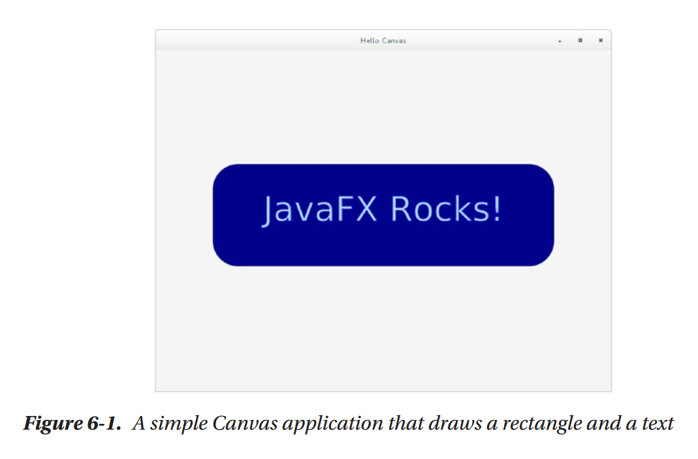

当我们绘制时，我们必须时提供其x与y位置，类似于我们在笛卡尔坐标系内跟踪函数所完成的内容。熟悉画布如果处理x与y位置对于正确地绘制非常重要，而它通常由左上角开始。对于x，与我们理解的相同，然而较高的y值意味着你绘制的元素更接近于程序的底部。使用列表6-2中的代码，我们可以生成图6-2的程序，展示画布中的各种x与y坐标。在嵌入循环中，我们绘制矩形同时绘制一个带有文本的小椭圆来显示每个x，y点。注意，在我们绘制文本之前我们如何将填充修改为魄，然后我们选择红色来绘制椭圆。

.. code::

    Listing 6-2. Drawing x,y coordinates

    Canvas canvas = new Canvas(WIDTH, HEIGHT);
    GraphicsContext gc = canvas.getGraphicsContext2D();
    gc.setFont(Font.font(12));
    gc.setFill(Color.BLACK);
    gc.fillRect(0, 0, WIDTH, HEIGHT);
    gc.setStroke(Color.LIGHTGRAY);
    for (int i = 0; i < WIDTH; i += RECT_S) {
        for (int j = 0; j < HEIGHT; j += RECT_S) {
            gc.strokeRect(i, j, RECT_S, RECT_S);
            gc.setFill(Color.WHITE);
            gc.fillText("x=" + i + ",y=" + j, i + 2, j + 12);
            gc.setFill(Color.RED);
            gc.fillOval(i - 4, j - 4, 8, 8);
        }
    }

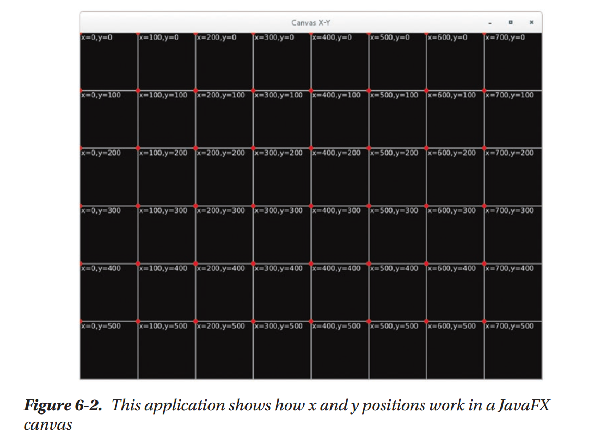

使用事件处理与Canvas绘制功能，我们可以修改图像创建的方式。例如，允许用户在画布中自由绘制，就如同你在列表6-3中所看到的那样，其中我们为鼠标点击注册一个监听器并开始绘制路径。然后在onMouseDragged时，我们持续向路径中添加线。如果用户停止拖拽并再次点击鼠标按钮，则创建一个新路径。当用户使用第二个鼠标按钮点击画布时，我们在画布中的所有内容上绘制背景，来清除它。用于创建路径的方法允许你交互式地构建几何形状；在此情况下，我们仅用其使得绘制更精确（我们也可以绘制小点创建路径），但此API还有许多其它应用。结果是一个简单的绘图程序，如图6-3所示。

.. code::

    Listing 6-3. Drawing on a canvas

    public void start(Stage stage) throws Exception {
        Canvas canvas = new Canvas(800, 600);
        GraphicsContext ctx = canvas.getGraphicsContext2D();
        ctx.setLineWidth(10);
        canvas.setOnMousePressed(e -> ctx.beginPath());
        canvas.setOnMouseDragged(e -> {
            ctx.lineTo(e.getX(), e.getY());
            ctx.stroke();
        });
        canvas.setOnMouseClicked(e -> {
            if (e.getButton() == MouseButton.SECONDARY) {
                clear(ctx);
            }
        });
        stage.setTitle("Drawing on Canvas");
        stage.setScene(new Scene(new StackPane(canvas), WIDTH, HEIGHT));
        stage.show();
        clear(ctx);
    }

    public void clear(GraphicsContext ctx) {
        ctx.setFill(Color.DARKBLUE);
        ctx.fillRect(0, 0, WIDTH, HEIGHT);
        ctx.setStroke(Color.ALICEBLUE);
    }

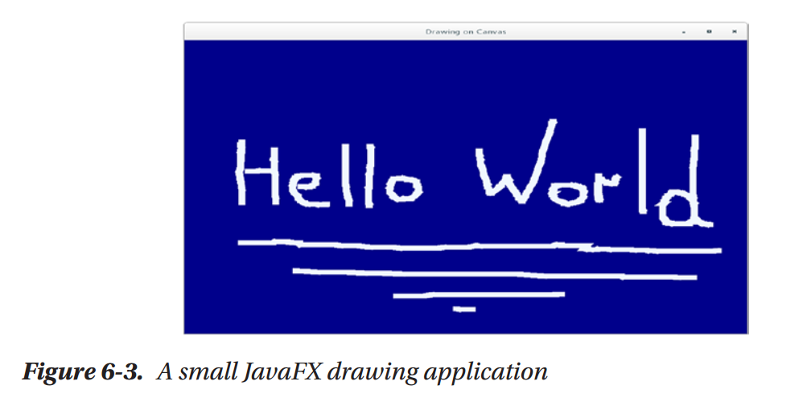

到目前为止，我们探讨了创建形状与文本的高层GraphicsContext方法。如果我们要创建更为复杂的图形，我们需要一个一个地直接处理像素。这可以通过访问GraphicsContext的PixelWriter轻松实现。使用像素写入器，我们可以设置画布中每个像素的颜色。像素的数量依赖于Canvas尺寸，例如，如果其尺寸为800x600，则它有480000个像素，可以使用x与y点进行单独访问。换句话说，我们可以由x=0遍历到x=Canvas.getWidth，而在此循环内部我们可以由y=0遍历到y=Canvas.getHeight来遍历每个像素。将其转换为代码，我们可以看到列表6-4中的内容，结果得到一个具有随机像素的画布，如图6-4所示。

.. code::

    Listing 6-4.

    Canvas canvas = new Canvas(WIDTH, HEIGHT);
    GraphicsContext gc = canvas.getGraphicsContext2D();
    for (int i = 0; i < canvas.getWidth(); i++) {
        for (int j = 0; j < canvas.getHeight(); j++) {
            gc.getPixelWriter().setColor(i, j, Color.color(Math.
            random(), Math.random(), Math.random()));
        }
    }

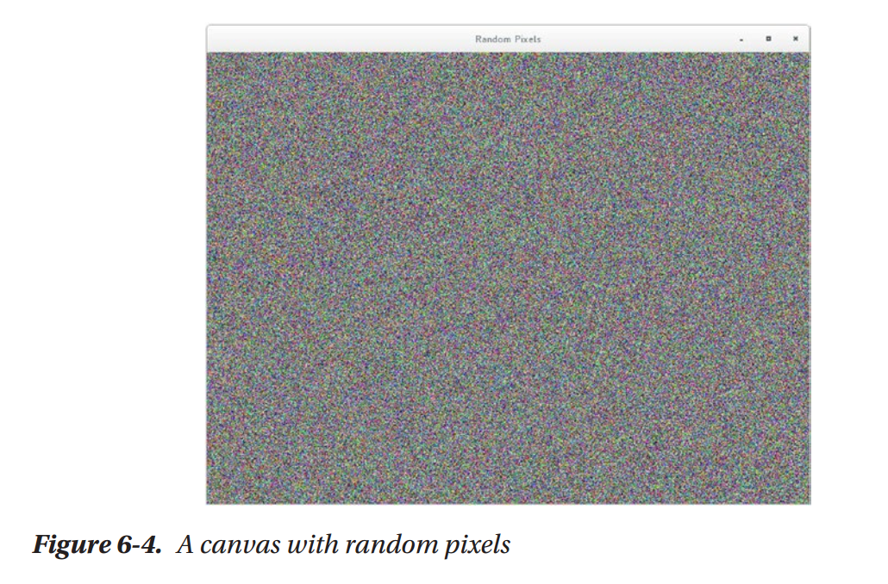

GraphicsContext类同时允许绘制复杂路径，其它几何形状，以及图像，并可以配置它如何显示。要探索所有的Canvas与GraphicsContext可能，我们推荐你阅读Javadocs，在其中你可以找到所有可用的方法以及如何使用的信息。

为Canvas应用以生命
========================

要创建我们在本章开头所创建的应用类型，我们需要固定更新画布来创建动画或模拟。有许多不同的方法可以实现；然而，为了保持简单，我们受处理编程语言的启发，创建一个被重复调用的方法，并且设置为仅在抽象类GraphicApp上调用一次。在本章中，我们将使用GraphicApp来探索一些已知的算法，因为有一些可以在所有示例中重复使用的代码。使用此抽象类，我们可以关注于设置与绘制，而不需要在每个示例中重复自身。让我们通过检测列表6-5中的代码来理解其功能。

.. code::

    Listing 6-5

    import javafx.animation.KeyFrame;
    import javafx.animation.Timeline;
    import javafx.application.Application;
    import javafx.scene.Node;
    import javafx.scene.Scene;
    import javafx.scene.canvas.Canvas;
    import javafx.scene.canvas.GraphicsContext;
    import javafx.scene.layout.BorderPane;
    import javafx.scene.paint.Color;
    import javafx.scene.paint.Paint;
    import javafx.stage.Stage;
    import javafx.util.Duration;

    /**
    *
    * @author user
    */
    public abstract class GraphicApp extends Application {

        protected int width = 800;
        protected int height = 600;
        protected GraphicsContext graphicContext;

        private Paint backgroundColor = Color.BLACK;
        private Timeline timeline = new Timeline();
        private int frames = 30;
        private BorderPane root;
        private Stage stage;

        @Override
        public void start(Stage stage) throws Exception {
            this.stage = stage;
            Canvas canvas = new Canvas(width, height);
            graphicContext = canvas.getGraphicsContext2D();
            canvas.requestFocus();
            root = new BorderPane(canvas);
            stage.setScene(new Scene(root));
            setup();
            canvas.setWidth(width);
            canvas.setHeight(height);
            startDrawing();
            stage.show();
            internalDraw();
        }

        public abstract void setup();

        public abstract void draw();

        public void title(String title) {
            stage.setTitle(title);
        }

        public void background(Paint color) {
            backgroundColor = color;
        }

        public void frames(int frames) {
            this.frames = frames;
            startDrawing();
        }

        public void setBottom(Node node) {
            root.setBottom(node);
        }

        private void internalDraw() {
            graphicContext.setFill(backgroundColor);
            graphicContext.fillRect(0, 0, width, height);
            draw();
        }

        private void startDrawing() {
            timeline.stop();
            if (frames > 0) {
                timeline.getKeyFrames().clear();
                KeyFrame frame = new KeyFrame(Duration.millis(1000 / frames), e -> internalDraw());
                timeline.getKeyFrames().add(frame);
                timeline.setCycleCount(Timeline.INDEFINITE);
                timeline.play();
            }
        }

        public double map(double value, double start1, double stop1, double start2, double stop2) {
            return start2 + (stop2 - start2) * ((value - start1) / (stop1 - start1));
        }
    }

注意方法draw与setup是抽象的。要创建应用，我们必须扩展GraphicApp并实现这些方法。正如你在startDrawing方法中所看到的，方法draw调用频率由Timeline类所控制，其中一个帧的持续时间是由帧int参数所控制的，它表第秒的帧数。在方法draw中，可以访问参数graphicContext，它是GraphicsContext类型，然后创建你的应用。使用graphicsContext，你也可以访问画布注册监听器，从而你可以响应用户输入。方法map是一个实用程序将范围值转换为其它范围。最后，你可以setBottom方法将自定义控件添加到底部。

使用GraphicsApp，我们可以关注于我们的可视效果。例如，让我们创建一个弹球应用。此应用简单地绘制一些椭圆，当它们遇到应用边界时会改变其方向。你可以在列表6-6中看到，我们关注于我们的想法，使用类Ball作为表示球的模型元素，并为其生成随机值；在绘制的每个迭代中，我们更新球的位置并在屏幕中绘制。

.. code::

    Listing 6-6

    import java.util.ArrayList;
    import java.util.List;
    import java.util.Random;
    import javafx.scene.canvas.GraphicsContext;
    import javafx.scene.paint.Color;

    /**
    *
    * @author user
    */
    public class BouncingBalls extends GraphicApp {

        private static final int TOTAL_BALLS = 20;
        List<Ball> balls = new ArrayList<>();

        public static void main(String[] args) {
            launch(args);
        }

        @Override
        public void setup() {
            Random random = new Random();
            for (int i = 0; i < TOTAL_BALLS; i++) {
                Ball ball = new Ball();
                ball.circ = random.nextInt(100) + 10;
                ball.x = random.nextInt(width - ball.circ);
                ball.y = random.nextInt(height - ball.circ);
                ball.xDir = random.nextBoolean() ? 1 : -1;
                ball.yDir = random.nextBoolean() ? 1 : -1;
                ball.color = Color.color(Math.random(), Math.
                        random(), Math.random());
                balls.add(ball);
            }
            background(Color.DARKCYAN);
        }

        @Override
        public void draw() {
            for (Ball ball : balls) {
                ball.update();
                ball.draw(graphicContext);
            }
        }

        public class Ball {

            int x, y, xDir = 1, yDir = 1, circ;
            Color color;

            public void update() {
                if (x + circ > width || x < 0) {
                    xDir *= -1;
                }
                if (y + circ > height || y < 0) {
                    yDir *= -1;
                }
                x += 5 * xDir;
                y += 5 * yDir;
            }

            public void draw(GraphicsContext gc) {
                gc.setLineWidth(10);
                gc.setFill(color);
                gc.fillOval(x, y, circ, circ);
                gc.setStroke(Color.BLACK);
                gc.strokeOval(x, y, circ, circ);
            }
        }
    }

当运行此程序时，你可以看到画布上的球向所有边移动，如图6-5所示。你可以通过添加相交检测，物理检测，事件处理，或是其它使其有用和更酷的效果进行改进。

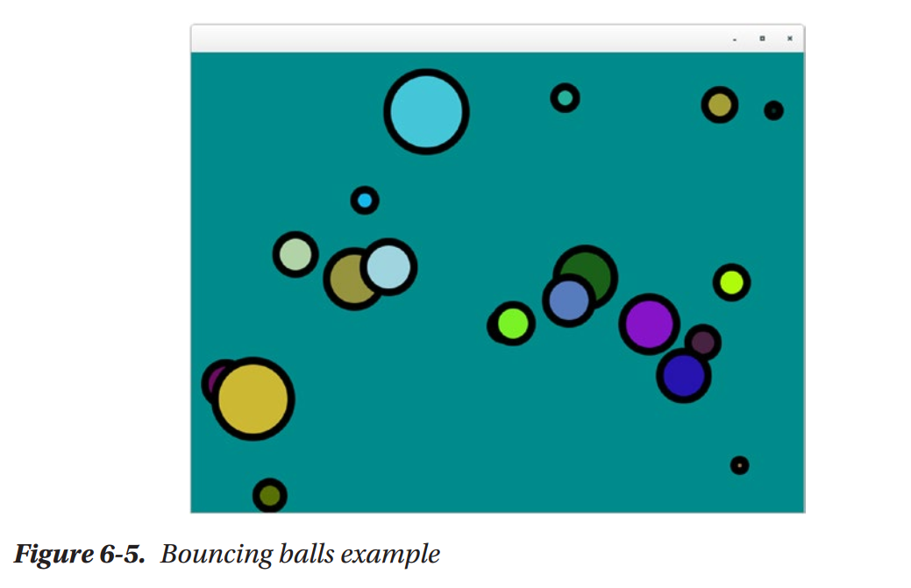

正像前面所说的，让我们探索一些使用我们GraphicsApp的已知算法。

粒子系统
=============

粒子系统是由William Reeves在其论文"Particle Systems: A Technique for Modeling a Class of Fuzzy Objects"中所引入，在其他将其定义为“组合在一起表示模糊对象的许多粒子的集合”。你可以认为它有两个主要组成部分：发射器与粒子。发射器持续创建最终会消失的粒子。粒子系统的应用包括：

* 游戏效果：爆炸，冲突
* 动画：火，云，碰上石头的波
* 模拟：空间，生物的重造

可以使用几行代码创建一个非常简单的粒子系统，但是依据我们要实现的效果，这种系统类型可以非常复杂。对于简单与高级的粒子系统，我们基本上需要两个类：Particle与Emitter。Particle类依赖于Emitter，而一个Emitter可以有一个或无限的粒子。

使用这些类，我们可以构建一个使用单个发射器的应用，生成向随机方向移动的粒子。如图6-6所示，后面是生成此图像的代码列表6-7。

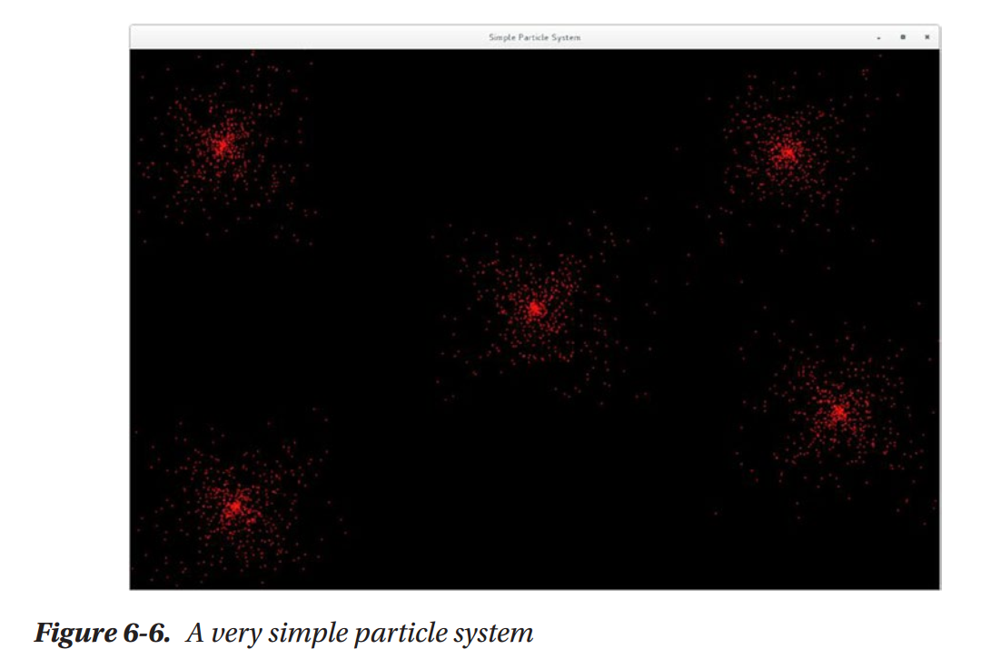

.. code::

    Listing 6-7. Very simple particle system

    import java.util.ArrayList;
    import java.util.List;
    import java.util.Random;
    import java.util.stream.Collectors;
    import javafx.scene.canvas.GraphicsContext;
    import javafx.scene.paint.Color;

    /**
    *
    * @author user
    */
    public class ParticleSystem extends GraphicApp {

        private List<Emitter> emitters = new ArrayList<>();
        Random random = new Random();

        public static void main(String[] args) {
            launch();
        }

        @Override
        public void setup() {
            frames(50);
            width = 1200;
            height = 800;
            // you can change it to onMouseDragged
            graphicContext.getCanvas().setOnMouseDragged(e -> emitters.
                    add(new Emitter(5, e.getSceneX(), e.getSceneY())));
            title("Simple Particle System");
        }

        @Override
        public void draw() {
            for (Emitter emitter : emitters) {
                emitter.emit(graphicContext);
            }
        }

        public class Emitter {

            List<Particle> particles = new ArrayList<>();
            int n = 1;
            double x, y;

            public Emitter(int n, double x, double y) {
                this.n = n;
                this.x = x;
                this.y = y;
            }

            public void emit(GraphicsContext gc) {
                for (int i = 0; i < n; i++) {
                    int duration = random.nextInt(200) + 2;
                    double yDir = random.nextDouble() * 2.0
                            + -1.0;
                    double xDir = random.nextDouble() * 2.0
                            + -1.0;
                    Particle p = new Particle(x, y, duration,
                            xDir, yDir);
                    particles.add(p);
                }
                for (Particle particle : particles) {
                    particle.step();
                    particle.show(gc);
                }
                particles = particles.stream().filter(p
                        -> p.duration > 0).collect(Collectors.toList());
            }
        }

        public class Particle {

            int duration;
            double x, y, yDir, xDir;

            public Particle(double x, double y, int duration, double yDir, double xDir) {
                this.x = x;
                this.y = y;
                this.duration = duration;
                this.yDir = yDir;
                this.xDir = xDir;
            }

            public void step() {
                x += xDir;
                y += yDir;
                duration--;
            }

            public void show(GraphicsContext gc) {
                gc.setFill(Color.rgb(255, 20, 20, 0.6));
                gc.fillOval(x, y, 3, 3);
            }
        }
    }

在列表6-7的代码中，我们在用户点击画布的位置生成一个粒子系统。注意，类发射器会在每次方向emit被调用时生成粒子，同时它会绘制已存在的料子；这两个动作可以分割为两个不同的方法中。一个料子是一个简单的椭圆；而且它有持续时间，初始x与y位置以及y与x方向。发射器发射所有料子，而在其完成之后，所有废弃的料子会被删除。代码非常灵活且易于扩展，例如，当我们移除画布上的鼠标点击事件监听器而将其修改为使用鼠标拖拽事件，我们可以使用料子系统编写。如图6-7所示。

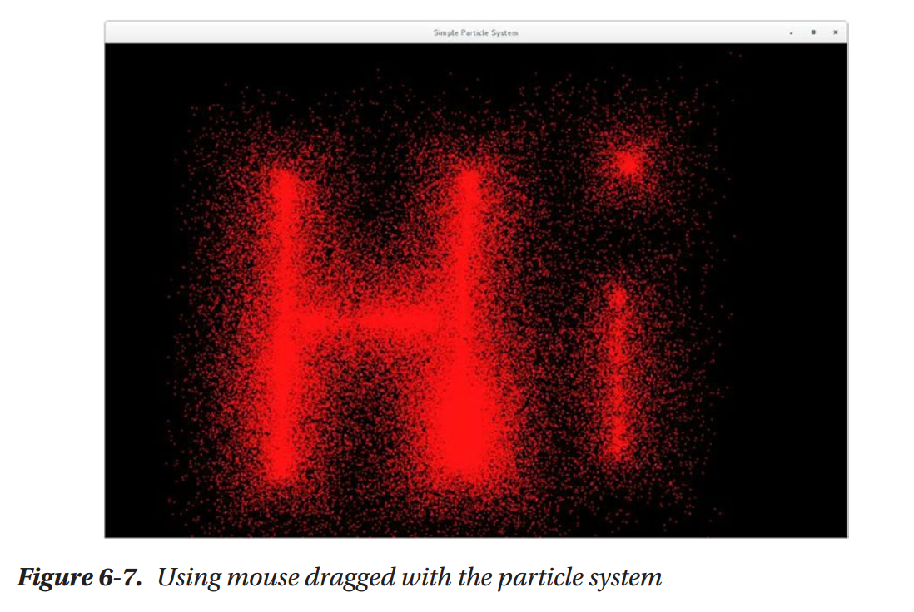

为使得料子系统可配置，让我们在应用的底部添加一个控制面板，从而用户可以配置发射器与料子的多个参数来试验料子系统的全部潜力。为此，我们创建一个应用，允许用户在点击画布时添加新的发射器。我们的可配置料子系统如图6-8所示。

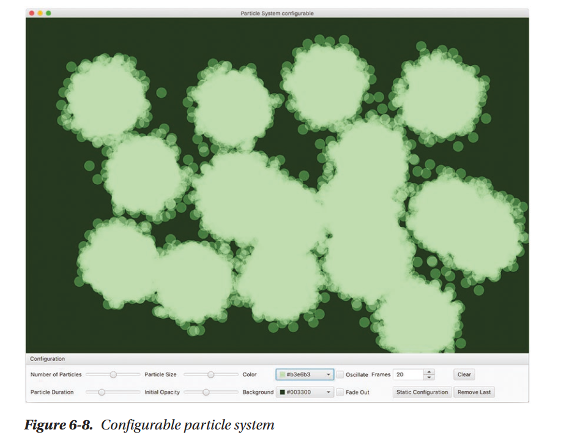

发射器生成代码如列表6-8所示。其工作方式非常简单。当在画布上发生点击时，一个新的发射器被添加到列表；而在draw方法中，每个粒子系统的emit方法被调用。底部面板中的配置（如图6-8所示）在创建时会传递给每个Emitter，如果用户选择切换按钮Static Configuration，特定发射器的配置不会实时更新。

.. code::

    Listing 6-8

    @Override
    public void setup() {
        frames(20);
        width = 1200;
        height = 800;
        GridPane gpConfRoot = buildConfigurationRoot();
        TitledPane tpConf = new TitledPane("Configuration", gpConfRoot);
        tpConf.setCollapsible(false);
        setBottom(tpConf);
        graphicContext.getCanvas().setOnMouseClicked(e -> {
            Emitter newEmitter;
            if (globalConf.cloneConfProperty.get()) {
                newEmitter = new Emitter(e.getSceneX(),
                        e.getSceneY(), globalConf.clone());
            } else {
                newEmitter = new Emitter(e.getSceneX(),
                        e.getSceneY(), globalConf);
            }
            emitters.add(newEmitter);
        });
        title("Particle System configurable");
    }

    @Override
    public void draw() {
        for (Emitter emitter : emitters) {
            emitter.emit(graphicContext);
        }
    }

配置对象存放发射器用于创建粒子的各种信息。类ParticleSystemConf（如列表6-9所示）使用JavaFX属性，从而属性值可以直接绑定到我们添加到底部面板中的控件上。这些属性控件每次emit被调用时所生成的粒子的数量，粒子在应用中存活多少帧（粒子持续时间），以及表示粒子透明度的椭圆的尺寸。同时你可以选择粒子颜色，以及它是否沿直线运动或是否碰撞或是否具有淡出效果。最后，配置同时有一个clone方法，允许我们创建一个不会被绑定到控件的新配置，如列表6-9所示。

.. code::

    Listing 6-9

    public class ParticleSystemConf {

        IntegerProperty numberOfParticlesProperty = new SimpleIntegerProperty();
        IntegerProperty durationProperty = new SimpleIntegerProperty();
        DoubleProperty sizeProperty = new SimpleDoubleProperty();
        DoubleProperty opacityProperty = new SimpleDoubleProperty();
        BooleanProperty oscilateProperty = new SimpleBooleanProperty();
        BooleanProperty fadeOutProperty = new SimpleBooleanProperty();
        ObjectProperty<Color> colorProperty = new SimpleObjectProperty<>();
        BooleanProperty cloneConfProperty = new SimpleBooleanProperty();

        public ParticleSystemConf clone() {
            ParticleSystemConf newConf = new ParticleSystemConf();
            newConf.numberOfParticlesProperty.
                    set(numberOfParticlesProperty.get());
            newConf.durationProperty.set(durationProperty.get());
            newConf.sizeProperty.set(sizeProperty.get());
            newConf.opacityProperty.set(opacityProperty.get());
            newConf.oscilateProperty.set(oscilateProperty.get());
            newConf.fadeOutProperty.set(fadeOutProperty.get());
            newConf.colorProperty.set(colorProperty.get());
            return newConf;
        }
    }

配置的所有域会在稍后绑定到被添加到应用底部的控件：

.. code::

    cbBackgrounColor.valueProperty().addListener((a, b, c) -> background(c));
    globalConf.numberOfParticlesProperty.bind(sldNumberOfParticles.
    valueProperty());
    globalConf.durationProperty.bind(sldDuration.valueProperty());
    globalConf.oscilateProperty.bind(cbOscillate.selectedProperty());
    globalConf.sizeProperty.bind(sldPParticleSize.valueProperty());
    globalConf.opacityProperty.bind(sldOpacity.valueProperty());
    globalConf.fadeOutProperty.bind(cbFadeOut.selectedProperty());
    globalConf.colorProperty.bind(cbColor.valueProperty());
    globalConf.cloneConfProperty.bind(tbClone.selectedProperty());

最后，Emitter与Particle类中用到的所有配置如列表6-10所示。

.. code::

    Listing 6-10

    public class Emitter {

        List<Particle> particles = new ArrayList<>();
        double x, y;
        private ParticleSystemConf conf;

        public Emitter(double x, double y, ParticleSystemConf conf) {
            this.x = x;
            this.y = y;
            this.conf = conf;
        }

        public void emit(GraphicsContext gc) {
            for (int i = 0; i < conf.numberOfParticlesProperty.get();
                    i++) {
                Particle p = new Particle(x, y, conf);
                particles.add(p);
            }
            for (Particle particle : particles) {
                particle.step();
                particle.show(gc);
            }
            particles = particles.stream().filter(p -> p.duration > 0).
                    collect(Collectors.toList());
        }
    }

    public class Particle {

        int duration, initialDuration;
        double x, y, yDir, xDir, size, opacity, currentOpacity;
        Color color = Color.YELLOW;
        boolean oscilate, fadeOut;

        public Particle(double x, double y, ParticleSystemConf conf) {
            this.x = x;
            this.y = y;
            this.oscilate = conf.oscilateProperty.get();
            this.size = conf.sizeProperty.get();
            this.initialDuration = conf.durationProperty.get() + 1;
            this.yDir = random.nextGaussian() * 2.0 - 1.0;
            this.xDir = random.nextGaussian() * 2.0 + -1.0;
            this.opacity = conf.opacityProperty.get();
            this.fadeOut = conf.fadeOutProperty.get();
            this.duration = initialDuration;
            this.currentOpacity = opacity;
            this.color = conf.colorProperty.get();
        }

        public void step() {
            x += xDir;
            y += yDir;
            if (oscilate) {
                x += Math.sin(duration) * 10;
                y += Math.cos(duration) * 10;
            }
            if (fadeOut) {
                currentOpacity = map(duration, 0, initialDuration,
                        0, opacity);
            }
            duration--;
        }

        public void show(GraphicsContext gc) {
            Color cl = Color.color(color.getRed(), color.getGreen(),
                    color.getBlue(), currentOpacity);
            gc.setFill(cl);
            gc.fillOval(x, y, size, size);
        }
    }

在本章中并未共享可配置粒子系统的所有代码，然而，你可以在本书关联的GitHub仓库中找到相应的代码。当你运行此程序时，你会注意到，如果你添加大量的发射器，在每帧中生成大量的粒子，以及你在每秒中有过多的帧时，你很快就会使得应用运行缓慢。你可以使用本章结束时提供的提示来改进性能。有许多可以添加到此应用的一些很棒的特性：

* 粒子格式化选择
* 粒子朝向
* 将可视化导出到文件或是可以在其它应用中重用的格式。

我们将这些作为留给你的练习。

分形
=============

分形的精力定义为由类似自身的小几何形状构成的几何形状。使用分形，我们可以创建漂亮迷人的艺术，同时可以理解自然界中的模式形成。在我们的示例中，我们使用分形探索画布功能。

由复杂集合所创建的著名分形是Mandelbrot集合。要构建一个Mandelbrot集合，你必须在函数f(z)=z^2+c上进行迭代，由零开始使用其自己的结果填充值。此函数是无穷的，然而却有许多会得出有趣结果的中间值。例如，如果你在图像像素上进行迭代，并将像素映射为Mandelbrot集合所接受的值，那么使用像素写入器，当结果趋向无穷时将像素颜色设置为颜色，否则设置为黑色，所得到的结果如图6-9所示。注意，在此图中，小部分类似于整体。看起来就如同到处有Mandelbrot一样。代码如列表6-11所示。

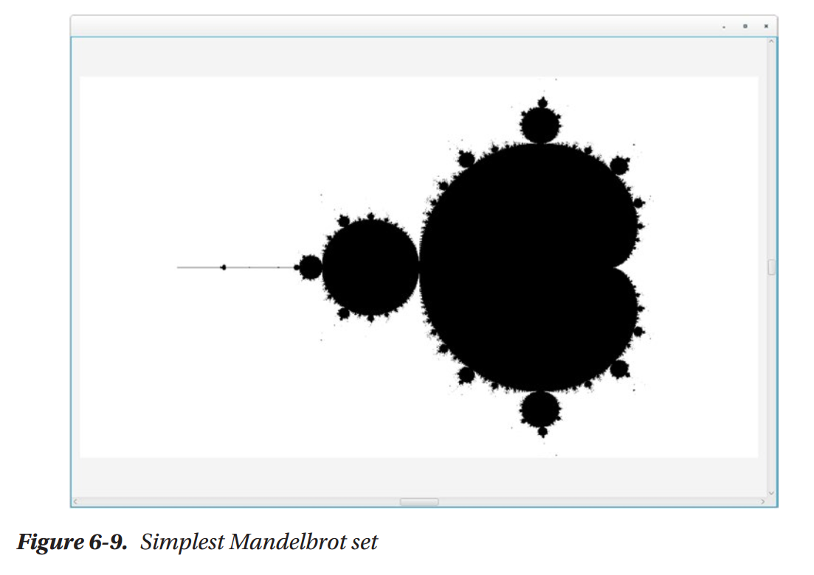

.. code::

    Listing 6-11

    @Override
    public void setup() {
        width = 1200;
        height = 800;
        frames(0);
    }

    @Override
    public void draw() {
        long start = System.currentTimeMillis();
        for (int x = 0; x < width; x++) {
            for (int y = 0; y < height; y++) {
                zx = zy = 0;
                // the known range of accepted values for cx and cy
                cX = map(x, 0, width, -2.5, 1.0);
                cY = map(y, 0, height, -1, 1.0);
                i = 0;
                while (zx * zx + zy * zy < 4 && i < MAX_ITERATIONS) {
                    tmp = zx * zx - zy * zy + cX;
                    zy = 2.0 * zx * zy + cY;
                    zx = tmp;
                    i++;
                }
                // if it is not exploding to infinite
                if (i < MAX_ITERATIONS) {
                    graphicContext.getPixelWriter().setColor(x,
                            y, Color.WHITE);
                } else {
                    graphicContext.getPixelWriter().setColor(x,
                            y, Color.BLACK);
                }
            }
        }
        System.out.println("GEnerating mandelbrot took " + (System.
                currentTimeMillis() - start) + " ms");
    }

如果你搜索Mandelbrot的在线视频，你会发现非常有趣的特殊效果，例如缩放效果与不同颜色。这是由于颜色算法与缩放效果而成为可能。让我们首先通过允许虚拟缩放来改进原始的Mandelbrot。这可以通过操作GraphicsApp的根面板并将画布封装在一个大尺寸的堆栈面板中，然后将其封装于一个滚动面板中提供滚动功能来实现的。画布的尺寸可以使用事件监听器进行修改：当用户使用左键点击滚动面板时，它放大；当用户使用右键点击时，它缩小；而使用中键点击时会重置缩放并位于面板中心。这是在setup方法中实现的，如列表6-12所示，在其中你可以看到缩放技巧：我们实际上在缩放画布，它并不是真正的缩放。在图6-10中，你可以看到无缩放的结果。缩放效果如图6-11所示。注意，它并没有调整分辨率，因而，正如我们所说的，是一个假缩放。

.. code::

    Lising 6-12

    @Override
    public void setup() {
        width = 1200;
        height = 800;
        Canvas canvas = graphicContext.getCanvas();
        BorderPane bp = (BorderPane) canvas.getParent();
        bp.setCenter(null);
        StackPane p = new StackPane(canvas);
        p.setMinSize(20000, 20000);
        ScrollPane sp = new ScrollPane(p);
        sp.setPrefSize(1200, 800);
        sp.setVvalue(0.5);
        sp.setHvalue(0.5);
        bp.setCenter(sp);
        sp.setOnMouseClicked(e -> {
            double zoom = 0.2;
            double scaleX = canvas.getScaleX();
            double scaleY = canvas.getScaleY();
            if (e.getButton() == MouseButton.SECONDARY && (canvas.
                    getScaleX() > 0.5)) {
                canvas.setScaleX(scaleX - zoom);
                canvas.setScaleY(scaleY - zoom);
            } else if (e.getButton() == MouseButton.PRIMARY) {
                canvas.setScaleX(scaleX + zoom);
                canvas.setScaleY(scaleY + zoom);
            } else if (e.getButton() == MouseButton.MIDDLE) {
                sp.setVvalue(0.5);
                sp.setHvalue(0.5);
                canvas.setScaleY(1);
                canvas.setScaleX(1);
            }
        });
        canvas.setOnMousePressed(canvas.getOnMouseClicked());
        frames(0);
        title("Mandelbrot with color and zoom");
    }

对于颜色，我们修改Mandelbrot颜色。不再是白色，而是相对于上一次迭代选择颜色。使用此值，我们可以尝试生成的颜色。例如，使用列表6-13中的值，所得到的结果如图6-10所示。

.. code::

    Listing 6-13

    // if the steps above are not heading towards infinite we draw the pixel with a specific color
    if (i < MAX_ITERATIONS) {
        double newC = ((double) i) / ((double) MAX_ITERATIONS);
        Color c;
        if (newC > 0.4) {
            c = Color.color(newC, 0.8, newC);
        } else {
            c = Color.color(0.2, newC, 0.2);
        }
        graphicContext.getPixelWriter().setColor(x, y, c);
    } else {
        graphicContext.getPixelWriter().setColor(x, y, Color.BLACK);
    }

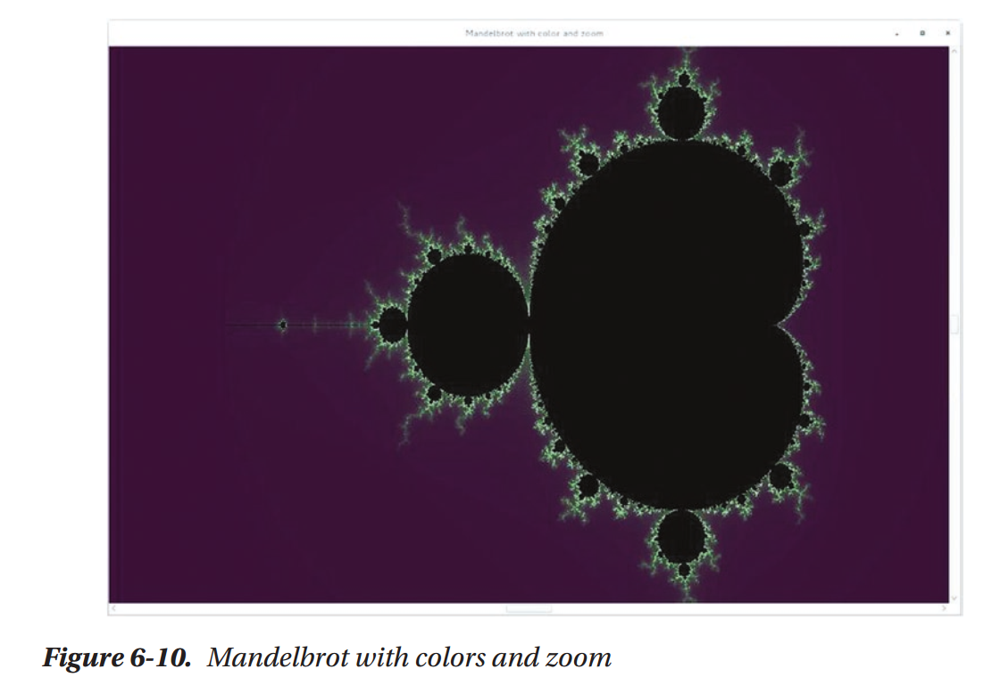

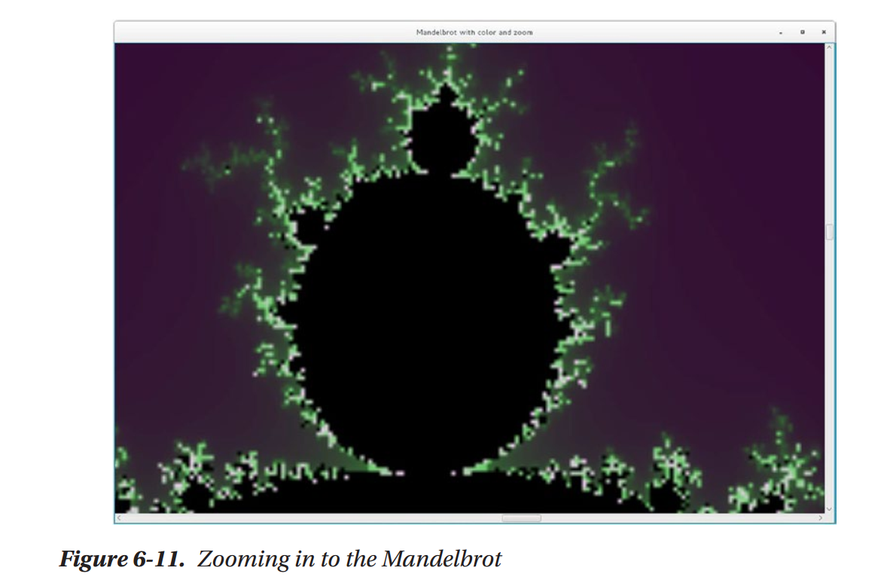

这就是Mandelbrot的所有代码。花些时间修改代码，试着生成更为有趣的颜色，并尝试各种参数。正如下一个可视效果所示，我们将会为实时实验创建一个面板，同时扩展Mandelbrot来允许我们测试Julia集合值，生成其它的分形形式。

